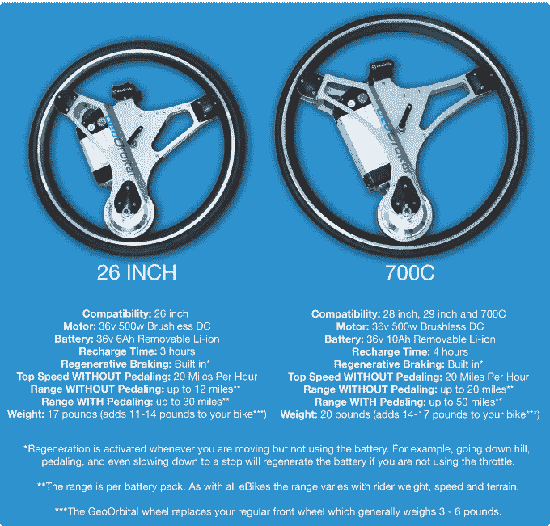
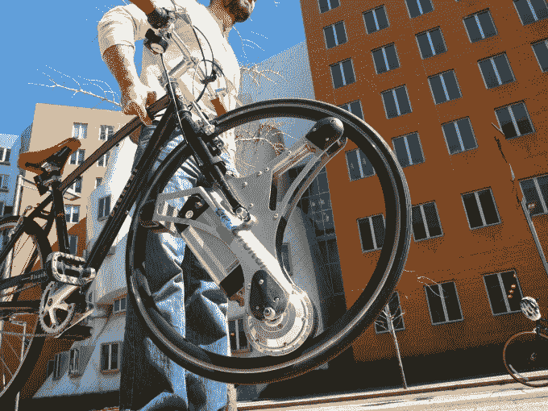

# GeoOrbital 的轮子几乎可以将任何自行车变成电动自行车

> 原文：<https://web.archive.org/web/https://techcrunch.com/2016/05/11/geoorbitals-wheel-turns-almost-any-bike-into-an-electric-bike/>

TechCrunch Disrupt NY 2016 的“通配符”参与者 [GeoOrbital](https://web.archive.org/web/20230331143242/https://www.crunchbase.com/organization/geoorbital#/entity) 对电动自行车有不同的看法。他们没有给自行车装马达，而是把它装在轮子里。这个疯狂的想法实际上是由创始人迈克尔·布尔托夫在电影《创》中看到的东西引发的。他认为摩托车内部有很多浪费的空间，因为它们的轮子是空心的。但这引发了他的梦想，他现在称之为地球轨道轮。

该车轮有两种尺寸，旨在不到一分钟的时间内安装到任何自行车上，取代自行车的前轮。

它使用松下 36V 可拆卸锂离子电池，每个电池的踏板辅助范围可达 50 英里，或 26 英寸车轮的范围可达 30 英里。它还有一个 500 瓦的无刷 DC 电机，该公司声称它可以在 6 秒内让你达到每小时 20 英里。就像任何其他电动自行车一样，你可以继续踩踏板跑得更快。

该公司表示，这种车轮有两种尺寸，可以覆盖超过 95%的成人尺寸自行车。该公司的 [Kickstarter 页面](https://web.archive.org/web/20230331143242/https://www.kickstarter.com/projects/1266381423/geoorbital-wheel-make-your-bike-electric-in-60-sec?ref=project_link)解释说，如果你的自行车有一个 26 英寸的车轮，或 700c 的前轮，并使用轮辋制动器，GeoOrbital 车轮是合适的。他们说，它还兼容 28 英寸和 29 英寸的车轮。

车轮通过内置插座以 USB 方式充电，也可以在旅途中为扬声器供电或为手机充电。如果您需要便携式电源，例如在海滩上度过一天，您也可以取下电池。

GeoOrbital 仅用了 78 分钟就突破了 75，000 美元的筹款目标。截至本文撰写之时，支持者已经为该公司提供了总计 633，788 美元的资金。

车轮本身是一个充满固体泡沫的全天候“无气”轮胎。这可能不会让它成为真正的自行车手的理想选择，但它们也不是 GeoOrbital 的真正市场。

“我们认为它更像是一种城市产品，或者郊区产品，”布尔托夫说。

他解释说，他的轮子会吸引任何想骑自行车，但需要一点推动力的人。这可能包括那些只想不出汗地去上班的人，或者那些本来想骑自行车但由于某种原因不能去的人。

这并不是布尔托夫的第一次创业。在 GeoOrbital 之前，他在 SaaS 创办了一家人力资源软件公司。但是他已经在轮子上工作了几年了。

在制作了原型并申请了专利后，他最终在当地的一次活动中遇到了 SpaceX 的工程师达科塔·德克。

一年半前，德克离开 SpaceX，成为 GeoOrbital 的 CTO。

现在，这个两人团队有 20 多名测试人员在创业公司的家乡剑桥驾驶他们的车轮。

继一周前在 Kickstarter 首次亮相之后，GeoOrbital 准备投入生产。他们正与新英格兰的一家制造商合作，这家制造商生产零件和附件。

该公司也不再完全靠自力更生。一个月前，他们从一群独立天使投资者那里筹集了 15 万美元，从而获得了第一笔外部资金。

GeoOrbital 的目标是在今年秋天开始以 700 美元的价格向客户运送轮子。对于 Kickstarter 的支持者来说，它将运行 499 美元。