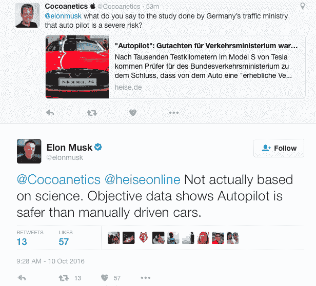

# 德国一份报告称特斯拉的自动驾驶为“危险”

> 原文：<https://web.archive.org/web/https://techcrunch.com/2016/10/10/german-report-calls-teslas-autopilot-a-hazard/>

根据《明镜周刊》的报道，德国联邦公路研究所(BASt)的一项新研究发现，特斯拉 Model S 的自动驾驶功能构成了“相当大的交通危险”。

不出所料，特斯拉首席执行官埃隆·马斯克不同意这种说法，他今天在[的一条推特](https://web.archive.org/web/20221006110306/https://twitter.com/Cocoanetics/status/785516136075067392)上表示，这些报道“实际上没有科学依据”，并重申“自动驾驶比手动驾驶汽车更安全。”

特斯拉报告称，在一辆汽车卷入[致命车祸之前，其汽车在自动驾驶模式下行驶了超过 1.3 亿英里。根据高速公路安全保险协会的数据，从统计数据来看，这打破了美国每 1 亿英里发生致命车祸的手动驾驶汽车的安全记录。](https://web.archive.org/web/20221006110306/https://www.tesla.com/blog/tragic-loss)

我们联系了特斯拉汽车公司以获取更多信息。记者未能立即联系到高管置评。

值得注意的是，明镜周刊报道说，这项研究是一项内部研究，并不代表最终的评估。

这份新的报告是在上个月末德国高速公路上的一次事故后委托撰写的。一辆自动驾驶的特斯拉 Model S 撞上了一辆公交车。没有人在事故中受伤，但它确实促使该机构更仔细地研究特斯拉的自动驾驶仪。

该报告列举了测试人员在特斯拉系统中发现的一些问题。除此之外，这辆车在施工区域没有遵循正确的道路标记——当没有道路标记时，这辆车只是跟随它前面的车辆。

特斯拉面临的另一个问题是由于一个简单的事实，即德国高速公路上仍有许多路段没有速度限制。报道称，这辆车的传感器只看了它后面大约 40 米的地方。如果特斯拉以 80 英里每小时的标准高速公路速度行驶，但有人在左侧车道以 125 英里每小时行驶(甚至更快)，这远远不够。

特斯拉的自动驾驶功能被宣传为驾驶员辅助，而不是完全自主的技术，但德国的报告指出，这个名称表明并非如此。该公司最近推出了自动驾驶更新，预计将于 10 月 17 日公布更多[产品新闻](https://web.archive.org/web/20221006110306/https://beta.techcrunch.com/2016/10/09/tesla-to-unveil-unexpected-new-product-october-17/)。

德国报告的作者实际上认为，应该禁止 Model S 出现在德国的街道上。然而，据《明镜周刊》报道，交通部长很可能会忽略这一点，而是计划向特斯拉提供一笔赠款，以在德国测试自动驾驶仪。

虽然马斯克今天在推特上为他的公司的技术辩护，但他也赞扬了德国立法者[新决议](https://web.archive.org/web/20221006110306/http://www.roadandtrack.com/new-cars/future-cars/news/a31097/german-government-votes-to-ban-internal-combustion-engines-by-2030/)到 2030 年禁止汽油和柴油车辆。