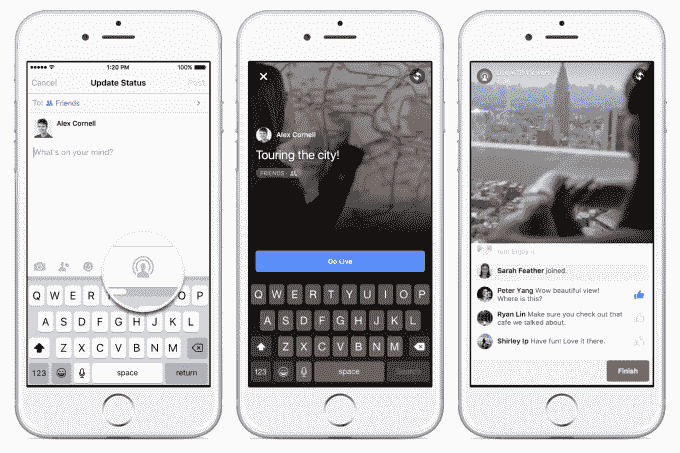

# 脸书通过展示高于保存流的直播视频来对抗 Periscope 

> 原文：<https://web.archive.org/web/https://techcrunch.com/2016/03/01/get-it-while-its-hot/>

# 脸书通过展示比保存的流更高的直播视频来对抗 Periscope

如果你错过了也没关系。脸书知道，人们观看实时视频的时间是保存视频的 3 倍。因此，它正在改变新闻内容，更倾向于持续播放。

Twitter 在 Periscope 上的一大优势是它们都是天生的实时平台。潜望镜为你所有的关注者生成通知，并立即显示在 Twitter 时间轴的顶部。

脸书的新闻不是为实时内容而建的。它旨在向您展示什么是最好的，即使那是几个小时前的。但这不适用于视频直播。脸书直播让你永久保存和展示你的流，而不是像 Periscope 一样在 24 小时后删除它们。但正是这种紧迫性、互动性和原始的不可预测性让直播视频看起来很有趣。

所以今天，脸书做出了一个非常明智的决定[改变它的新闻订阅排名算法](https://web.archive.org/web/20230404154742/http://newsroom.fb.com/news/2016/03/news-feed-fyi-taking-into-account-live-video-when-ranking-feed/),将当前直播的视频排在比旧的保存视频更靠前的位置。

脸书在 8 月份推出了名人直播,然后慢慢推广到拥有经过验证的个人资料和页面的人，最终在 1 月份推广到所有 iOS 用户[。](https://web.archive.org/web/20230404154742/https://techcrunch.com/2016/01/28/comfortable-ephemerality-vs-reach/)然后它给了[安卓用户](https://web.archive.org/web/20230404154742/https://techcrunch.com/2016/02/26/facebook-live-video-android/)上周播放的选项。脸书没有在你广播时通知你所有的朋友或粉丝，而是通过只向你发送来自亲密朋友、你最近互动的页面或你故意订阅他们的直播视频的推送来减少垃圾邮件。

这一改变应该会让你更有可能在脸书直播的时候就能看到。这样，您可以留下广播公司可以看到的评论。

我们终于看到了脸书直播和潜望镜的不同之处，因为流媒体和直播观看体验几乎是一样的。Twitter 将依靠通知和你看到的潜望镜的初始推文或转发。更多的是让人们在最初的几秒钟内参与进来。

与此同时，脸书将希望利用其新闻订阅获得的巨大关注，在你已经在看的地方展示最好的正在进行的流媒体。它可以使用喜欢和评论等信号来显示最好的信息流，这样你就不会收到通知或看到一些无聊的午餐独白。