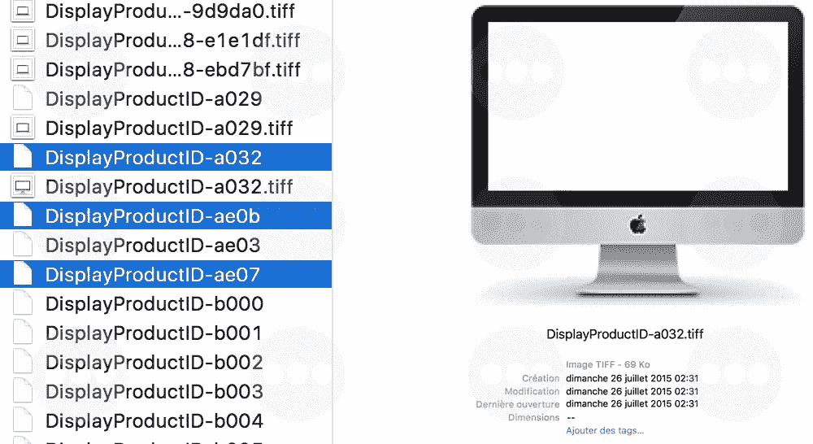

# 准备好迎接配备 4K 视网膜显示屏的 21.5 英寸 iMac 

> 原文：<https://web.archive.org/web/https://techcrunch.com/2015/08/04/get-ready-for-a-21-5-inch-imac-with-4k-retina-display/>

27 英寸、5K retina iMac 是一台[漂亮的台式电脑](https://web.archive.org/web/20221208111013/https://beta.techcrunch.com/2014/10/20/retina-imac-review/)，但对许多人来说有点太贵了。随着 OS X El Capitan 的最新测试版告诉我们更多关于即将到来的 iMac 的信息，这种情况将会改变，这种 iMac 具有更小的 21.5 英寸 4K 分辨率显示屏，确切地说是一种疯狂的 4096 x 2304 显示屏。预计这款新电脑将在未来几个月内上市。

27 英寸、5K 的 iMac 现在的起价为 1999 美元，比刚上市时便宜多了。当苹果宣布 5K iMac 时，它的价格是 2499 美元。但即使是 1999 美元，你仍然需要多花一点钱来购买固态硬盘或融合硬盘。再进行一两次升级，你就能拥有一台强大而昂贵的台式电脑。

法国网站 [Consomac](https://web.archive.org/web/20221208111013/http://consomac.fr/news-3651-el-capitan-beta-6-trois-nouveaux-imac.html) 在最新的 El Capitan beta 中发现了一些新图片。其中两个展示了新的 5K iMac，所以苹果应该会在不久的将来用新的规格更新现有的 27 英寸型号。

但是第三个是一个全新的形象。根据图像属性，此图像显示了一台配有 retina 显示屏的 21.5 英寸新 iMac。原生分辨率将是 4096 x 2304，比现有分辨率的两倍多一点。目前的 21.5 英寸 iMac 配备了 1920 x 1080 的显示屏。这种新的显示器意味着您将能够以其原始分辨率观看 4K 视频，而不必将其缩小——视频专业人员会喜欢这一点。

El Capitan 图标还显示了一台与之前设计相同的 iMac。看起来苹果今年不会更新其台式电脑的设计了。

目前的 21.5 英寸 iMac 起价 1099 美元。retina 变体应该比那个贵一点，但仍然比它更大的 27 英寸兄弟便宜很多。凭借这款新的 iMac，苹果填补了其产品线中的一个漏洞，因为如果你真的想要视网膜显示屏，你必须在 15 英寸的 MacBook Pro 和 27 英寸的 iMac 之间做出选择。

我也很想看到一个泄露，表明苹果正在开发一种新的外部显示器。苹果目前的外接显示器是 2010 年发布的，2011 年更新了一个 Thunderbolt 连接器。虽然它是 27 英寸的显示器，但它的分辨率只有 2560 × 1440。即使今天泄露的 21.5 英寸 iMac 也有更大的分辨率。随着雷电 3 的到来，新的视网膜显示器可能是另一个巨大的潜在产品更新。

