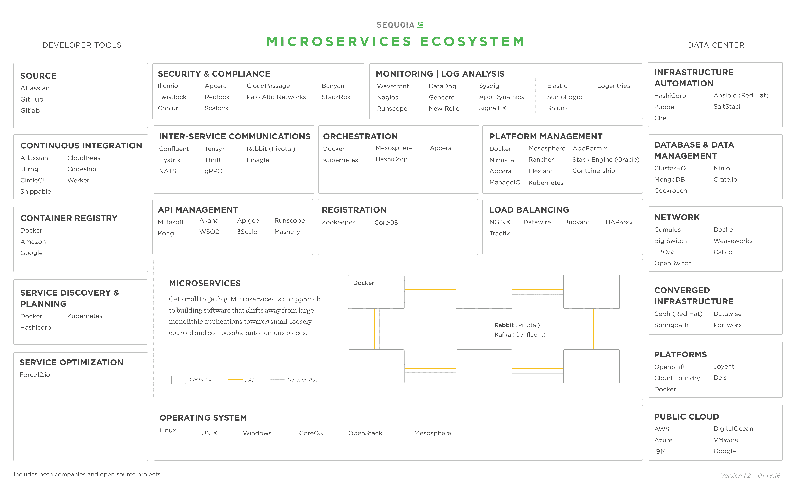

# 通过微服务变小变大

> 原文：<https://web.archive.org/web/https://techcrunch.com/2016/01/23/get-small-to-get-big-through-microservices/>

如果我们追溯一条从古腾堡使用活字到马尔孔·麦克林发明集装箱的道路，我们会发现一个非常有趣的模式:每一个新的抽象和标准化层都会从规模和效率的增加中创造出巨大的价值。

今天的数字创新者可以追踪类似的历史轨迹，从大型计算机和单片应用程序开始，然后一步一步地揭示软件的可互换部分，直到我们到达今天的基于云的[微服务和持续集成](https://web.archive.org/web/20230321052126/https://www.sequoiacap.com/article/build-us-microservices/)时代。

微服务是一种构建软件的方法，它从大型单片应用程序转向小型、松散耦合和可组合的自治部分。这种抽象的好处是专门化，它降低了开发成本，提高了敏捷性和质量——同时操作更具弹性的系统。

这种方法并不新鲜；亚马逊和谷歌已经使用了十多年。容器技术(如 Docker)、API 和云基础设施的可用性使得微服务现在对更广泛的公司来说是可行的。

Airbnb、迪士尼、Dropbox、通用电气、高盛和 Twitter 等公司在使用微服务时，开发周期缩短了 75%。这个概念听起来很简单，但做起来比看起来要难。这催生了一个全新的公司和开源软件生态系统，来帮助人们完成这一转变。

点击放大

60 位工程领导者最近聚集在红杉的微服务峰会上，分享了在谷歌、亚马逊、微软、Twitter、网飞、迪士尼、富国银行、Dropbox、安进、花旗、纳斯达克、Medallia、惠普、Okta、Gilt、Instacart 等公司实施微服务的故事。

以下是构建和部署微服务的 10 个最佳实践。

**确定自己是否真的需要** **微服务**

并不是每个应用程序都足够复杂，以至于需要分解成微服务。Thoughtworks 的 Martin Fowler 和 Ryan Murray 引用了“微服务溢价”，在许多用例中，微服务的复杂性阻碍了团队的生产力。当您的应用程序变得非常复杂，或者您的团队开始超过 50-75 名工程师时，这种架构的好处就会开始显现。

把你的房子整理好

持续交付和自动化比微服务更重要。能够经常(至少每天)集成工作的小型敏捷团队是微服务的重要先驱。能够自动化您的系统并定期推送代码更新对于处理这种架构所带来的复杂性至关重要。

**任命一名工匠大师**

如果您不设计和管理微服务的发展，结果可能是无法控制的蔓延。让一个人或一个小团队负责控制架构决策并帮助确保标准的采用是至关重要的。

> 需要管理的部件越多，遥测就越重要。

谷歌有一个由大师级工匠组成的小团队，他们了解各部分如何组合在一起，并帮助指导新服务的创建。Twitter 的 [Alex Roetter](https://web.archive.org/web/20230321052126/https://twitter.com/aroetter) 称这一疏忽为“使用了适量的盐”你永远不会想压制自下而上的伟大创新。

**将您的微服务映射到业务流程**

团队应该有限定的上下文，系统应该遵循普通的业务流程。梅尔文·康威在 1967 年首次提出了这一原则，它适用于今天。当您的服务没有被直接映射时，将来的故障排除或重新架构会变得更加困难。

**将每个新产品作为一个整体开始**

除非你能观察它的用途，否则不可能知道分割这块巨石的最佳方法。一旦你对你的产品将如何被使用有了概念，你就可以从那里开始分解。今天，在调整您的服务规模方面有一些尝试和错误。将来可能会有人通过软件来帮助完成这个过程。

**增量移动**

不要扔掉整块石头。这可能会带来灾难性的后果。一次拿一块，掰下来。一旦这一块工作，移动到下一个自然的一块。一些公司发现，更激进的方法会导致功能丧失，并使诊断问题变得困难。

**创建共享存储库**

考虑创建一个包含所有服务的大型共享存储库，供团队在应用程序开发中使用。您不希望一个公共服务有两个或三个活动版本在使用。你的工匠应该帮助管理这个仓库。

**应用更全面的监控**

需要管理的部件越多，遥测就越重要。微服务监控领域非常分散。没有明确的赢家，一些公司正在开发自己的产品。微服务需要比你的 monolith 更全面的监控工作。

**改善安全性和治理**

更多的表面和复杂性增加了对安全性和治理的需求。考虑如何验证谁可以与谁通话，以及如何识别非法流量。谁有权处理某些服务？所有服务可以用于贵公司的所有任务吗？共享服务如何计费或管理？

**收获回报**

成功实施后，微服务可以大幅提高公司构建和部署软件的速度和灵活性。交付应用程序的成本大大降低，您的系统将变得更有弹性。开发时间可能从几个月到几周不等。

如果这听起来令人生畏，那么考虑一下替代方案:比你的竞争对手更长的开发周期、更脆弱的基础设施和更慢的创新。微服务并不适合所有人，但如果有效实施，其结果可能会在创建持久公司方面带来变革。