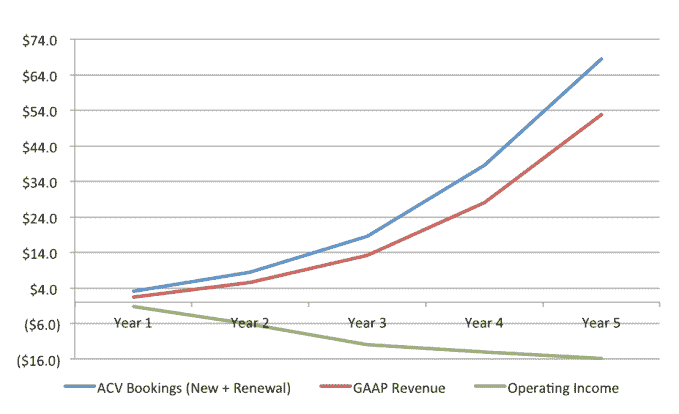
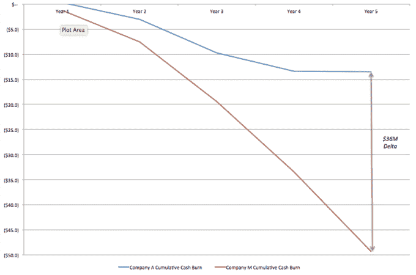

# 从 SaaS 获得更多现金:时机就是一切

> 原文：<https://web.archive.org/web/https://techcrunch.com/2015/01/10/getting-more-cash-out-of-saas-timing-is-everything/>

关于高速增长的 SaaS 公司的巨额现金消耗，人们已经了解了很多，也写了很多。但如何在保持资本效率的同时实现 SaaS 业务的快速增长呢？关注现金回收的时机，而不仅仅是现金支出。

在过去几年中，Sapphire Ventures 投资了数十家 SaaS 公司，包括 Box、ExactTarget、DocuSign、Krux 和 Socrata，并对数百家公司进行了评估。因此，我们对最佳实践有了深刻的理解，并了解了在运营 SaaS 公司时真正重要的基准和指标。

我们注意到的是，现金回笼的时机可以极大地影响一个高增长、经常性收入企业的现金消费，远远超出人们的直觉假设。这最终会影响到一家企业的吸引力，或者至少会影响到该企业随着时间的推移所经历的股东稀释水平，随着廉价增长资本时期的慢慢结束，这将成为一个越来越受关注的领域。

## 关注现金消费的缺口

“现金换增长”是大多数 SaaS 公司面临的一个众所周知的问题。软件订阅业务今天会产生销售费用，这些费用会转化为未来一段时间的收入。这可能会在发生现金费用(如销售和营销)和从客户处收取现金收据之间造成时间上的不匹配。这也解释了为什么 SaaS 公司经常消耗大量现金，并在高增长阶段出现重大 P&L 损失。那么，开账单和收现金的时间与所有这些有什么关系呢？

首先，许多从业者大大低估了现金回笼对累积现金需求的影响。还有其他一些与预付现金相关的重要考虑因素。

让我们假设两个处于早期到中期阶段、高增长、经常性收入的 SaaS 企业，并在五年内对它们进行建模。我们假设每家公司的年度 GAAP 收入从 2M 美元-600 万美元-1300 万美元-2800 万美元-5300 万美元之间令人钦佩地增长，并且享有 100%的年度更新率。两家公司的总成本结构完全相同，都超过了收入的 100%，这是以我们最近评估或投资的几十家高增长 SaaS 企业或已上市企业为基准的。如下图所示，两家公司因此拥有相同的 GAAP 记账、收入和营业收入。

两项业务的预订量、收入和营业收入:相同

唯一的区别是，第一家公司，M 公司(“按月”)，与大多数 SaaS 公司一样，在一年的合同期内，它按月按比例获得现金报酬。第二家公司，A 公司(“预付款”)，提前收取全部年度合同价值。

累积现金消耗的比较:截然不同

这两家公司在现金消耗上的差异是惊人的。由于递延收入余额的增长，公司 A 在五年内将减少消耗 3600 万美元的现金，以实现与公司 m 完全相同的收入和预订轨迹。现金消耗的这一差距可能是成功和破产的区别，也可能是创始人和早期投资者适度或显著稀释的区别。

与 A 公司相比，M 公司消耗了三倍多的资金，尽管预订、收入增长和运营费用都相同。谁能忽视这一点？

(完整的基础 P&L 和现金电子表格可在[此处](https://web.archive.org/web/20230326081452/http://sapphireventures.com/cnt/uploads/2015/01/Annual-Upfront-vs-Monthly-Payment-Models_Sapphire-Ventures.pdf)获得。)

## 现在够快了吗？

改善现金流并不是提前收取现金的唯一好处。

预收账款产生的额外现金可用于加速收入增长，因此，可用于产生潜在的更多现金。这种良性循环扩大了每月收款模式和预收款模式之间的收入和现金差异。

其次，预先收取现金的企业通常比不收取现金的企业拥有更高的客户保持率。原因很简单:预付现金的客户在经济上更愿意继续使用产品，他们愿意预付的事实表明他们对购买的舒适度更高。此外，提前支付年费的客户在一年内可能会面临一个而不是 12 个不连续的续约或重新谈判决策点，这并没有什么坏处。

## 另一方面…

尽管预收账款 SaaS 业务在现金、留存和增长方面具有显著优势，但如果没有概述潜在的相关权衡，讨论将是不完整的。

预付现金最难的部分是客户需要同意预付。尽管销售主管很有魅力，也很有说服力，但客户通常会寻找一些提前付款的动机。这通常表现为折扣的形式，可能是 5%到 20 %,通常是为了获得相同数量的客户，同时将销售周期保持在合理的水平。与此相关，可能需要概念验证或免费试用以及销售代表的再培训。

其次，预收现金的一个关键但意想不到的后果是，公司可能会倾向于以不那么谨慎的方式花费更多的钱，而这仅仅是因为他们可以这样做。虽然一家公司可能会通过继续预订新客户和留住现有客户来掩盖过度支出，但如果业务放缓，现金限制和短缺可能会随之而来。

因此，尽管在预付现金收款模式中，销售和营销的“回收期”是微不足道的，但理解提前记账的长期和持续后果的重要性怎么强调都不为过。一旦提前收取现金，随后的现金消耗将大于每月模式，每月模式不提前收取现金，但此后消耗较少(或产生更多)的现金。

为了说明这一点，图 3 比较了预付款和月度收款业务中一份价值 12，000 美元的 ACV 合同样本的月度和累计现金流:

一份价值 12，000 美元的 ACV 合同的月现金流比较(代表 50%的净收入利润业务)

最后，由于客户提前承诺，不再有每月潜在客户流失的催化剂，SaaS 从业者应小心衡量客户续保的流失率，而不是像每月计费制度下那样按月计算。这将提供一个更现实的业务保留性能特征的视图。

最终，当谈到向客户收费的时机时，并不一定有正确或错误的答案。通过密切关注传统的销售效率比率和其他指标，每月收取现金的企业可以非常节省资本，而提前收取现金的企业可能会由于臃肿的成本结构而烧钱。最重要的是牢记这两种模式的近期和长期财务、业务甚至心理影响和权衡。