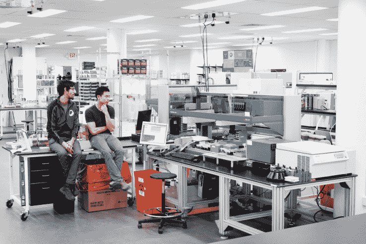
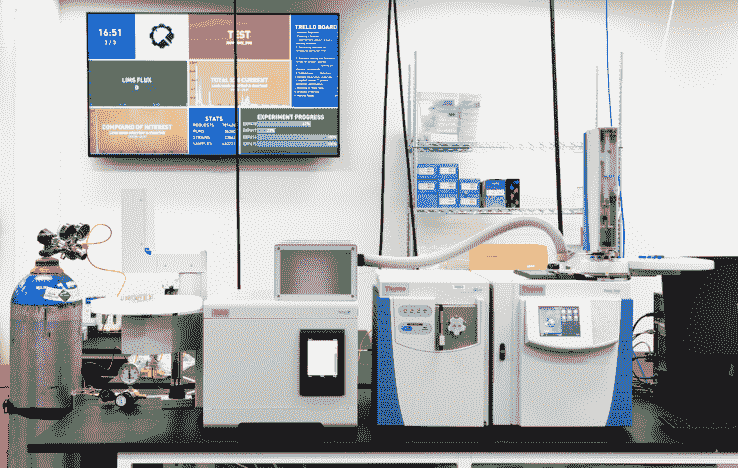

# 银杏生物工程公司以 4500 万美元的 B 轮融资收购 Zymergen 

> 原文：<https://web.archive.org/web/https://techcrunch.com/2015/07/23/ginkgo-bioworks-takes-on-zymergen-with-45-million-in-series-b-funding/>

波士顿生物技术初创公司[银杏生物工程](https://web.archive.org/web/20221208180002/http://ginkgobioworks.com/)刚刚从一份“超额认购”投资者名单中获得了额外的 4500 万美元 B 轮融资。这家初创公司在 3 月份筹集了[900 万美元，因此到目前为止，这家初创公司总共获得了 5400 万美元的资金。](https://web.archive.org/web/20221208180002/https://beta.techcrunch.com/2015/03/18/ginkgo-bioworks-lands-9-million-in-series-a-funding-to-build-out-new-lab-facilities/)

由于新技术、自动化机器人、降低的生产成本和快速迭代的能力，生物技术创业公司在过去几年里从寥寥无几到炙手可热。银杏是那些使合成生物学对希望从转基因酵母产品中获得高额回报的投资者具有财务吸引力的植物之一。

“合成生物学是目前发展最快的技术领域之一，而银杏在这一领域处于领先地位，”Y Combinator 总裁萨姆·奥特曼说。YC 将银杏作为其首批生物技术创业公司之一，并继续投资，包括这一轮作为其[比例](https://web.archive.org/web/20221208180002/http://blog.ycombinator.com/pro-rata)倡议的一部分。

YC 加入了之前的投资者 OS Fund 和 Felicis Ventures 的 B 轮融资。维京环球在这一轮中领先。

银杏集团接受了这笔投资，以帮助其超越最初的合成香料生产，进入化妆品、营养品、健康和消费品领域。此举将银杏置于与硅谷合成生物学初创公司 Zymergen 的直接竞争中。

Zymergen 和银古今年都筹集了相当大的一笔资金，用自动化机器生产各种各样的消费品——zy mergen 最近完成了 4400 万美元的首轮融资。银杏目前与 10 个不同的企业客户签订合同，为各种产品生产 20 种设计生物。据这家初创公司称，客户包括许多财富 500 强公司。

银杏公司的联合创始人杰森·凯利认为，Zymergen 公司和银杏公司的不同之处在于，他们的初创公司富有人情味。“我们让人类设计师能够设计这些微生物的基因组，让它们做一些事情。这是一种哲学上不同的方法，”凯利告诉 TechCrunch。

> 合成生物学是目前发展最快的技术领域之一，银杏在这一领域处于领先地位。山姆奥特曼

银杏公司计划将部分资金用于建造自动化机器 Bioworks2，该机器需要为初创公司再扩建 1 万平方英尺的空间，并将有助于加快生产速度。这家初创公司利用其 A 轮融资建立了第一家微生物工厂 Bioworks1，生产设计师酵母原型。

凯利将 Bioworks2 的建设比作英特尔开发新的半导体工厂，并表示这是下一代模式，将允许双倍生产，并为销售团队提供一些弹药。

银古还与 DARPA 合作生产益生菌，帮助美国士兵抵御他们可能在海外感染的胃病。银杏从 Bioworks 机器中开发的原型中制造这些益生菌，理论上，它们将与你的肠道微生物群一起工作，以避免疾病。

银杏不仅有望以潜在的低成本快速生产，而且有望创造新的可能性，比如前面提到的士兵益生菌，或者玫瑰的淡淡香味。玫瑰香水是一种稀缺商品，随着全球短缺的逼近，这种商品将会大量出现。然而，银杏能够使用 Bioworks1 大规模再造一种合成的、基因完全相同的玫瑰油。这是一个全新的、怪异的、令人敬畏的充满可能性的世界。