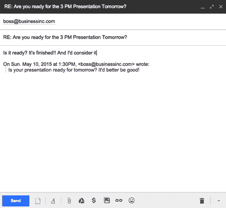

# Giphy 让电子邮件变得不那么可怕

> 原文：<https://web.archive.org/web/https://techcrunch.com/2015/05/11/giphy-makes-email-slightly-less-horrendous-with-giphy-for-gmail-extension/>

# Giphy 通过 Gmail 扩展使电子邮件变得不那么可怕

我们都同意电子邮件是发生在我们身上最糟糕的事情。当然，它淘汰了邮政服务，并将文本传输的速度提高了 20 万倍左右，但这并不意味着我们大多数人不会淹没在促销和时事通讯中。但还是有希望的。朋友们: [Giphy](https://web.archive.org/web/20221216120759/https://techcrunch.com/tag/Giphy) ，我们都知道并喜爱的 GIF 搜索和分享服务，刚刚插入了你的撰写窗口。

没错:通过一个漂亮的小 Chrome 扩展，Giphy 现在可以直接在 Gmail 的撰写窗口中使用。

“gif 应该很容易分享，这真的很令人兴奋，因为越来越多的公司来找我们，希望让这成为现实，”[朱莉·洛根](https://web.archive.org/web/20221216120759/https://techcrunch.com/2015/03/19/giphys-first-acquisition-nutmeg-is-a-big-step-towards-mobile/)、[Giphy](https://web.archive.org/web/20221216120759/https://www.linkedin.com/in/thejulielogan)的女王闪光炸弹说。“在这种情况下，我们与 [Inbox SDK](https://web.archive.org/web/20221216120759/http://www.inboxsdk.com/) 合作，将 Giphy 直接放入您的 Gmail 编辑器中。”

除了格式化文本的常用图标之外，您还应该在同一个栏中看到熟悉的彩虹图标。当你点击图标时，你会看到一些流行的 gif 图片，顶部有一个搜索栏。搜索、选择、点击，你的 GIF 就被嵌入并准备发送到电子邮件中了。

这只是 Giphy 通过其平台实现的许多集成之一，包括与 Slack 的翻译集成，这可能是全球许多拖延的根源。

如果您想下载 Giphy for Gmail 扩展，只需点击此处的链接。这将是一个[大灌篮](https://web.archive.org/web/20221216120759/http://giphy.com/search/slam-dunk)！

