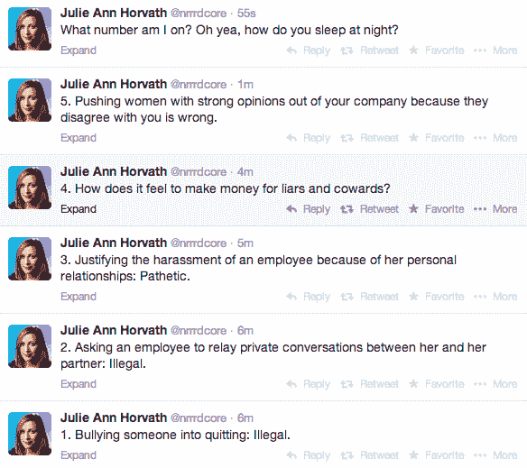

# GitHub 否认“基于性别的骚扰”指控，联合创始人普雷斯顿-沃纳辞职

> 原文：<https://web.archive.org/web/https://techcrunch.com/2014/04/21/github-denies-allegations-of-gender-based-harassment-co-founder-preston-werner-resigns/>

# GitHub 否认“基于性别的骚扰”的指控，联合创始人普雷斯顿-沃纳辞职

GitHub 今天发表了一篇简短的博客文章，详细介绍了其对现已离职的员工[朱莉·安·霍瓦特](https://web.archive.org/web/20230326030333/https://twitter.com/nrrrdcore)对该公司的[骚扰](https://web.archive.org/web/20230326030333/https://techcrunch.com/2014/03/15/julie-ann-horvath-describes-sexism-and-intimidation-behind-her-github-exit/)指控的调查结果。

据该公司称，“调查没有发现任何证据支持对汤姆和他妻子的性骚扰或基于性别的骚扰或报复，或性别歧视或敌对的工作环境的指控。”然而，该公司承认，调查确实发现了“判断失误和错误的证据”GitHub 的联合创始人汤姆·普雷斯顿-沃纳(Tom Preston-Werner)已经辞职。

GitHub 对“其余指控”进行了全面否认，称调查发现“没有证据表明存在基于性别的歧视、骚扰、报复或虐待。”

在这位联合创始人离开后，霍瓦特最初对她的评论很尖锐。正如 TechCrunch 当时报道的那样:

> 据霍瓦特说，这位创始人指责她威胁他的妻子，自从妻子请她出去喝酒后，她就没有和她互动或联系过。在这一集里，霍瓦特哭了，因为她说创始人不仅“惩罚”了她，还说她是“骗子”霍瓦特说，这位创始人在会议结束时说，与同事约会是“糟糕的判断”(指的是她与 GitHub 另一名员工的关系)，然后离开了。霍瓦特回忆说，在他离开后，他坐在那里“无法控制地哭泣和颤抖”

普雷斯顿-沃纳今天也发表了一篇博文,承认自己“犯了错误”,但坚决否认自己的行为带有性别偏见:

> 首先，我想谈谈过去一个月来对我和我家人的严重指控。我在 GitHub 做出的每一个决定，以及我与员工的每一次互动中，我都试图比他们期望的更好地对待他们，并以同理心解决冲突。尽管如此，我还是犯了错误，我对那些被这些错误伤害的人深感抱歉。当我知道我没有达到目标时，我很难过，我会每天努力做得更好。
> 
> 也就是说，我想明确一件事:我和我的妻子特里萨都没有参与过基于性别的骚扰或歧视。GitHub 的独立调查结果明确证实了这一点，我们准备在法律的最大范围内打击任何进一步的虚假指控。我相信各行各业的人都应该多元化和平等，尤其是在科技行业。这对我来说非常重要，我会继续尽我最大的努力来推进这一信念。

普雷斯顿-沃纳表达了对“沉浸式计算”的兴趣，暗示他下一步可能在哪里工作。

GitHub 正在建立新的控制和程序，以更好地提供“包容性的工作环境”，包括培训和“员工主导的倡议”。

在这两个帖子发布后，霍瓦特发布了一系列推文，对发布的笔记进行反驳。在撰写本文时，霍瓦特尚未回复 TechCrunch 的置评请求。以下是她关于最近发展的推文:

**更新:**霍瓦特回应了 TechCrunch 的置评请求。以下是她对当天事件的回应:

> 汤姆别无选择，只能辞职。有充分的证据表明他和他的妻子受到了骚扰，他们都利用公司的资源对我和公司的其他女性进行政治迫害。
> 
> 如果汤姆没有辞职，GitHub 现在已经在流失优秀员工了。虽然，我不确定这会不会启动。很明显，调查全是假象。看看接下来会发生什么，以及 GitHub 如何在未来传达其行动的影响，将会很有趣。