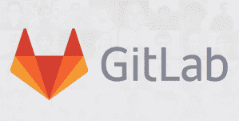

# GitLab 获得了与 Google 的 Kubernetes 引擎 TechCrunch 的原生集成

> 原文：<https://web.archive.org/web/https://techcrunch.com/2018/04/05/gitlab-launches-a-native-integration-with-googles-kubernetes-engine/>

# GitLab 获得了与 Google 的 Kubernetes 引擎的原生集成

最受欢迎的自托管 Git 服务之一 GitLab 最近表现不错。在[发布其与 GitHub](https://web.archive.org/web/20221209210157/https://techcrunch.com/2018/03/22/gitlab-adds-support-for-github/) 的集成仅仅两周之后，该公司今天[宣布](https://web.archive.org/web/20221209210157/https://about.gitlab.com/google-cloud-platform/)其平台上的开发者现在可以在谷歌的 Kubernetes 引擎(GKE)上自动启动一个集群，并且只需点击几下鼠标就可以将他们的应用程序部署到其上。

为了构建这一功能，该公司与谷歌合作，但这一集成也广泛使用了 GitLab 现有的 [Auto DevOps](https://web.archive.org/web/20221209210157/https://docs.gitlab.com/ee/topics/autodevops/) 工具，该工具已经为处理容器提供了类似的功能。Auto DevOps 旨在消除设置 CI/CD 管道和部署到容器的所有繁重工作。

“在 GKE 整合之前，GitLab 用户需要深入了解 Kubernetes 来管理他们自己的集群，”GitLab 首席执行官 Sid Sijbrandij 在今天的公告中表示。“通过这种合作，我们让我们的用户可以轻松地在[谷歌云平台]上设置托管部署环境，并利用 GitLab 强大的 Auto DevOps 功能。”

为了使用 GKE 集成，开发者只需从 GitLab 连接到他们的谷歌账户。由于 GKE 自动管理集群，开发人员将能够完全专注于编写他们的应用程序，并将部署和管理留给 GitLab 和 Google。

这些新功能是 GitLab 10.6 版本的一部分，现在所有 GitLab 用户都可以使用。