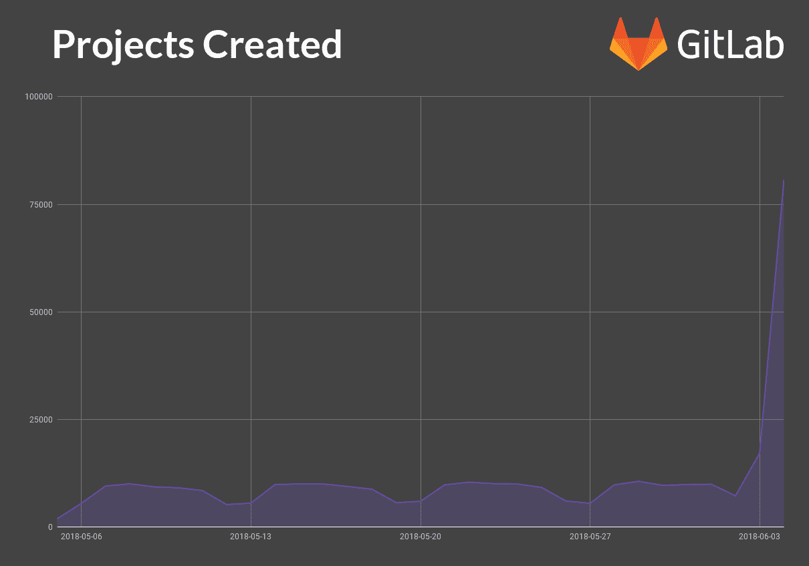
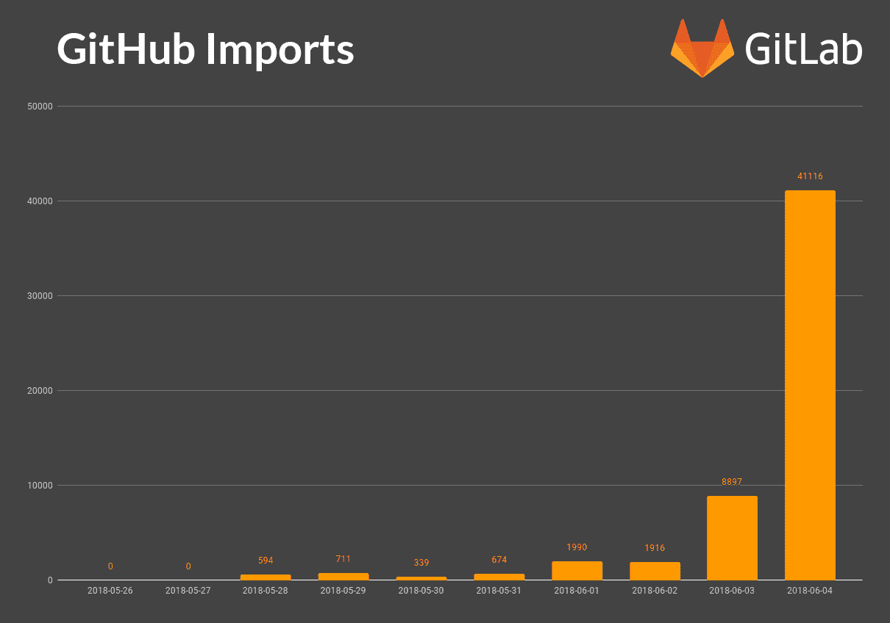

# GitLab 的高端计划现在对开源项目和学校免费

> 原文：<https://web.archive.org/web/https://techcrunch.com/2018/06/05/gitlabs-high-end-plans-are-now-free-for-open-source-projects-and-schools/>

# GitLab 的高端计划现在对开源项目和学校是免费的

微软收购 GitHub 的事实让许多开发者深感不安，他们中的许多人正在寻找替代方案。其中之一是 [GitLab](https://web.archive.org/web/20230225042402/https://about.gitlab.com/) ，该公司已决定趁热打铁。为了吸引更多的开发者到它的平台上来，GitLab 今天宣布，它的高级自托管 GitLab [终极计划](https://web.archive.org/web/20230225042402/https://about.gitlab.com/pricing/self-hosted/feature-comparison/)和托管的[黄金计划](https://web.archive.org/web/20230225042402/https://about.gitlab.com/pricing/gitlab-com/feature-comparison/)现在对开源项目和教育机构免费开放。

GitLab 首席执行官 Sid Sijbrandij 告诉我:“大多数教育和开源项目都无法获得针对其软件项目的增强安全性或性能管理工具。“在 GitLab，我们很高兴取得了一定程度的成功，这使我们能够通过免费提供 GitLab Ultimate 和 GitLab Gold 计划，将全套功能扩展到这些重要的社区。”

对迁移到 GitLab 的兴趣是非常真实的，因为该公司告诉我，在 GitHub 新闻昨天宣布后，它的网站有超过 14，300 个独立访问者，这些开发者在 GitLab.com 开设了超过 100，000 个新的知识库。其中大多数肯定尝试过 GitLab 的免费但有限的核心计划，它包括所有的基础，但并不真正适合更大的项目。

然而，黄金版和终极版通常每个用户每月花费 99 美元，并且几乎包括你能想到的所有功能，包括你想要的所有基本功能，从代码库到发布[路线图](https://web.archive.org/web/20230225042402/https://docs.gitlab.com/ee/user/group/roadmap/)的工具、依赖性和容器扫描、Kubernetes 集群监控，以及在不久的将来用于[许可](https://web.archive.org/web/20230225042402/https://gitlab.com/gitlab-org/gitlab-ee/issues/2592)和[投资组合管理](https://web.archive.org/web/20230225042402/https://about.gitlab.com/direction/#portfolio-management-and-issue-management)的工具。

这里有一个警告，免费黄金和终极计划不包括支持。虽然开发者和开源项目需要支持，但是他们仍然可以以每个用户每月 4.95 美元的价格购买。

另一个限制是，这适用于学校，而不是个别学生。“为了减轻 GitLab 的管理负担，只有教育机构可以代表学生申请，”该公司表示。“如果你是一名学生，而你的教育机构没有申请，你可以在 GitLab.com 上使用公共项目的所有功能，使用私人项目的免费功能，或者自己付费。”

