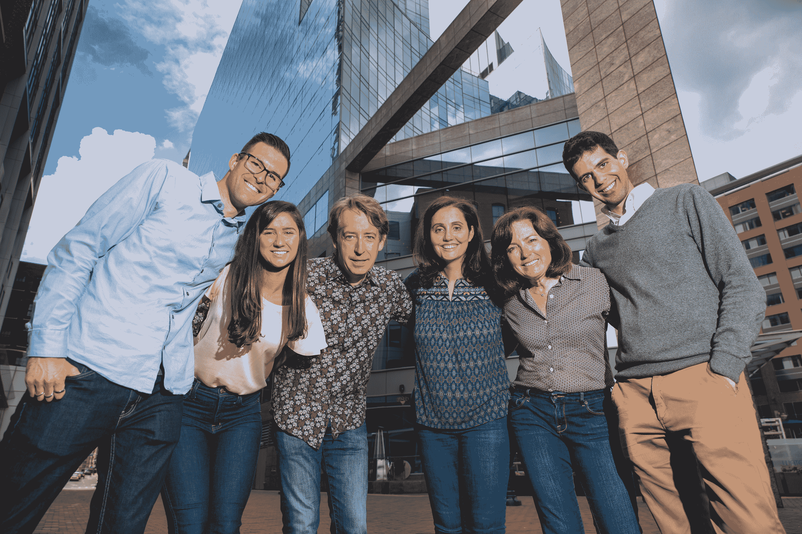

# Glasswing Ventures 以 1.12 亿美元关闭其专注于人工智能的基金 

> 原文：<https://web.archive.org/web/https://techcrunch.com/2018/07/12/glasswing-ventures-closes-its-artificial-intelligence-focused-fund-with-112-million/>

在获得 7500 万美元的巨额承诺投资于将人工智能应用于各个行业的早期公司一年后， [Glasswing Ventures](https://web.archive.org/web/20221209203206/http://glasswing.vc/) 以 1.12 亿美元关闭了其首只基金。

对于一家号称是东海岸最大的专注于机器学习的早期投资者，以及由女性领导的最大的早期基金之一的公司来说，这是一个重要的里程碑。

Glasswing 由 Rudina Seseri 和她的长期投资伙伴 Rick Grinnell 一起创立，并得到了前投资组合高管 Sarah Fay 的支持，迄今为止已经投资了三家初创公司:BotChain(一家从 Glasswing 早期投资的人工智能管理公司 Talla 剥离出来的公司)；威胁检测公司 Allure Security 铽实验室，当敏感或被盗信息出现在互联网上时，他们的服务会提醒公司。

对于塞塞里和格拉斯温来说，关闭实际上只是一个开始。正如她在声明中所说:

> 对 Glasswing Ventures 来说，在东海岸筹集一只专注于人工智能的基金只是一个开始。随着我们踏上塑造未来的旅程，我们将重点投资于那些利用人工智能建立颠覆性公司和改造市场的杰出创始人。除了提供智能资本，我们还坚定地致力于从各个方面支持我们的企业家建立和扩大他们的业务。

塞塞里和她的联合创始人格林内尔的故事实际上始于近十年前的风险投资公司[费尔黑文资本](https://web.archive.org/web/20221209203206/http://fairhavencapital.com/)，这是道明银行集团更名后的投资部门。

根据丹·普里马克(Dan Primack)在《财富》(Fortune)工作时的报道，2016 年公司成立时，Glasswing 的第一只基金的目标是 1.5 亿美元，管理费为 2.5%，附带权益为 20%(对于风险基金来说，这是非常标准的条款)。

在 Primack 看到的一份推介材料中，该公司吹嘘其投资的回报率为 4.25 倍，其中包括 Grinnell 退出 EqualLogic(以 14.6 亿美元出售给戴尔)和 Seseri 对 Jibo(现在基本上毫无价值)和 SocialFlow(并非如此)的投资等交易中实现的 6 倍和未实现的 1.8 倍。

费伊在费尔黑文的一家证券投资公司工作，在两位合伙人启动他们的新企业后不久就被聘用了。

Glasswing 无疑受益于该公司靠近波士顿的一流大学。毕业于哈佛大学的塞塞里与哈佛和麻省理工的研究界保持着密切的联系——邀请蒂姆·伯纳斯·李这样的名人加入公司的网络顾问委员会。

Chase Martin，营销和活动经理；Emma Marty，运营和支持协调员；里克·格林内尔，创始人兼管理合伙人；Rudina Seseri，创始人兼管理合伙人；莎拉·费伊，总经理；和安德烈·罗查，投资合伙人