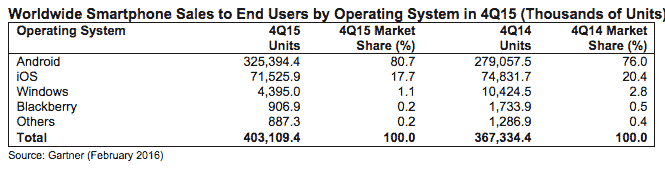
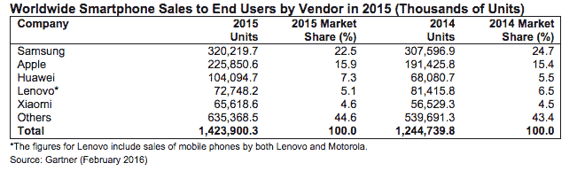

# 全球智能手机销售增长放缓至 2008 年水平，高德纳技术公司表示

> 原文：<https://web.archive.org/web/https://techcrunch.com/2016/02/18/global-smartphone-sales-growth-slows-to-2008-levels-says-gartner/>

根据高德纳最新的[市场报告](https://web.archive.org/web/20221220011538/https://www.gartner.com/doc/3213117)，2015 年第四季度全球智能手机销售经历了自 2008 年以来最慢的增长率。该季度苹果的苹果手机销量首次下降，分析师表示，库比蒂诺的销量比上一季度下降了 4.4%。

三星和华为是唯一两家提高份额的前五大智能手机供应商，尽管这家韩国移动制造商的份额仅略有上升，从 2014 年第四季度的 19.9%增长到 2015 年第五季度的 20.7%。

华为实现了同比最佳表现——增长 53%，市场份额从 2015 年第四季度的 5.7%升至 2015 年第四季度的 8.0%。高德纳将这归因于这家中国移动制造商在海外品牌知名度的提高。

分析师预计，本季度安卓的市场份额为 80.7%，高于上年同期的 76%，谷歌的移动操作系统受益于对平价智能手机日益增长的需求。

相比之下，苹果的 iOS 份额从 2014 年第四季度的 20.4%下降到 2015 年第四季度的 17.7%。尽管在 2015 年全年，库比蒂诺仍然设法缩小了它与高端智能手机制造商竞争对手三星之间的市场份额差距。

与此同时，移动的前平台视窗 T5 在 2015 年假日季度的全球份额下降到只有 1.1%。

市场份额排名前五的智能手机品牌是三星、苹果、华为、联想和小米。去年第四季度，中国三大手机制造商总共占据了 17%的市场份额，高于上年同期的 16.5%(尽管几乎所有增长都来自华为)。

智能手机市场剩下的增长主要来自新兴市场。Gartner 预计这一趋势在未来几年将变得更加明显。

该公司还预计，中国原始设备制造商今年将继续增加份额，并指出，由于制造成本优势，它们有能力满足新兴市场对中低端智能手机的需求。

“未来五年，我们预计智能手机市场的增长将主要来自新兴市场。到 2019 年，基本款和低端智能手机将占智能手机销量的三分之二；分析师罗伯塔·科扎(Roberta Cozza)在一份声明中指出:“同一年，只有 20%的智能手机销量来自成熟市场。”。

苹果如何应对这种持续向低端转移将会很有趣，因为它已经开始看到 [iPhone 销量增长碰壁](https://web.archive.org/web/20221220011538/https://techcrunch.com/2016/01/26/apple-beats-earnings-expectations-but-misses-on-iphone-sales/)。要么它[最终制造出真正低成本的 iPhone](https://web.archive.org/web/20221220011538/https://techcrunch.com/2013/02/22/why-every-analyst-is-in-love-with-the-siren-song-of-the-low-cost-iphone/) ，要么它想出如何说服更多三星的高端买家从 Android 转向 iOS。

高德纳认为，未来移动制造商有机会利用从功能手机到智能手机的剩余转变，渗透到新兴亚太和 EMEA 等地区的低端市场。

“我们已经看到这些地区的印度和中国玩家——比如 Micromax、Xiaomi、Huawei、Intex、Oppo 和 BBK Electronics——从对平价智能手机需求的增长中获益，”科扎指出。

全球最大的移动商务展会将于下周在巴塞罗那开幕。新的旗舰智能手机预计将在移动世界大会上亮相，包括三星、LG、华为和小米，尽管看起来是不那么花哨的设备发布会真正推动了 2016 年智能手机市场的增长。

虽然负担能力是剩余智能手机市场增长的关键引擎，但高德纳也认为渠道战略和对当地消费者市场动态的了解变得越来越重要——这是分析师所说的“高度商品化”安卓市场的结果。

换句话说，安卓原始设备制造商需要非常努力地将他们的硬件与众不同，与当地品牌/公司合作是一种脱颖而出的策略，正如科扎指出的:“与当地开发者和内容提供商的合作在产品的差异化方面也将变得越来越重要。”

有趣的是，这也是生产旗鱼操作系统的安卓替代移动初创公司约拉采取的“T2”战略，该公司一直在寻求通过与新兴市场的当地品牌建立联系来扩大其开放移动平台的覆盖范围。然而，推动安卓这样的主流平台的任何替代品仍然是一个 T4 式的挑战。