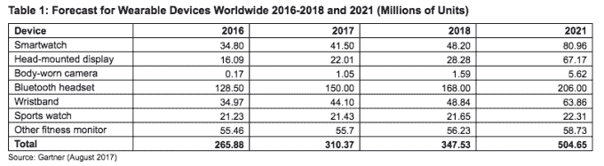

# 全球可穿戴设备市场将在 2017 年增长 17%，售出 3.1 亿台设备，收入 305 亿美元:Gartner 

> 原文：<https://web.archive.org/web/http://techcrunch.com/2017/08/24/global-wearables-market-to-grow-17-in-2017-310m-devices-sold-30-5bn-revenue-gartner/>

分析师 Gartner 预计，今年全球可穿戴设备市场将同比增长 16.7%，包括各种类型和外形的设备，从智能手表到体戴式相机，甚至头戴式显示器。

其[预测](https://web.archive.org/web/20230225042026/https://www.gartner.com/document/3778064?ref=solrAll&refval=189299666&qid=37a4e96586b75f96f365c724978fc260)预计今年全球可穿戴设备的销量为 3.104 亿，总收入为 305 亿美元——其中 93 亿美元将来自智能手表类别，苹果手表目前在智能手表领域领先于三星的 Gear 智能手表等竞争对手。

预计苹果将于今年 9 月发布一款新的智能手表——增加直接蜂窝连接功能，这意味着苹果手表将能够支持使用 Siri 语音助手、发送消息和传输传感器数据，而不需要 iPhone 在附近——从而扩大其实用性，并有可能提振该产品在消费者中的前景。

该公司没有公布这款手表的单位销量，但在本月早些时候报告其最新收益时首席执行官蒂姆·库克表示，这款可穿戴设备的销量同比增长了 50%。(苹果在“其他产品”类别中报告了手表的收益，这一类别还包括苹果电视、Beats 电子设备、iPods 和苹果品牌的配件等产品，该类别整体上季度为其带来了 27.4 亿美元的收入。)

Gartner 表示，预计今年将售出 4150 万块智能手表，并补充称，从 2019 年到 2021 年，除蓝牙耳机外，这种设备将成为所有可穿戴设备中销量最高的设备。

Gartner 估计，到 2021 年，智能手表的总销量将达到近 8100 万块，占可穿戴设备总销量的 16%。

它指出，智能手表的收入受到了 Apple Watch 相对稳定的平均销售价格(ASPs)的支撑。Apple Watch 是一种可穿戴的腕戴设备，入门价格为 269 美元起。

“智能手表类别的整体平均售价将从 2017 年的 223.25 美元降至 2021 年的 214.99 美元，因为较高的销量导致制造和部件成本略有下降，但苹果和 Fossil 等强势品牌将保持定价与传统手表的价格区间一致，”Gartner 研究总监安吉拉·麦金太尔(Angela McIntyre)在一份声明中指出。

虽然预计苹果将继续引领智能手表类别，但 Gartner 预测，随着更多提供商进入市场，Cupertino 的份额将在未来几年下降，从 2016 年的约三分之一下降到 2021 年的四分之一。(尽管华硕、华为、LG、三星和索尼等其他品牌的份额仍将较低——预计到 2021 年，它们将仅占 15%。)

有趣的是，根据高德纳的计算，儿童智能手机是一个表现良好的子类别，占 2021 年智能手表总出货量的 30%。

这些是针对 2 至 13 岁儿童的可穿戴设备，制造商针对的是那些还不想让孩子拥有一部功能齐全的智能手机的父母。

该分析师还预计，传统手表品牌/奢侈品/时尚智能手表细分市场将会上升，预计到 2021 年将占智能手表销量的 25%，因为老牌品牌试图吸引年轻客户。

与此同时，新创公司和自有品牌智能手表品牌，如爱可视、Cogito、仁宝、Martian、Omate 和广达，将占 2021 年单位销售额的 5%。

在可穿戴设备领域的其他地方，蓝牙耳机仍将是最大的子类别，占 2017 年销售的所有可穿戴设备的近一半(48%)。该分析师还预计，到 2021 年，音频设备仍将是销量最高的可穿戴设备，预计销售额将达到 2.06 亿英镑。

根据 Gartner 的说法，这里的增长是由“主要智能手机提供商”取消耳机插孔推动的。虽然[苹果开始了这一转变](https://web.archive.org/web/20230225042026/https://techcrunch.com/2016/09/07/headphone-jack-rip/)——当然也有一对蓝牙驱动、Siri 支持的高价无线耳塞卖给你([ai rpods](https://web.archive.org/web/20230225042026/https://techcrunch.com/tag/airpods/))——但分析师的假设是，到 2021 年，几乎所有的高端手机都将不再有 3.5 毫米插孔。撕裂世界各地可信赖的旧耳机。

与此同时，分析师表示，当今可穿戴市场的一项小技术——头戴显示器(HMDs)——支持增强现实应用，不会完全阻挡佩戴者的视觉(像全虚拟现实耳机那样)——将在未来五年左右继续发挥作用。

Gartner 预测，HMD 将仅占今年出货的所有可穿戴设备的 7%，并表示它们在 2021 年前不会被消费者或工业客户主流采用。(这相当于对 AR 初创公司 [Magic Leap](https://web.archive.org/web/20230225042026/https://techcrunch.com/tag/magic-leap/) 的近期前景持悲观态度——该公司仍未在市场上推出可穿戴设备，尽管其创始人[暗示](https://web.archive.org/web/20230225042026/https://techcrunch.com/2017/01/04/what-can-we-learn-from-magic-leaps-latest-pr-trip/)今年可能会推出一款。)

Gartner 指出，头盔显示器的近期机会包括:视频游戏玩家；用于各种工业和商业用例，例如用于执行设备维修、检查和维护的工人，或者用于帮助制造、培训、设计和客户交互；以及用于诸如主题公园、剧院和运动场所的娱乐用例，以增强体验或提供补充信息。

HMDs 的麦金太尔补充说:“目前主流消费者的低采用率表明该市场仍处于起步阶段，并不是说它缺乏长期潜力。”