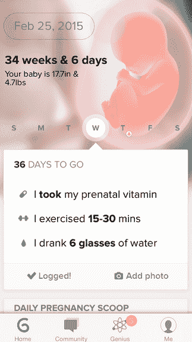

# 辉光赋予怀孕生命应用程序辉光滋养技术崩溃

> 原文：<https://web.archive.org/web/http://techcrunch.com/2014/07/17/glow-gives-life-to-pregnancy-app-glow-nurture/>

# 发光赋予怀孕生命应用发光滋养

在帮助或阻止怀孕的生育追踪公司【T2 辉光】发布近一年后的今天，iOS 上发布了一款新应用。[辉光滋养](https://web.archive.org/web/20230130231806/https://glowing.com/features_nurture)是该公司的第二款产品，这次是为了帮助已经有孩子的女性。我得以与 Glow 首席执行官[迈克·黄](https://web.archive.org/web/20230130231806/http://www.crunchbase.com/person/michael-huang)坐下来，第一次浏览了该应用程序。您可以在下面的视频中看到我们 TechCrunch 电视演播室的采访。

把这个应用想象成一个“当你期待的时候会发生什么”，但是在你的苹果手机上。[发光滋养](https://web.archive.org/web/20230130231806/http://www.crunchbase.com/product/nurture)与最初的发光应用程序在设计上非常相似，但它是专门为处于婴儿成长过程中的人创建的一个指南和社交社区。黄告诉我，这个应用程序的创建是为了回应已经怀孕的发光用户。“我们每天都收到大量反馈，询问‘既然我怀孕了，我该怎么办？’。”据黄等人透露，这是调查组的头号要求。

发光滋养有四个组成部分:

1.  主页为移动中的用户提供标准的妊娠文献。
2.  社区为女性提供了一个社交渠道，让她们可以互相检查并分享怀孕照片。它还为他们提供了一种方法，以了解他们的症状是否正常，或者是否有问题。
3.  “我”是一个与社区合作良好的领域，让女性提供一些关于自己的个人信息。
4.  Genius 是应用程序中能够洞察孕妇个人健康和福祉的领域。

Glow 团队的目标是让那些能够使用原始 Glow 应用程序 Glow nursing 怀孕的人毕业。黄说，到目前为止，已经有超过 20，000 对夫妇可以在这个应用程序上怀孕。目前的 Glow 用户只要在手机上下载新的应用程序，就可以无缝地将他们的数据转移到 Glow nutrition。新用户只需要创建一个帐户。

虽然黄很谨慎地向我指出，这款应用并不是提供医疗建议，但他确实表示，像这样的应用可以在 9 个月的过程中提供安慰和支持性的数字社区。它还可以在事情不太对劲时提醒女性，并敦促她去检查一下。

Glow Nurture 从今天开始在 App Store 免费提供。Glow 也正在开发这款应用的安卓版本。该公司还计划添加一个处理怀孕后九个月的应用程序。