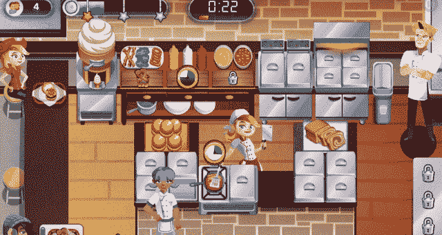

# Glu 与戈登·拉姆齐合作推出新的 Dash 游戏

> 原文：<https://web.archive.org/web/https://techcrunch.com/2016/06/29/glu-debuts-new-dash-game-with-gordon-ramsay/>

如今，如果一个名人推出自己的游戏，很可能是通过 Glu Mobile。这家上市公司以免费玩手机游戏闻名，列出了 100 多种游戏，包括刺猬索尼克、变形金刚、吉他英雄和猎鹿人。但自 2014 年末以来，该团队已经从建立已知的游戏游戏转向新的个性化明星特许经营。继金·卡戴珊、布兰妮·斯皮尔斯和其他名人成名游戏登顶游戏排行榜之后，Glu Mobile 现在与厨师戈登·拉姆齐合作，为他们已经很受欢迎的 [Dash](https://web.archive.org/web/20230326225254/http://www.glu.com/games/genre/33) 系列添加名人元素。

据自称控制狂的拉姆齐说，格鲁明白他想参与到游戏的每一个方面。“这不是一个标签巴掌或什么的，他们只是把我的名字也。你会看到特质、直觉水平和竞争力。”拉姆齐是你的主厨导师，正如你所料，他并不总是那么容易取悦。

在游戏中，你开始在旧金山的一家咖啡馆卖汉堡。你玩每一关都可以赚到钱，然后你可以用这些钱升级你的烹饪站，让烹饪变得更快更有效率。戈登每一步都陪着你，给你赞美，或者在你耳边狂吠。尽管他的名声经常不好，游戏化的拉姆齐还是很有帮助的，当你在杂草中时，他会停止游戏给你提示或清理线路。

“它让我了解了我的生活。我从附近的小酒馆开始。我从便宜的农产品开始，没有顾客，餐厅空无一人。三个在厨房，两个在餐厅，”拉姆齐说。“实际的 app 一模一样。你回到最基本的，然后你建立。但这确实很严重。如果你变得更好，我变得更坚强。如果你变得超级棒，我会变得更硬。如果你表现得太好，我就要把你打倒。”

[gallery ids="1345432，1345434，1345433，1345439，1345438，1345441，1345442"]

随着游戏的进行，你会扩大你的特许经营权，努力去更好的餐厅，更好的食材，并希望得到那些令人垂涎的 Wishelin 星，Ramsay 的米其林。玩了几天后，我还没有获得玩多人厨师对战的能力。游戏的竞争性是 Glu 移动团队引以为豪的，并认为这将保持人们玩游戏的积极性。

Glu 拥有 Dash 特许经营权，这是一个拥有 15 年历史的品牌，在 PC 和移动设备上的安装量超过 5 亿。在此期间，该团队制作了餐厅冲刺、烹饪冲刺、酒店冲刺和婚礼冲刺游戏。“这是唯一的戈登·拉姆齐短跑比赛，”Glu 首席执行官尼依格罗酒店·德·马西说。“与戈登合作，我们有望成为烹饪游戏类型的类别杀手。”

这款游戏似乎有潜力做到这一点。在已经深受喜爱的游戏上建立名人体验只能导致一件事:现实生活中的现金。据报道，金·卡戴珊从她的好莱坞游戏中赚了数百万美元，在名人手机游戏领域有一条被证实的致富之路。看看戈登·拉姆齐和他所有的竞争力是否会让金为她的钱而战，这将是一件有趣的事情。