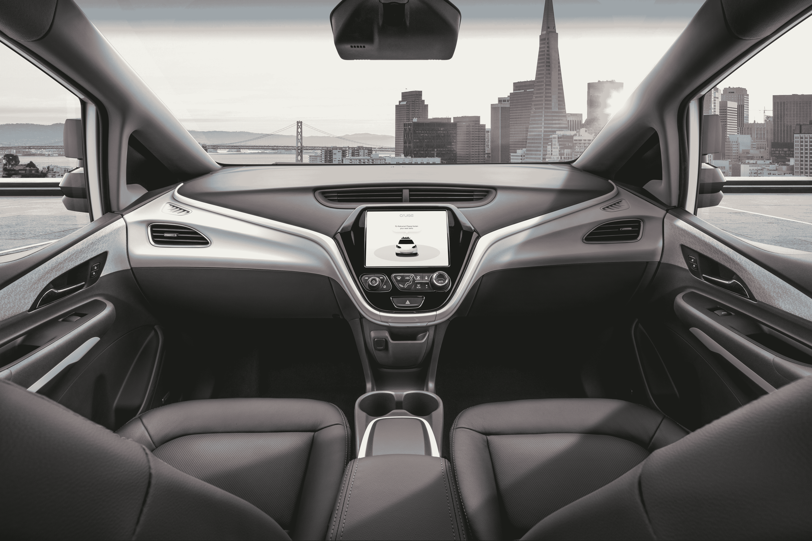

# 通用汽车和 Cruise 发布第四代无方向盘 Cruise AV 

> 原文：<https://web.archive.org/web/https://techcrunch.com/2018/01/11/gm-and-cruise-reveal-their-fourth-generation-steering-wheel-free-cruise-av/>

# 通用汽车和克鲁斯揭示了他们的第四代，无方向盘巡航 AV

通用汽车和 Cruise 在向公众部署自动驾驶汽车的计划上取得了进展:今天，它展示了第四代 Cruise 自动驾驶汽车(AV)，这是在它首次披露第三代汽车后短短几个月内推出的。

第四代汽车是生产准备就绪，根据通用汽车的丹·阿曼，谁讨论了新的车辆在新闻发布会上宣布这一消息。不过，这个版本真的很了不起，因为它没有刹车和油门踏板，也没有任何类型的手动方向盘。

Cruise 并不只是展示这是一个未来的概念，该公司正在向国家公路和交通安全管理局提交一份请愿书，以便能够在 2019 年实际部署它，这一年通用汽车和 Cruise 透露他们希望在去年年底开始运营他们的商业服务。通用汽车正在要求对汽车在道路上行驶的规则进行例外处理，并详细说明他们的变通办法和安全措施。如果获得批准，他们要求的例外将允许他们在 2019 年运营多达 2600 辆汽车。

【YouTube https://www.youtube.com/watch?v=MvP82IsGqNc&w=680&h=383]

基于 Bolt EV 平台，最新的 Cruise AV 是一款全电动汽车，如果乘客在乘坐过程中离开自动驾驶汽车时没有关门，这款新的巡航汽车也可以自己关门。通用汽车解释说，它知道它需要自动开关自己车门的能力，以避免服务中断，如果乘客在车辆外出服务时没有关上自己的车门。

通用汽车和 Cruise 还发布了一份安全报告，提供了许多细节，说明他们采取了哪些措施来确保车辆在街道上的安全。其中包括一系列冗余系统、后座安全气囊等等。

除了再次确认其目标是在 2019 年的某个时候，通用汽车不会进一步阐述其部署计划。Cruise 首席执行官 Kyle Vogt 也表示，即使在明年之前进行测试，我们也不会在街上看到这款新的 Cruise AV。当被问及其他潜在的非螺栓为基础的设计，阿曼拒绝评论具体的未来模式，但暗示了潜在的变化。

“你可以有把握地假设第四代不会是最后一代，”阿曼说，暗示其他未来的迭代可能会使用不同的基础平台或设计，以适应其他类型的乘客和货物装载。