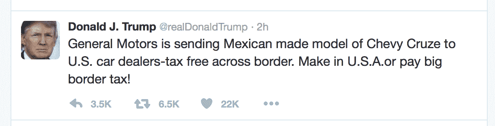

# 通用汽车反驳特朗普关于雪佛兰科鲁兹在墨西哥制造的推特声明

> 原文：<https://web.archive.org/web/https://techcrunch.com/2017/01/03/gm-counters-trumps-twitter-claim-about-chevy-cruze-being-made-in-mexico/>

# 通用汽车反驳特朗普关于雪佛兰科鲁兹在墨西哥制造的推特声明

周二上午，唐纳德·特朗普[发推文](https://web.archive.org/web/20230328084350/https://twitter.com/realDonaldTrump/status/816260343391514624)称，在美国销售的雪佛兰科鲁兹是在墨西哥制造的，并通过美国境内的经销商免税销售。通用汽车发表声明回应了这一说法，澄清了其在美国零售的科鲁兹的确切制造地，原来主要是在俄亥俄州。

通用汽车指出，在美国销售的所有科鲁兹轿车都是在该州的一家工厂制造的，尽管一些为全球市场设计的雪佛兰科鲁兹掀背车在美国本土销售，而且事实上是在墨西哥制造的，但这些车辆中的绝大多数都是出口到其他国际市场。

这不是特朗普第一次认为干预美国公司的制造地点选择是合适的；他之前宣布了与开利的一项协议，以保留这家空调公司在美国的一些工作岗位，尽管这还不是一项确定的协议，而且细节大多被[蒙在鼓里](https://web.archive.org/web/20230328084350/https://www.washingtonpost.com/news/wonk/wp/2016/12/30/the-public-is-being-kept-in-the-dark-about-trumps-deal-with-carrier/?utm_term=.817c256599c1)。

特朗普在这里的说法有一点真实性，但显然是对事实的严重夸大，旨在塑造他精心构建的美国就业救星形象。科鲁兹在美国市场销售轿车车型势不可挡，正如该公司证实的那样，这些车型仅在俄亥俄州的工厂组装。

通用汽车公司声明全文:

> 通用汽车公司在俄亥俄州洛兹敦生产雪佛兰科鲁兹轿车。在美国销售的所有雪佛兰科鲁兹轿车都是在通用位于俄亥俄州洛兹敦的组装厂制造的。通用汽车在墨西哥生产面向全球市场的雪佛兰科鲁兹掀背车，少量在美国销售。