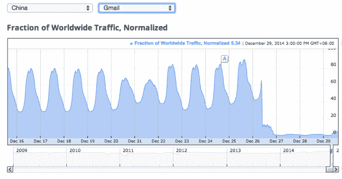

# Gmail 现在在中国更难访问 

> 原文：<https://web.archive.org/web/https://techcrunch.com/2014/12/29/gmail-china-blocked/>

# Gmail 现在在中国甚至更难访问

今年，中国已经让使用谷歌服务变得越来越困难，包括 Gmail。现在，Gmail 用户被禁止使用一种变通方法，这种方法允许他们通过第三方服务访问电子邮件。

以前，人们仍然可以通过苹果邮件和微软 Outlook 等应用程序下载邮件，这些应用程序使用 POP、SMAP 和 IMAP。现在[看来这些服务器](https://web.archive.org/web/20221206152631/https://www.techinasia.com/china-great-firewall-blocks-access-gmail/)也被中国的防火长城屏蔽了。这意味着中国用户将只能通过 VPN 服务访问 Gmail。

谷歌自己的透明度报告显示，从周五开始，来自中国的 Gmail 访问量急剧下降。谷歌亚洲发言人说:“我们已经检查过了，我们这边没有任何问题。”

尽管谷歌自 2006 年推出 Google.cn 以来一直受到审查，但中国最近对其服务施加了更严格的限制。6 月，在天安门广场大屠杀 25 周年之前，中国[屏蔽了几个谷歌网站，包括 Google+、Gchat、Gmail、谷歌日历和谷歌驱动](https://web.archive.org/web/20221206152631/http://mashable.com/2014/06/03/china-blocks-google-tiananmen-square/)。