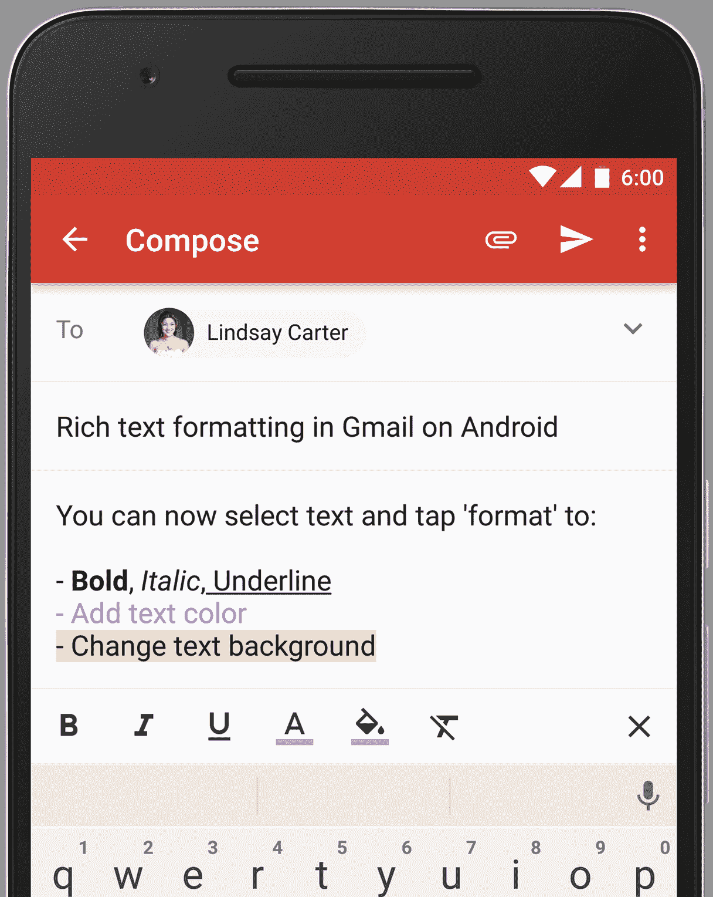

# Gmail For Android 获得丰富的文本格式和即时回复 

> 原文：<https://web.archive.org/web/https://techcrunch.com/2016/02/24/gmail-for-android-gets-rich-text-formatting-and-instant-rsvps/>

# Android 版 Gmail 获得了丰富的文本格式和即时回复

 谷歌今天宣布了安卓上 [Gmail 的两个小而有用的更新:富文本格式和即时回复。](https://web.archive.org/web/20221209064238/https://play.google.com/store/apps/details?id=com.google.android.gm&hl=en)

Gmail 的富文本格式早就可以在网上使用了，但这是谷歌第一次将它带到手机上。格式选项非常简单:你可以加粗，倾斜，下划线，颜色和突出显示文本。可悲的是，你仍然不能在你的信息中链接文本，但至少有粗体文本的选项可能是我所需要的。

即时回复是谷歌从网页版 Gmail 带来的另一个功能。现在，当你收到 Google Calendar 或 Microsoft Exchange 的会议邀请时，你只需点击一下就可以回复，你的日程表也会立即弹出。因此，你现在可以在 Gmail 应用程序中完成所有这些工作，而不必为了确保没有日程冲突而在不同的应用程序之间切换并接受邀请。

值得注意的是，微软的 Outlook 手机版很早就包含了一个非常相似的功能。

谷歌没有说它计划何时将这些功能引入 iOS 版 Gmail 应用程序，但如果我们首先看到它们出现在收件箱中，我其实不会感到惊讶。事实上，鉴于 Inbox 本质上是谷歌的下一代电子邮件客户端，该公司没有首先为 Inbox 推出像富文本编辑这样的功能是令人惊讶的。