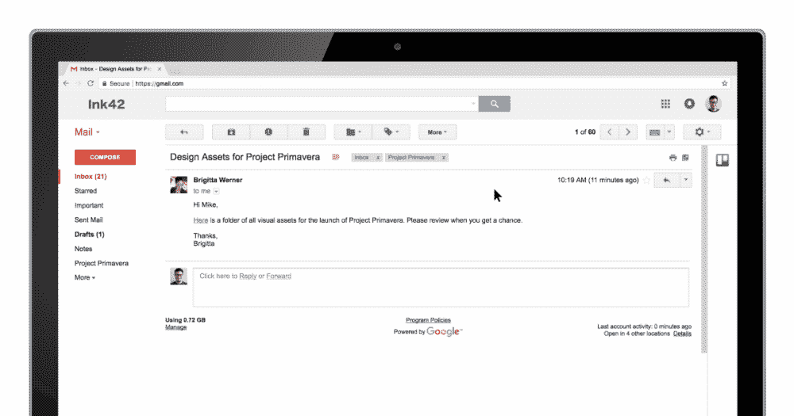
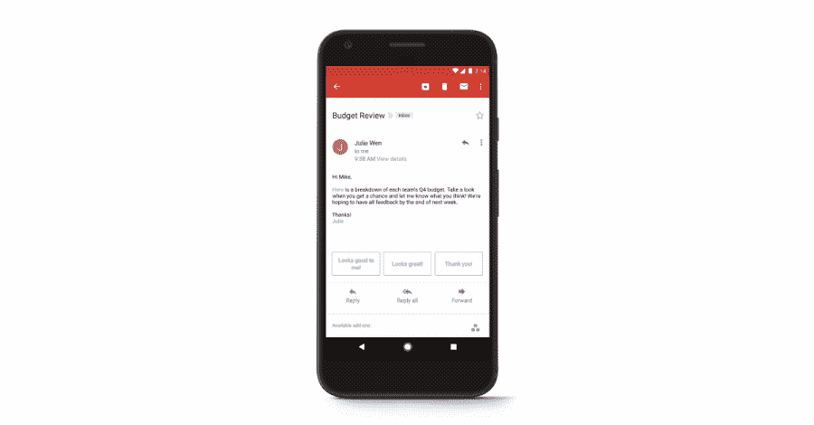

# Gmail 增加了对第三方插件的支持

> 原文：<https://web.archive.org/web/https://techcrunch.com/2017/10/24/gmail-gets-third-party-add-ons/>

谷歌今天将推出 Gmail 第三方插件。这些本机扩展将允许您将 Asana、DocuSign、Trello、Wrike 和其他服务的功能直接带到您的收件箱中——无论您是企业用户还是个人用户。

如果你一直在关注此事，那么这份声明并不完全令人惊讶。该公司首先[在三月份的 I/O 开发者大会上宣布](https://web.archive.org/web/20230406161929/https://techcrunch.com/2017/03/09/google-adds-add-on-support-to-gmail/)这一功能即将到来。不过，当时这只是一个开发者预览版；自那以后，谷歌与许多合作伙伴合作，为 Gmail 带来了第一批原生扩展。

第一批合作伙伴包括 Asana、Dialpad、DocuSign(即将推出)、Hire(由谷歌提供)、Intuit QuickBooks、ProsperWorks、RingCentral、Smartsheet、Streak、Trello 和 Wrike。不出所料，这里的重点是生产力服务，在很大程度上，已经包括了一些与电子邮件的联系。这些插件位于 Gmail 的右侧窗格中(尽管遗憾的是，谷歌的另一个电子邮件客户端 Gmail 的收件箱中没有这些插件)。

Asana 的联合创始人贾斯汀·罗森斯坦(Justin Rosenstein)告诉我，这将允许他的客户更容易地将外部电子邮件中的任务引入工作跟踪服务。它也将允许 Asana 用户看到更多关于任务的细节，这些细节出现在他们直接从 Asana 或其他用户那里收到的电子邮件中。

对于大多数其他集成来说也是如此，无论是让你将电子邮件转化为可操作任务的 Trello 插件，还是让你从收件箱中拨打电话、查看和发送短信的 RingCentral 插件。

令人高兴的是，这些插件也可以在 Android 上的移动 Gmail 应用程序中工作。至于对 iOS 的支持，谷歌发言人告诉我，该公司正在“与苹果合作，为 iOS 用户带来 Gmail 插件。”不过，还不清楚具体什么时候会发生。

作为一个严重依赖 Trello 基于 Chrome 的 Gmail 插件来保持半清醒的人，与 Gmail 原生集成的想法听起来肯定会让生活变得更容易——尤其是因为这种移动集成。

你现在可以从 [G 套件市场](https://web.archive.org/web/20230406161929/https://gsuite.google.com/marketplace/category/works-with-gmail)安装这些集成；如果您是开发人员，您也可以开始为自己的组织创建附加组件。这些 Gmail 插件加入了市场上已经存在的类似的 Google Docs 和 Sheets 工具。

