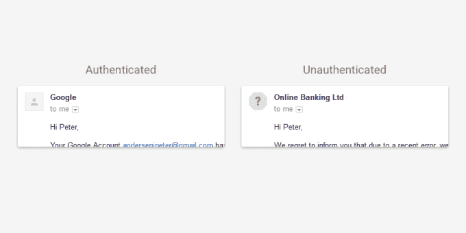

# Gmail 现在会在用户通过不安全的连接收发电子邮件时发出警告 

> 原文：<https://web.archive.org/web/https://techcrunch.com/2016/02/09/gmail-now-warns-users-when-they-send-and-receive-email-over-unsecured-connections/>

谷歌通过在 Gmail 中引入新的认证功能来帮助更好地识别可能有害或不完全安全的电子邮件，来纪念今天的安全互联网日。

[该公司去年表示](https://web.archive.org/web/20230131013110/https://techcrunch.com/2015/11/12/gmail-will-soon-warn-users-when-emails-arrive-over-unencrypted-connections/)将加强安全措施，识别通过未加密连接到达的电子邮件，现在它已经为 Gmail 实施了这一计划，[谷歌刚刚宣布](https://web.archive.org/web/20230131013110/https://techcrunch.com/2016/02/01/gmail-now-has-more-than-1b-monthly-active-users/)的活跃用户已经超过 10 亿。除了标记通过不安全连接发送的电子邮件，谷歌还警告发送邮件的用户。

当用户向账户没有加密的收件人发送电子邮件时，网络版 Gmail 会提醒用户，右上角会有一个小锁。如果你从一个没有加密的账户收到邮件，同样的锁也会出现。

加密对电子邮件很重要，因为它降低了邮件被第三方劫持的可能性。谷歌不久前转向 HTTPS，以确保所有 Gmail 到 Gmail 的电子邮件都是加密的，但并不是所有其他供应商都这样做了。去年，谷歌表示，用户通过其他电子邮件提供商发送到 Gmail 的邮件中有 57%是加密的，而从 Gmail 发出的邮件中有 81%也是加密的。

今天实施的另一项措施是，当用户从一个无法认证的电子邮件帐户收到一封邮件时，向他们显示。如果发件人的个人资料图片是一个问号，这意味着 Gmail 无法验证他们。

身份验证是一种评估电子邮件是网络钓鱼企图还是旨在获取用户数据或信息的另一种恶意攻击的方法。

“如果你从一个大的发件人(如金融机构，或主要的电子邮件提供商，如谷歌，雅虎或 Hotmail)收到一封未经认证的邮件，这封邮件很可能是伪造的，你应该小心回复它或打开任何附件，”[谷歌在其 Gmail 帮助部分解释了](https://web.archive.org/web/20230131013110/https://support.google.com/mail/answer/180707?hl=en&ref_topic=3404236)。

未经认证的电子邮件不一定是危险的，但是，通过这一新指标，谷歌让用户更加了解潜在的威胁，以帮助他们做出更好的在线安全决策。

最后，因为好消息应该是三个一起来的，[谷歌今天](https://web.archive.org/web/20230131013110/http://googledrive.blogspot.com/2016/02/safer-internet-day-2016.html)表示，它将免费为用户提供 2GB 的额外存储空间。要获得免费赠品，只需对你的谷歌账户进行新的安全检查。

谷歌声称这一过程只需两分钟，你可以检查你的恢复信息，哪些设备连接到你的帐户，以及你启用了哪些权限。谷歌去年为更安全的互联网日提供了同样的交易，该公司表示，2GB 的扩展对所有用户开放，包括去年获得 2GB 的用户。(小警告:这项服务不对谷歌工作应用程序或谷歌教育应用程序开放。)

[只需进入您的谷歌账户](https://web.archive.org/web/20230131013110/https://security.google.com/settings/security/secureaccount)即可开始。