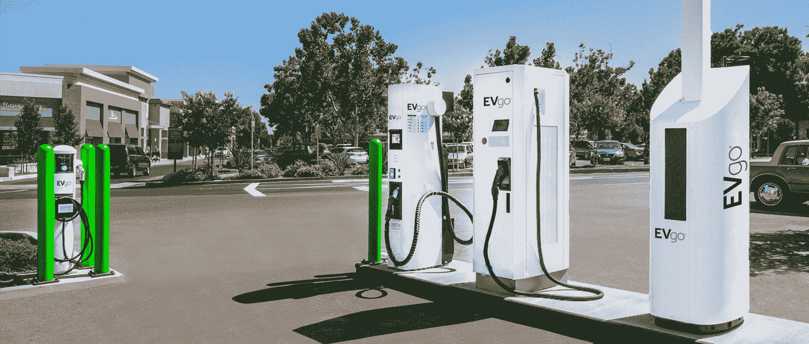

# 通用汽车的 Maven Gig 是为 Gig 经济量身定制的汽车共享服务

> 原文：<https://web.archive.org/web/https://techcrunch.com/2017/05/03/gms-maven-gig-is-a-car-sharing-service-tailor-made-for-the-gig-economy/>

Maven 是通用汽车专门的移动部门，将于周三推出 [Maven Gig](https://web.archive.org/web/20230406022224/http://gig.maven.com/) ，为临时的零工经济工作者提供一种方便的方式，让他们可以在短期内轻松获得车辆，做一些事情，如按需交付杂货和食品，并提供拼车服务。Maven Gig 每周 229 美元，包括保险、无限英里数、免费充电和定期维护，最初提供雪佛兰 Bolt 电动汽车的使用权，因此你可以在需要或想要的时候成为一名自由职业者，并在不需要时轻松归还汽车。

Gig 是 Maven 产品线中的一个新产品，与 Maven City 和 Maven 为 Lyft 司机提供的 Express Drive 计划或其与优步的合作伙伴关系一起，这两者都将与 Gig 一起继续存在。但是对于那些在他们提供的按需服务工作中寻找更多灵活性和范围的人来说，Gig 正是打算提供这种服务。

Maven 的商业移动战略总监 Rachel Bhattacharya 在接受采访时解释说:“我认为这是对我们已经在做的零工经济的补充，也是一种发展。”。“我们不断从我们的租户那里听到的需求之一，以及我们在关于人们如何参与 1099 驱动程序的数据中看到的事情之一是多平台。我们知道，我们的客户真的希望自己赚钱，为他们想要的人开车。每个人赚钱的方式略有不同，他们如何从零工经济中受益最大化，我们希望开放这一点。”

 Maven Gig 将在圣地亚哥推出 forest，目前已经在那里上线，之后将推广到旧金山和洛杉矶。Bhattacharya 告诉我，这些地点对于首次亮相来说是最有意义的，因为结合了司机收入潜力(这些市场看到按需交付和重塑服务的使用比例过高)，还因为这些城市现有的充电基础设施，这要归功于合作伙伴 EVgo，它为 Maven Gig 的螺栓车队提供免费充电地点。

“我们将在其他市场推出，我们正在与(EVgo)密切协调，”Bhattacharya 说。“我们所做的是，在特定市场，以已知的节奏给他们已知的需求。因此，当他们寻求构建和推广他们的基础设施时，他们不必只是猜测性地构建并希望人们出现。我们可以说‘这个月，这个城市，我们将放下这么多螺栓，然后一个月后我们将增加这么多螺栓’，我们可以与他们密切合作。”

这有利于刺激额外电动汽车充电基础设施的发展，这有助于帮助司机舒适地购买和使用电动汽车，另一方面，它也消除了 EVgo 等公司希望通过创建充电网络开展业务的一些风险。到目前为止，Maven 已经在加州的汽车共享服务中部署了超过 100 辆 Bolt 电动汽车，这对 EVgo 充电需求来说是一个重大的福音。

这种基础设施，以及 Bolt 电动汽车在车队部署中的使用，似乎是一种最终可能成为成熟的自动驾驶汽车网络的方法，这是通用汽车过去曾表示 Maven 将帮助的事情。Bhattacharya 说，她不能对他们具体的自主计划发表评论，但 Maven Gig 项目确实在该领域提供了“许多很好的学习机会和协同作用”。

Bhattacharya 告诉我，与此同时，Maven Gig 是 Maven 今天可以为用户提供的另一个扩展，它以有趣的方式补充了该公司现有的类似 ZipCar 的小时租赁模式。

“我们正在做的是，我们给你带来一辆车，你可以在城市计划中供个人使用，你可以在周末外出，你可以旅行，你可以只是在镇上跑腿，如果你只是想支付一两个小时的使用费，那太好了，”她解释道，通过 Maven 如何看待它的程序为司机一起工作。“如果你决定参与零工经济并赚一段时间，你可以用这辆车少则一周，多则一个多月，用它赚钱，当然也可以用于个人用途，尽管你承诺的是一份稍微长一点的合同。如果几个星期后，你赚到了足够的钱去做你想做的任何事情，你可以回到城市计划，只在需要的时候用车。”

虽然 Maven 正在帮助通用汽车找出汽车市场中个人所有权的替代方案，但它也可以帮助按需经济的驾驶员供应方，释放出一个可用的资源库，该资源库具有参与零工经济服务的所有要素，但没有汽车，因为他们主要是城市居民。Maven gig 的官方合作伙伴包括 GrubHub、Instacart、Roadie、优步和 Lyft，但鉴于 Gig 用户选择驾驶的服务的开放性，Gig 可以让所有船只漂浮在太空中。

当然，与租赁相比，Maven Gig 是昂贵的，但这也意味着没有长期承诺，也不需要担心保险、燃料成本和维护。对于越来越希望通过零工经济副业来补充的城市居民来说，这听起来是一个有吸引力的处方。