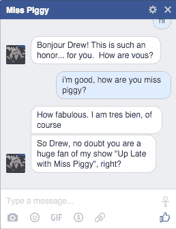

# 在 Facebook Messenger TechCrunch 上与小猪小姐聊天

> 原文：<https://web.archive.org/web/https://techcrunch.com/2015/12/07/go-chat-with-miss-piggy-on-facebook-messenger/>

# 去 Facebook Messenger 上和小猪小姐聊天吧

如果你曾经对自己说“伙计，我很想和布偶中的小猪小姐在 Facebook 上聊天”，现在是你出击的时候了。

嗯，其实不是猪小姐。是 AI 假扮成小猪小姐。很难过，我知道。但这是你能和她聊天的最接近的机会了。抓住朋友、孩子和他们的朋友，开始聊天:

前往她的脸书主页。

以下是科米对这次聊天的评论:

> 我想和猪小姐交谈会让粉丝们很好地了解我每天都在经历什么。我认为每个人都会学到一些东西，而且我会在她和粉丝聊天的时候得到一个小时的平静和安宁。双赢！

这是为每周二晚八点在美国广播公司播出的布偶秀做宣传。这项人工智能技术由迪士尼消费产品和互动媒体实验室开发，由 [Imperson](https://web.archive.org/web/20220927132351/http://www.imperson.com/) 提供技术支持。

习惯这种聊天机器人的促销活动，因为有了 Line、WhatsApp、Messenger 等所有应用，品牌都在排队想分一杯羹。

你会问她什么？