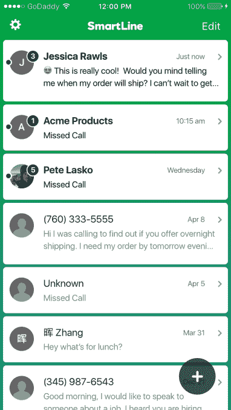

# GoDaddy 推出 SmartLine，为企业提供第二个手机号码 

> 原文：<https://web.archive.org/web/https://techcrunch.com/2017/08/15/godaddy-smartline/>

# GoDaddy 推出 SmartLine，为企业提供第二个手机号码

GoDaddy 可能因其网络域名注册而闻名([这一业务最近一直是头条新闻](https://web.archive.org/web/20221209140009/https://beta.techcrunch.com/2017/08/13/godaddy-tells-white-supremacist-site-daily-stormer-to-find-a-new-domain-provider/)，但它也进入了语音和电话业务，从[去年收购 FreedomVoice](https://web.archive.org/web/20221209140009/http://www.prnewswire.com/news-releases/godaddy-acquires-freedomvoice-to-accelerate-the-delivery-of-communications-services-to-small-businesses-300270256.html) 开始。

今天，该公司推出了一款名为 SmartLine 的新应用程序，旨在解决小企业的基本需求——越来越多的小企业(根据 GoDaddy 的调查，86%)正在使用智能手机进行工作和私人通话，但他们不一定想给每个人自己的个人电话号码。

因此，SmartLine 创建了第二个号码，连接到客户的 iOS 或 Android 设备。明显的对比是谷歌语音，但是 GoDaddy 的高级副总裁兼电话总经理 Barry Saik 说，SmartLine 是不同的，因为“我们类别中的其他产品没有特别关注小企业主。”

因此，有些区别可能看起来相对微妙，但赛克表示，这些区别对 GoDaddy 客户来说很重要，比如在同一个屏幕上显示来电显示(假设它们在你的联系人列表中)和来电来自 SmartLine 的事实(这样你就知道它是与业务相关的)。

其他功能包括从移动应用程序完全配置 SmartLine(无需访问网站)，设置工作时间(以便在工作时间以外的电话直接转到语音邮件)和接收语音邮件转录。

Saik 还指出，SmartLine 应用程序将你与某人的所有互动——包括语音和文本——集中在一个窗口中。

此外，公司还计划推出更多功能，比如虚荣心号码、免费电话号码，以及多个员工的手机共用一个电话号码。

无限制拨打电话和发送短信的 SmartLine 每月收费 9.99 美元。你也可以每月支付 3.99 美元，最多 100 分钟和 100 条短信——赛克说，这种“基本”计划是为那些刚刚起步的客户设计的，他们想要一个专业的电话号码，但他们“不准备使用所有的分钟”