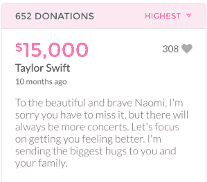
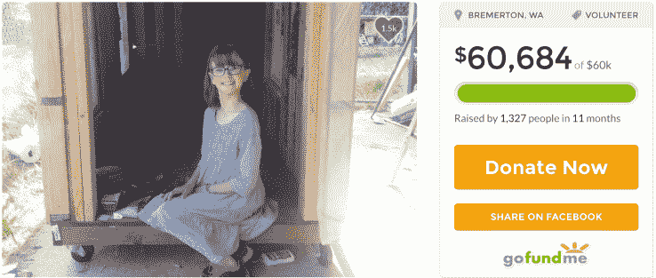
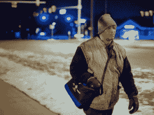
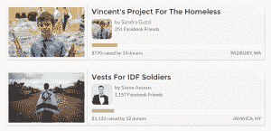

# GoFundMe 在其捐赠平台 TechCrunch 上吸引了 2500 万名捐赠人并筹集了 20 亿美元

> 原文：<https://web.archive.org/web/https://techcrunch.com/2016/05/10/gofundme-2bn-raised/>

[GoFundMe](https://web.archive.org/web/20230129104628/https://www.gofundme.com/) 这几天似乎无处不在；我的社交媒体订阅源离公司为某项事业或目标筹集资金的活动不会太远。

该公司的吸引力很容易理解:它使朋友、家人和社区之间的微小慈善行为成为可能。本周，该平台庆祝其社区突破 2500 万捐赠人的里程碑。

## 巨大成功

是的*那个*泰勒·斯威夫特。

GoFundMe 的成功或许并不令人惊讶；这是泰勒·斯威夫特用来向[捐赠 5 万美元的平台，这个女孩因为癌症治疗而不得不错过她的演唱会](https://web.archive.org/web/20230129104628/https://www.gofundme.com/teamnaomi)(嗯，在他们改变了他们的最大捐赠限额后[)，这是 WWE 明星](https://web.archive.org/web/20230129104628/https://techcrunch.com/2015/07/09/taylor-swift-is-the-best-kind-of-trouble/)用来筹集资金的[，并且经常出现在新闻中——不管是好是坏。](https://web.archive.org/web/20230129104628/https://www.gofundme.com/22vqm7w)

该平台[最近估值约为 6 亿美元](https://web.archive.org/web/20230129104628/https://techcrunch.com/2015/06/22/gofundmes-valuation-rises-to-nearly-600m-650m-in-latest-funding-round/)，旨在将众筹缩小到微观规模，让人们更容易为特定目标从小群体中筹集资金。

鉴于 GoFundMe 收取所有捐款的 5%作为其费用，很容易理解为什么此刻在其办公室里可能会有一场派对。我会让你不必做算术:20 亿的 5%是 1 亿美元，尽管该公司确实将一大笔钱重新捐赠给了自己平台上的事业，但可以肯定的是，慈善事业中有很多钱。

## 范围广阔，充满希望

作为一个平台，GoFundMe 的范围非常广泛，这个网站充满了绝对精彩的故事，这些故事会让你恢复对人性的信心。

以 Hailey's Harvest 为例，一千多人捐款帮助一名 9 岁女孩利用空闲时间建造小型活动房屋，她和她的母亲将这些房屋送给当地无家可归者社区的成员。

海莉得到了媒体的广泛关注和来自世界各地的大量支持，帮助她为她所在城市的无家可归者建造小房子。

詹姆斯·罗伯逊在上班的路上

或者该网站最受欢迎的活动之一如何，筹集了一大笔钱来帮助詹姆斯·罗伯逊买一辆车，在他花了十年时间每天步行 21 英里去上班之后，没有错过——甚至没有迟到——一天。这个故事[在网上疯传](https://web.archive.org/web/20230129104628/https://www.buzzfeed.com/stephaniemcneal/after-story-of-man-who-walks-21-miles-a-day-to-work-goes-vir?utm_term=.auVr471n8K#.uqlaQGPl7D)，互联网上喜欢好故事的人抓住机会帮忙。

## 并非没有挑战

尽管该网站做了很多好事，但也有令人不安的暗流。这可能不是该网站的错——自从有傻瓜和钱以来，欺诈者就一直在采用新技术来让傻瓜从他们的钱中分离出来，但当我浏览活动一个小时左右时，我确实发现了大量不太正确的活动。

平台上可用的活动种类多得惊人。

一些有问题的活动仅仅是乏味的，类似于“我很无聊，给我买个 Playstation”，但我想他们同龄人之间的公开嘲笑最终会消除这种事情。其他竞选活动更令人担忧。在一次活动中，一位单身父亲筹集资金帮助照顾一名残疾儿童，却被反暴力分子包围在活动评论中。在其他情况下，阅读这些活动会让你明白，在掏钱之前做一轮额外的尽职调查是值得的；[发生过不少](https://web.archive.org/web/20230129104628/http://www.wmur.com/news/merrimack-woman-alters-photos-of-injured-son-for-gofundme-page/39109706)诈骗案件，尤其是自然灾害过后的。

该平台通过澄清“捐赠者应该只向他们个人认识和信任的 GoFundMe 用户付款”来解决这个问题，但是，当然，最成功的活动不在这个建议范围内，并且考虑到发现不确定的活动有多容易，也许该是该平台加强监管和调节活动的时候了。

很明显，在众筹领域，像 GoFundMe 这样的网站有一席之地；当它被用来从朋友和家人那里筹集资金时，效果非常好，同伴压力效应与在需要的时候帮助朋友的感觉相结合，是一种有效的鸡尾酒，在基层对人们的生活产生真正的影响。为接下来的 2500 万捐赠者干杯！