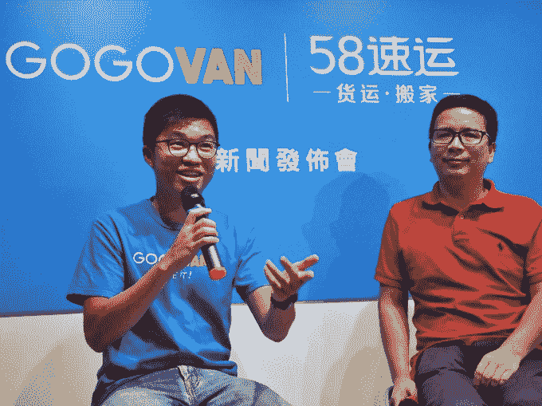

# 合并交易完成后，GoGoVan 成为香港第一家 10 亿美元的初创公司

> 原文：<https://web.archive.org/web/https://techcrunch.com/2017/09/01/gogovan-becomes-hong-kongs-first-1-billion-startup-following-merger-deal/>

在 6 月份的 TechCrunch 中国活动上，我们讨论了香港初创企业的光明前景，尽管面临一些重大挑战。本周，这个国家跨越了一个显著的里程碑，因为它获得了第一家价值 10 亿美元的初创公司，更广为人知的是独角兽。

问题中的公司是 [GoGoVan](https://web.archive.org/web/20230329161131/https://www.gogovan.com.hk/en/) ，一家物流按需提供商，连接货车司机和客户运输货物。GoGoVan 和其他类似的公司，包括香港公司 Lalamove，经常被贴上“送货优步”的标签，但大多数客户来自商界。

GoGoVan 突破了 10 亿美元大关，正是因为它希望超越 B2B 市场。它已经与总部位于中国的 58 速运合并，后者是一家专注于服务消费者的按需物流平台。

除了将以业务为中心的服务与以消费者为中心的产品相结合的战略之外，这笔交易在地理位置上也是互补的。在线分类广告巨头[58.com](https://web.archive.org/web/20230329161131/http://xx.58.com/)旗下的 58 速运在中国 100 多个城市拥有 120 万注册司机，而 GoGoVan 则在中国八个城市以及中国大陆、台湾、新加坡、韩国和印度拥有业务。

合并后的实体将被称为 GoGoVan，计划将这两项业务整合在一起，在 58 Suyun 的地点提供 GoGoVan 服务，并将 58 Suyun 的服务带到中国以外。新成立的公司估值超过 10 亿美元，其首席执行官 Steven Lam 在接受 TechCrunch 采访时表示。

“这笔交易对双方都非常有意义，”Lam 说。“我们在东南亚和中国的重点是 B2b，这与 58 完全不同，58 在消费者市场。我们在中国和东南亚的一些国家处于领先地位，我们可以在东南亚和其他地区做得更多。”

> GoGoVan 首席执行官 Steven Lam 和 58 到家首席执行官陈晓华在宣布合并交易的活动上

还有一个共同投资人。[阿里巴巴通过其创业基金](https://web.archive.org/web/20230329161131/https://techcrunch.com/2016/05/06/alibabas-hong-kong-fund-invests-in-three-e-commerce-startups/)投资 GoGoVan，[在 2015 年的一轮 3 亿美元融资中，阿里巴巴支持 58.com 的 58 到家子公司](https://web.archive.org/web/20230329161131/http://www.prnewswire.com/news-releases/58com-subsidiary-58-home-raises-us300-million-in-series-a-funding-300157755.html)，后者运营 58 速运。GoGoVan 是由五位香港创始人于 2014 年创立的[，已经从投资者那里筹集了超过 2600 万美元，尽管其最近的 C 轮融资尚未披露。](https://web.archive.org/web/20230329161131/https://techcrunch.com/2014/06/19/gogovan-wants-to-be-the-uber-of-delivery-for-asia/)

Lam 表示，该公司希望通过这笔交易筹集 2 亿美元以上的资金，用于明年拓展两三个新市场。2019 年，他希望走出亚洲，或许进入澳大利亚和欧洲，并将公司上市。

“计划是为了确保公司做好上市准备，但这取决于市场形势。如果我们真的可以盈利，我们甚至可以保持私有，”Lam 解释道。他补充说，香港可能是 IPO 的目的地，但 GoGoVan 也对在美国上市持开放态度，科技公司对香港的兴趣越来越大。

GoGoVan 并不是唯一有这种野心的人。Lalamove 也开始探索上市的机会。[今年早些时候，它从投资者那里筹集了 3000 万美元](https://web.archive.org/web/20230329161131/https://techcrunch.com/2017/01/10/lalamove-series-b/),其国际业务负责人表示，它将寻求在 2020 年前进行首次公开募股，最有可能在香港进行。