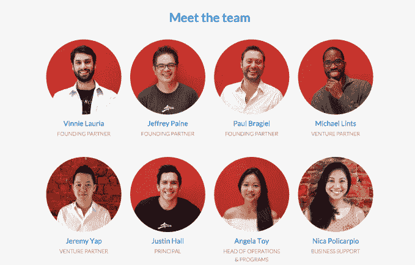
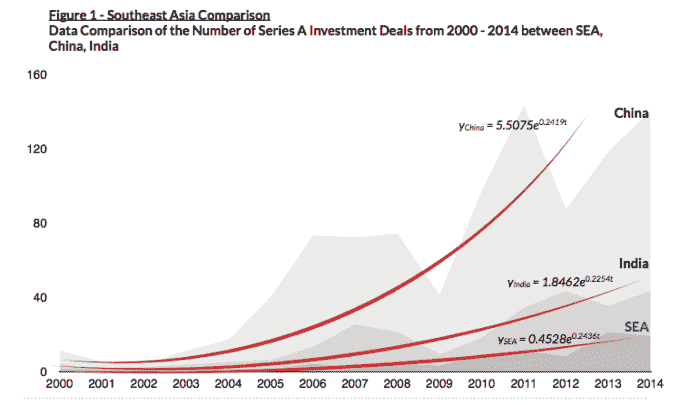

# 金门投资公司为东南亚设立了 5000 万美元的基金

> 原文：<https://web.archive.org/web/https://techcrunch.com/2015/07/28/golden-gate-ventures-50-million-southeast-asia/>

创始人，[集合](https://web.archive.org/web/20230404221107/https://www.youtube.com/watch?v=JAUoeqvedMo)！东南亚有一只熟悉面孔的新基金。总部位于新加坡的[金门风险投资](https://web.archive.org/web/20230404221107/http://goldengate.vc/)刚刚宣布了其第二笔 5000 万美元的基金，以支持该地区的初创公司和希望搬到那里的国际公司。

这家由三位美国企业家于 2012 年创立的公司已经从一系列知名投资者那里获得了 3500 万美元的初始资金，这些投资者包括新加坡政府基金淡马锡(Temasek)、欧洲的 Monitor Capital Partners、脸书联合创始人爱德华多·萨维林以及即时通讯应用 Line 背后的韩国公司 Naver。

创始合伙人姚一奇·劳里亚是一名美国人，在周游世界期间对新加坡印象深刻，于 2011 年定居新加坡，他告诉 TechCrunch，该基金将分为两部分，以覆盖早期种子投资——与第一只基金的重点相同——以及首轮后续交易。

Lauria 解释说，进入 A 轮交易背后的理由有两个:增加对有前景增长的投资组合公司的承诺，以及为投资公司在种子期没有继续发展的初创公司提供一个工具。

到目前为止，金门投资公司的突出交易包括 Redmart，[一家在新加坡经营的在线杂货商](https://web.archive.org/web/20230404221107/https://techcrunch.com/2014/01/22/singapore-online-grocer-redmart-raises-5-4m-from-investors-including-facebook-co-founder/)，Carousell，[一家同样由日本在线零售巨头乐天支持的社交商务初创公司](https://web.archive.org/web/20230404221107/https://techcrunch.com/2014/11/26/carousell-seriesa/)，以及[一家软件即服务公司，最近完成了 650 万美元的 A 轮融资](https://web.archive.org/web/20230404221107/https://techcrunch.com/2015/04/21/tradegecko-seriesa/)。

Lauria 证实，新基金的重点将与以前大致相同，特别是在电子商务、支付和市场领域运营的初创公司。

“我们几乎是垂直不可知论者，”Lauria 在一次采访中告诉 TechCrunch，她于 2010 年离开了美国论坛初创公司 Lefora。“我们进入了对消费者有感觉的互联网相关服务，但倾向于远离纯粹的企业游戏。”

## 声誉良好的赞助者

东南亚以外的大型科技公司正作为新基金的有限合伙人进入该地区的初创企业领域——例如，雅虎日本(Yahoo Japan)上个月投资了蒙克希尔风险投资公司(Monk's Hill Ventures)的基金——金门风险投资公司(Golden Gate Ventures)也延续了这一趋势。

因与马克·扎克伯格共同创建脸书而闻名的爱德华多·萨维林，自 2012 年放弃美国国籍以来一直居住在新加坡。萨维林保持低调，但他增加了对东南亚初创公司的投资，包括与 [Nitrous 的交易。IO](https://web.archive.org/web/20230404221107/https://techcrunch.com/2014/03/18/cloud-development-platform-nitrous-io-closes-6-65m-series-a-round-led-by-bessemer/) 、[房产门户网站 99.co](https://web.archive.org/web/20230404221107/https://techcrunch.com/2015/01/29/99-co-sequoia-saverin/)、Redmart 和[媒体公司亚洲科技](https://web.archive.org/web/20230404221107/https://techcrunch.com/2015/06/21/oh-hai-guys/)。鉴于他过去曾与金门风险投资公司(Golden Gate Ventures)达成交易，他被纳入有限合伙人名单很有意义。

收购聊天应用 Line 背后价值数十亿美元的公司 Naver 的可能性较小。Line 拥有 2.05 亿月活跃用户，预计今年上市。东南亚是其业务的一个关键地区，它已经在泰国取得了突破，泰国的活跃用户数超过了脸书。Lauria 表示，通过成为该基金的有限合伙人，Naver 希望获得潜在 M&A 活动和合作伙伴的交易流，同时也为风投公司提供战略利益。

“Naver 是我们的战略合作伙伴，原因有二。第一，Line messenger 在该地区非常受欢迎，可以帮助我们的投资组合公司。其次，作为一家大型的泛亚洲公司，Naver 对早期阶段的公司有深入的了解，这些公司可能会产生后期阶段的增长投资。

## 东南亚崛起

金门投资公司现在有八名员工，是最初员工人数的两倍多，可以理解的是，它对东南亚创业生态系统的发展方向充满信心。Compass 上周的一份报告发现该地区是世界上发展最快的地区之一，随后 Compass 在[发布了自己的研究](https://web.archive.org/web/20230404221107/http://goldengate.vc/wp-content/uploads/2015/07/Asia-VC-Investment-Report.pdf)，该公司认为，这表明事情才刚刚开始。

金门投资公司(Golden Gate Ventures)的团队结合德里经济学院(Delhi School of Economics)和皇后大学(Queen's University)的分析得出的这份“竹子报告”(Bamboo Report)将东南亚的投资现状与 2004 年的中国和 2011 年前后的印度进行了对比。

劳里亚承认，新加坡仍是东南亚的风险投资中心，该地区不会达到这些十亿人口国家的规模，但他认为这些发现将让投资者有理由认真关注东南亚。

“报告显示，我们正处于东南亚增长曲线的早期，而中国现在确实在放缓。仍然有很多机会，特别是对那些现在带着疑问看待中国的投资者来说，”Lauria 说。

Lauria 在公司的新闻发布会上发表声明补充道:

> 如果你想在亚洲投资，中国不仅价格过高，而且开始降温。本月早些时候，中国证券监督管理委员会(CSRC)甚至暂停了科技股的 IPO，自那以来，这一行动已经阻碍了多达 28 宗 IPO。与此同时，东南亚在开发和投资方面以低得多的估值实现了爆炸式增长——这就像时光倒流，进入了中国科技领域的底层。

不过，劳里亚补充说，这不仅仅是纯粹的投资现金。创业场景本身和其中的参与者也在走向成熟。他说，他认为现在的企业家经验越来越丰富，比如 Redmart(是的，一家金门投资公司)的首席执行官罗杰·伊根(Roger Egan)，他已经花了三到四年的时间经营公司，这意味着有更多的洞察力将帮助新的创始人和初创公司发展。

“人们站在别人的肩膀上建设，使得硅谷如此强大，”劳里亚说道。“你现在在中国看到了这一点，但在东南亚，我们还需要几年时间。”

金门风险投资公司的新基金预计将在未来三年覆盖约 20 笔交易。迄今为止，该公司已经在 7 个国家投资了超过 25 家初创企业。