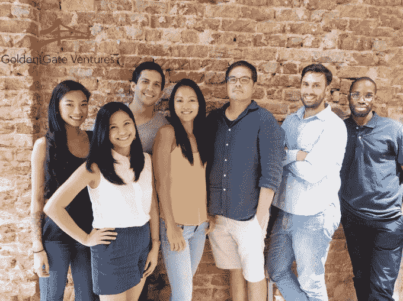

# 金门投资公司首次为东南亚投资 1 亿美元新基金

> 原文：<https://web.archive.org/web/https://techcrunch.com/2018/07/31/golden-gate-ventures-hits-first-close-on-new-100m-fund-for-southeast-asia/>

观察一个新兴的创业生态系统的一个迷人之处在于，不仅仅是公司在扩大规模，为它们提供资金的风投公司也在增长。这一点也许在金门投资公司(Golden Gate Ventures)身上得到了最好的体现，这是一家总部位于新加坡的公司，由三名硅谷企业家于 2011 年创立，即将关闭一家面向东南亚的大型新基金。

在[于 2015 年筹集到价值 6000 万美元的第二笔资金](https://web.archive.org/web/20230405024719/https://techcrunch.com/2016/06/14/golden-gate-ventures-closes-new-60-million-fund-for-southeast-asia/)之前，金门公司一开始只有一个小型种子投资基金。一位知情人士告诉 TechCrunch，现在它正处于敲定一只新的 1 亿美元基金的最后阶段，该基金已经完成了超过 6500 万美元的承诺。

[6 月份提交给美国证券交易委员会的一份文件首次显示该公司打算融资 1 亿美元。消息人士告诉 TechCrunch，金门之前基金的一些有限合伙人已经签约，包括 Naver，而由软银董事长孙正义的哥哥 Taizo 经营的 Mistletoe 公司是新加入的支持者之一。](https://web.archive.org/web/20230405024719/https://www.sec.gov/Archives/edgar/data/1744309/000174430918000001/xslFormDX01/primary_doc.xml)

金门现有的有限合伙人还包括新加坡主权基金淡马锡、脸书联合创始人爱德华多·萨维林和韩国韩华。

预计该基金将在今年年底前完全关闭。

该公司迄今已进行了 40 多项投资，其投资组合包括移动分类广告服务 Carousell、汽车销售初创公司 Carro、房地产网站 99.co 和支付网关 Omise。TechCrunch 明白，该公司对这只新基金的投资理念将保持不变。当它筹集第二只基金时，创始合伙人姚一奇·劳里亚告诉我们，金门已经找到了早期投资的对手，它将像它支持的公司一样保持精干和灵活。

然而，内部的一个重大变化是贾斯汀霍尔被提升为该基金的合伙人。他加入了 Lauria、创始合伙人 Jeffrey Paine 和 Michael Lints 的合伙人行列。

霍尔最初于 2012 年以实习生身份加入金门，当时还是一名学生，之后于 2013 年成为全职员工。他的升迁体现了东南亚初创企业在那个时期的成长和发展——这不仅仅局限于初创企业本身。

大约在 2016 年，金门投资公司团队增加了新成员

随着乘车共享公司 Grab and Go-Jek、旅游初创公司 Traveloka 和 Tokopedia 等电子商务公司等独角兽的出现，东南亚已经开始在一个拥有超过 6.5 亿消费者和超过 3 亿互联网用户的市场上展示出本土科技公司的潜力。这些公司的出现激发了投资者的兴趣，为风投及其基金提供了资金，而这些资金是它们的生命线。

金门并不是唯一一个筹集大笔资金的公司。Openspace，前身为 NSI Ventures(T1)，[正在为其第二只基金](https://web.archive.org/web/20230405024719/https://techcrunch.com/2017/12/13/nsi-ventures-125-million-southeast-asia-fund-two/)筹集 1.25 亿美元， [Jungle Ventures 据说正在计划一只 1.5 亿美元的基金](https://web.archive.org/web/20230405024719/https://www.dealstreetasia.com/stories/jungle-ventures-fund-101847/)，新加坡的 [Golden Equator 和 Korea Investment Partners 有一只 8800 万美元的联合基金](https://web.archive.org/web/20230405024719/https://techcrunch.com/2018/07/15/gec-kip-fund-southeast-asia-88-million/)，而[淡马锡关联的 Vertex 去年关闭了一只创纪录的 2.1 亿美元基金](https://web.archive.org/web/20230405024719/https://techcrunch.com/2017/10/10/vertex-ventures-210-million-southeast-asia-india/)。

增长潜力是主要原因，但与此同时，基金开始关注通过退出实现有限合伙人的回报，这具有挑战性，因为迄今为止，东南亚很少有大规模的收购或公开上市。但是，对于规模较小的基金来说，结果已经很有希望了。

跟踪全球投资资金的 Preqin 的数据显示，金门的第一只基金的回报率已经超过 4 倍，而第二只基金的回报率为 1.3 倍，尽管最终收盘是在 2016 年。

除了任何二次出售——随着更多投资资本的涌入，早期支持者出售少数股权并不罕见——金门的退出包括[将 Redmart 出售给 Lazada](https://web.archive.org/web/20230405024719/https://techcrunch.com/2016/11/01/alibaba-lazada-redmart-confirmed/) (尽管不是重磅炸弹) [Priceline 收购 woomo](https://web.archive.org/web/20230405024719/https://techcrunch.com/2016/05/24/taipei-based-startup-woomoo-acqui-hired-by-priceline/)、 [Line 收购 Temanjalan](https://web.archive.org/web/20230405024719/https://www.digitalnewsasia.com/business/line-acquires-indonesian-startup-temanjalan) 以及[将马攀(原 Ruma)出售给 Go-Jek](https://web.archive.org/web/20230405024719/https://techcrunch.com/2017/12/14/go-jek-buys-three-startups-to-advance-its-mobile-payment-business/) 。