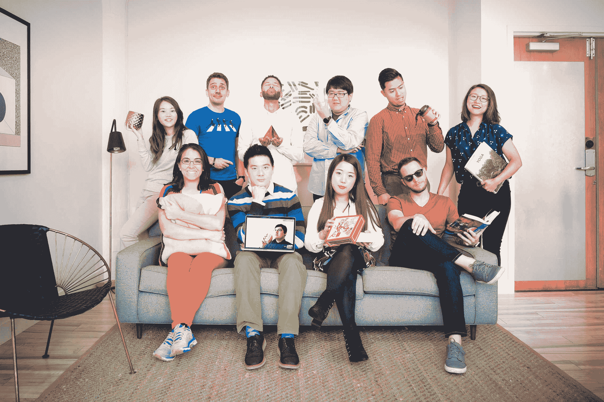

# GoodTime nabs $2M 将求职者与面试官匹配，以节省时间并建立融洽关系 

> 原文：<https://web.archive.org/web/https://techcrunch.com/2017/08/21/goodtime-nabs-2m-to-match-job-applicants-with-interviewers-to-save-time-and-build-rapport/>

# GoodTime nabs $2M 将求职者与面试官匹配，以节省时间并建立融洽关系

尽管有无数的尝试和数百万的风险投资，日历，一个最普遍的工作工具，在我的记忆中基本上没有改变。为了让日历变得过时，Ahryun Moon、Jasper Sone 和李家杰, [GoodTime](https://web.archive.org/web/20221025222925/http://www.goodtime.io/) 的联合创始人没有改写日历，而是将日历放在最前面和中心——作为理解人们的一种方式。

有了由[大盆地资本](https://web.archive.org/web/20221025222925/https://www.bigbasincapital.com/)和[华登风险投资](https://web.archive.org/web/20221025222925/http://www.waldenintl.com/usa/index.aspx)领投的 200 万美元种子融资，GoodTime 的远大愿景开始体现为一个人力资源工具。通过少量的自然语言处理，GoodTime 正在帮助招聘团队将求职者与合适的面试官匹配起来。

在竞争激烈的招聘环境中，将顶尖候选人与有工作经验或大学背景的面试官适当配对，可能是说服那个人接受这份工作的关键。当然，这个想法并不新鲜；招聘人员通常会花大量时间手动检查日历，以协调日程和牵线搭桥。

“我遇到了一位来自 CoinBase 的招聘人员，她花了半天时间安排面试，”Moon 告诉我。

GoodTime 与申请人跟踪系统集成，以获取候选人的信息。然后将这些数据与当前员工的基本详细信息配对。这些信息并不难提取，但确实来自无数意想不到的地方——电子表格、各种文档等等。

“通常在人工智能领域，人们认为机器会复制人类会做的事情，”Sone 谈到生态系统中采取更以机器人为中心的方法的其他人时说。“我们发现，尽管这是一个很酷的应用程序，但候选人不想花更多的时间来来回回。”

团队快乐时光

所有这些都是有帮助的，它节省了招聘人员大量的时间，但这只是 GoodTime 愿景的一小部分。问题的另一半是挖掘日历，将重要会议与垃圾提醒和其他不重要的日历项目区分开来。

我们都为以这样一种方式填写日历而感到内疚，那种方式只对我们有意义。电子邮件提醒放在 eclipse 提醒旁边，我们为可选的全体会议电话留出时间，即使我们无意参加。

不幸的是，这使得机器很难自动安排和优化面试。因此，该团队正在努力增加解释日历项目重要性的功能。有了人的参与，GoodTime 将能够通过对事件进行分类，将重要的采访安排在生日提醒之前。

GoodTime 已经设法吸引了一些早期用户。Airbnb 正在付费使用该平台来协调其工程面试。该公司还发现产品市场适合与条纹，图钉和其他。其中一些用例还包括帮助面试小组多样化。

除了人力资源，该团队还将日历中的潜力视为帮助人们优化日常生活的一种方式。这家初创公司希望在销售和工程领域招聘一些关键员工，特别是在机器学习领域。