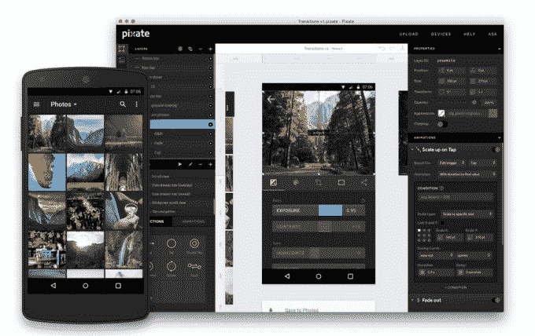

# 谷歌收购移动应用原型工具 Pixate 

> 原文：<https://web.archive.org/web/https://techcrunch.com/2015/07/21/google-acquires-mobile-app-prototyping-tool-pixate/>

# 谷歌收购移动应用原型工具 Pixate

两家公司都证实，谷歌今天收购了移动应用原型工具 Pixate。2013 年，Pixate 已经从 Accel Partners 筹集了 380 万美元。它之前已经从 Y-Combinator 烤箱中弹出来了(YC S12)。

以下是 Pixate 首席执行官保罗·科尔顿[今天在博客](https://web.archive.org/web/20230228185445/http://blog.pixate.com/post/124673189563/google)上分享的关于这一举措的内容:

> 今天，我非常自豪地宣布，Pixate 已经加入谷歌的设计团队。
> 
> Pixate 成立于三年前，其目标是让原生移动应用的设计和原型制作变得更容易、更容易。我们的早期采用者帮助我们沿着制作工具和服务的道路前进，这些工具和服务最适合那些努力将想法变为现实的设计师的需求。今天，我们有各种规模的公司，从单人创业公司到全球公司，都在使用 Pixate 将他们的应用程序想法变为现实。
> 
> 我们不想就此止步。我们在 Pixate 的小团队有一些非常大的想法，在谷歌的帮助下，我们将能够把这些想法带到大规模的设计社区。对于成千上万的设计师来说，我们已经成为了工作流程中必不可少的一部分，并且对于将我们在谷歌的使命扩展到全球数百万的产品团队感到非常兴奋。
> 
> 从今天开始，我们将免费提供 Pixate Studio，并大幅降低 Pixate 云服务的成本。你可以在我们的常见问题中读到这些。我真诚地感谢你们所有人宝贵的反馈和你们用 Pixate 创造的无穷无尽的鼓舞人心的原型。设计工具的前景正在迅速变化，Pixate 致力于走在最前沿。

[据谷歌](https://web.archive.org/web/20230228185445/https://www.google.com/design/articles/introducing-pixate-and-form-1-3/)称，该团队将融入设计团队正在做的事情:

> 我们激动地宣布 Pixate 已经加入谷歌！Pixate 增加了我们开发新的设计和原型工具的努力，包括 Form 1.3。下面探索这两款产品的最新功能，并查看我们与谷歌设计副总裁马蒂亚斯·杜阿尔特(Matias Duarte)以及 Pixate 和 Form 的创始人的圆桌对话。

谷歌不断发展的设计能力在过去几年里一直在展示，但似乎人们现在才注意到。

该公司之前已经推出了他们的服务的几个层次，完全专注于原型开发，但承诺在某个时候进入“开发人员交接”，以改善从设计师到开发团队的工作流程。

听起来这将在谷歌实现，因为很明显，根据他们的[acquisition FAQ](https://web.archive.org/web/20230228185445/http://www.pixate.com/pixate-google-faq/)(TM)，该应用程序不会被关闭:

> Pixate 将继续作为独立产品，不会中断服务或支持。