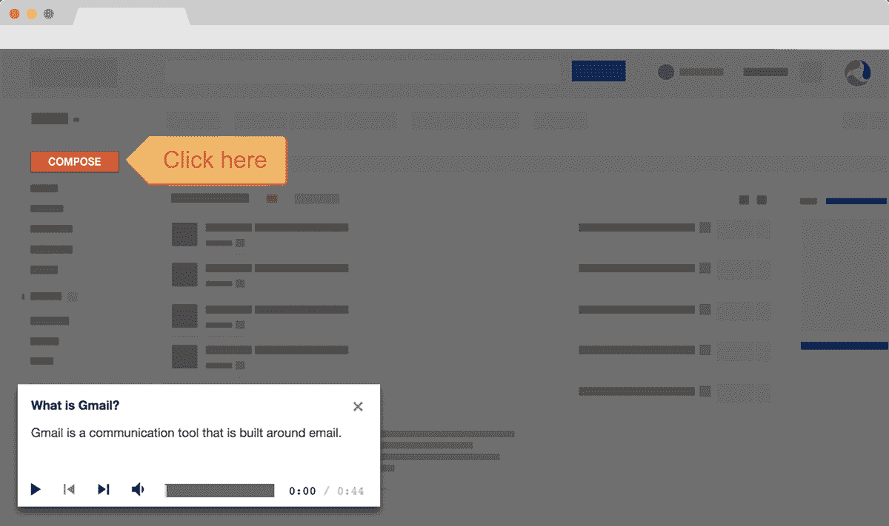

# 谷歌收购 Synergyse，这是谷歌应用程序 TechCrunch 的一项互动培训服务

> 原文：<https://web.archive.org/web/https://techcrunch.com/2016/05/02/google-acquires-synergyse-an-interactive-training-service-for-google-apps/>

# 谷歌收购了谷歌应用程序的互动培训服务 Synergyse

谷歌已经收购了总部位于多伦多的谷歌工作应用程序互动培训服务公司 Synergyse，该公司由一群前谷歌员工于 2013 年创立于 T2。作为此次收购的一部分，谷歌将在[向所有谷歌应用程序客户免费提供](https://web.archive.org/web/20221006105351/https://chrome.google.com/webstore/detail/synergyse-training-for-go/idkloemkmldbemijiamdiolojbffnjlh)针对谷歌应用程序的 Synergyse 培训。

该公司没有披露交易的财务条款。根据 CrunchBase 的消息，Synergyse 没有筹集任何外部资金。

虽然弄清楚如何在工作中使用谷歌应用程序似乎是微不足道的，但实际上对这种培训有相当大的需求。Synergyse 表示，到目前为止，它的服务已经在 3000 个组织中培训了 400 多万人。这可能使它成为谷歌应用程序最受欢迎的培训服务。

谷歌还指出，使用这一培训项目的公司发现“跨应用产品的采用率平均高出 35%。”

以下是 Synergyse 对该公司[不可思议的旅程](https://web.archive.org/web/20221006105351/http://ourincrediblejourney.tumblr.com/)的描述:“通过加入谷歌应用程序团队，我们可以加快我们的使命，因为我们将与构建谷歌应用程序的团队更加密切地合作。以更快的速度推进我们的使命对于 Synergyse 团队来说是非常令人兴奋的，我们的客户将在我们前进的过程中直接看到好处。”

Synergyse 的服务也建立在谷歌的云平台之上，这肯定不会伤害到它，这应该会使它与谷歌自己的服务相集成相对容易

谷歌表示，它将在今年晚些时候将 Synergyse 集成到自己的产品中。现有客户将能够继续使用这项服务，新客户现在可以免费下载[Chrome 扩展](https://web.archive.org/web/20221006105351/https://chrome.google.com/webstore/detail/synergyse-training-for-go/idkloemkmldbemijiamdiolojbffnjlh?hl=en)。