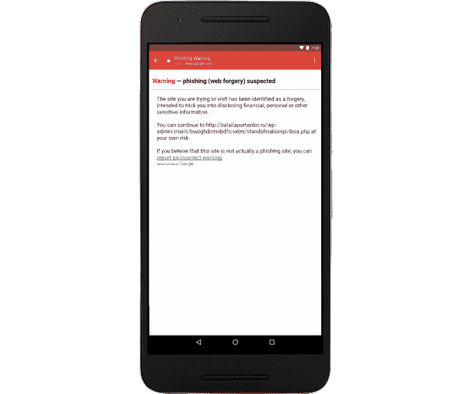

# 谷歌在安卓的 Gmail 上增加了网络钓鱼保护技术

> 原文：<https://web.archive.org/web/https://techcrunch.com/2017/05/04/google-adds-phishing-protection-to-gmail-on-android/>

继本周影响谷歌文档和 Gmail 用户的“T0”大范围网络钓鱼诈骗“T1”后，谷歌表示,“T2”公司正在安卓系统的 Gmail 应用程序中推出一项新的安全功能“T3 ”,该功能将有助于提醒用户注意可疑链接。然而，该功能可能无法阻止本周的攻击，因为该攻击涉及一个恶意的假“谷歌文档”应用程序，该应用程序托管在谷歌自己的域中。

然而，考虑到有多少用户通过手机访问 Gmail，而且这些网络钓鱼攻击越来越复杂，甚至可以愚弄相当精通技术的个人，额外的安全保护是朝着正确的方向迈出的一步。

例如，在本周的[袭击](https://web.archive.org/web/20230123112008/https://techcrunch.com/2017/05/03/psa-this-google-doc-scam-is-spreading-fast-and-will-email-everyone-you-know/)中，您会收到一位已知联系人的电子邮件，他说他们正在与您共享一份文件。当你点击打开文档时，你会被带到一个由谷歌托管的看起来很无辜的网页上。该页面甚至不会提示您输入密码，而是列出了所有可以点击的谷歌账户。

你会被要求给一个名为“谷歌文档”的应用程序帐户权限，但它不是真正的谷歌文档。一旦它可以访问，蠕虫就开始传播到您联系人列表中的每个人。

Android 版 Gmail 应用程序中新的网络钓鱼保护依赖于[谷歌的安全浏览](https://web.archive.org/web/20230123112008/https://www.google.com/transparencyreport/safebrowsing/?hl=en)技术，如果网络用户将要访问一个假冒合法网站的页面，如银行、在线商店或任何其他试图欺骗你分享用户名和密码信息的网站，该技术可以警告网络用户。

在 Gmail 中，如果你点击电子邮件中的可疑链接，应用程序将显示一条警告信息，内容如下:

> *您试图访问的网站已被识别为伪造网站，旨在欺骗您披露财务、个人或其他敏感信息。*

然后，它会通知您，如果您选择继续访问该网站，风险自负。

最近的网络钓鱼攻击似乎不太可能在发生时被该系统标记出来，因为它是谷歌自己域上的托管应用程序。

谷歌周三表示，已经对影响 Gmail 和谷歌文档用户的网络钓鱼攻击采取了行动。它禁用了违规账户。移除了虚假页面，并通过安全浏览及其滥用团队推送更新。该公司还要求用户在 Gmail 中报告任何可疑的钓鱼邮件。

新的移动功能将于本周向 Android 上的 Gmail 用户推出。