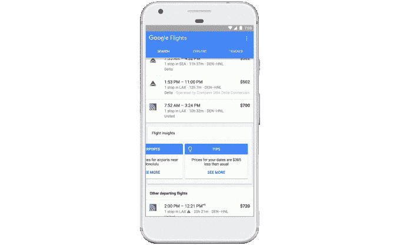

# 谷歌为谷歌航班、谷歌旅行和酒店搜索增加了价格跟踪和交易功能 

> 原文：<https://web.archive.org/web/https://techcrunch.com/2017/12/14/google-adds-price-tracking-and-deals-to-google-flights-google-trips-and-hotel-search/>

谷歌今天正在为使用谷歌服务的旅行者扩展其预订功能，包括旅行、航班和酒店搜索，重点是帮助人们找到更好的价格。例如，谷歌现在可以告诉你购买机票的最佳时间，或者查看何时房价更高，等等。

这些价格跟踪功能类似于 Kayak 等其他旅游服务以及 Hopper 等初创公司已经提供的功能。现在，谷歌正在利用这些服务的一个与众不同的特点，让在网上搜索旅游信息的每个人都能更广泛地使用它。

通过谷歌航班，该公司正在利用机器学习技术来分析历史价格数据，以通知您何时是预订航班的最佳时间。输入目的地后，你会收到类似“价格不会再降了”或“价格低于正常水平”的提示，以帮助你确定是应该现在预订还是等待。这些提示出现在你的搜索结果上面，对那些日期可能比较灵活的休闲旅行者更有用。

航班搜索价格跟踪正在全球范围内推出，包括桌面和移动设备。

与此同时，谷歌的酒店搜索结果将提供同类信息。在谷歌上搜索一家酒店后，你会看到由于当地事件，房价是否比平时更高，或者该地区是否比平时更繁忙。你也可以选择接收关于价格波动的电子邮件提醒，从明年年初开始在桌面上发布。

这种价格跟踪在全球范围内以所有语言在手机上提供。

[gallery ids="1578273，1578274"]

酒店价格跟踪的增加可能是受欢迎的预订应用 Hopper 特别关注的，该应用[最近刚刚开始提供酒店价格跟踪](https://web.archive.org/web/20221208123708/https://beta.techcrunch.com/2017/10/25/hopper-expands-its-price-prediction-technology-to-hotels-initially-in-nyc/)——但仅限于有限的市场。现在它也必须在这一领域与谷歌竞争。

最后，谷歌还在其 iOS 和 Android 版的 Google Trips 移动应用程序中添加了打折机票和旅游的信息。

Google Trips 应用程序是在一年多前作为一个个性化的旅行计划程序推出的。但谷歌将把它的旅游预订功能整合到这里也是有意义的，而不是仅仅成为利用谷歌地图数据的另一种方式。

新的门票和旅游优惠将出现在应用程序中您正在访问的城市，并将以英语、法语、意大利语、德语、西班牙语和葡萄牙语在全球推出。