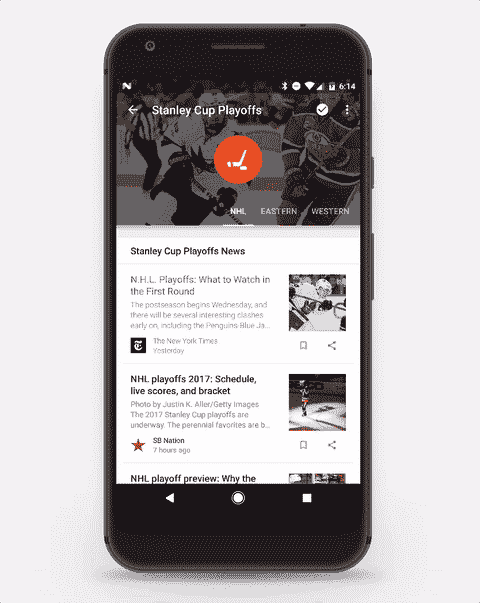
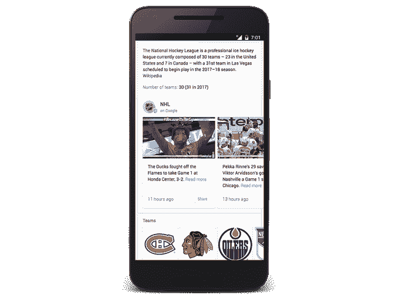

# 谷歌将 NHL & NBA 的实时更新直接添加到其搜索结果中 

> 原文：<https://web.archive.org/web/https://techcrunch.com/2017/04/17/google-adds-real-time-updates-from-the-nhl-nba-directly-to-its-search-results/>

谷歌[今天下午宣布](https://web.archive.org/web/20221006235610/https://blog.google/products/search/want-score-playoff-season-shoot-over-search-and-newsstand/)将为谷歌搜索和谷歌游戏报摊增加新功能，这将帮助人们在 NBA 和 NHL 季后赛期间了解他们最喜爱的球队及其排名。在搜索中，你现在可以找到直接来自球队信息的知识面板，如 NHL，NBA 以及 MLB 队的集锦，照片或 gif。与此同时，报摊还将提供头条新闻、分数、分析和视频。

搜索功能利用了谷歌[最近扩展的“谷歌帖子”产品](https://web.archive.org/web/20221006235610/https://beta.techcrunch.com/2017/03/22/more-organizations-and-celebrities-can-now-post-on-google-with-posts-on-google/)，该产品允许组织直接在谷歌的搜索结果页面上分享状态更新和其他信息，这些信息以小部件的形式出现在蓝色链接中。实际上，它把谷歌本身变成了 Twitter 的变体——但只有获得批准的组织才能分享他们的新闻。

该功能最初是为 2016 年美国总统竞选开发的，允许候选人在谷歌搜索结果页面上发布更新。[上个月](https://web.archive.org/web/20221006235610/https://beta.techcrunch.com/2017/03/22/more-organizations-and-celebrities-can-now-post-on-google-with-posts-on-google/)，谷歌表示将更广泛地开放该项目，例如，向博物馆、运动队、体育联盟和电影制片厂等机构开放。

继 3 月份的声明之后，增加体育更新是谷歌首次高调发布的帖子之一。

您可以通过输入特定的查询来触发这些搜索结果，如“斯坦利杯季后赛”或球队名称。

谷歌告诉我们，这些帖子可以是任何东西，从照片到 gif，甚至是对粉丝的呼吁。

NHL 和 NBA 的更新在搜索和报摊上都可以找到，但 MLB 只被提到集成到搜索中。

实时更新也将进入 Google Play Newsstand 的应用程序，该应用程序可在 newsstand.google.com 在线获得，或作为 iOS 或 Android 上的独立移动应用程序。该应用程序将特别关注 NBA 和斯坦利杯季后赛，除了实时帖子(链接到谷歌搜索)，还有最新的新闻，比分，分析和视频。

这些功能现在以英语在全球推出，但美国和加拿大的团队信息将会显示。