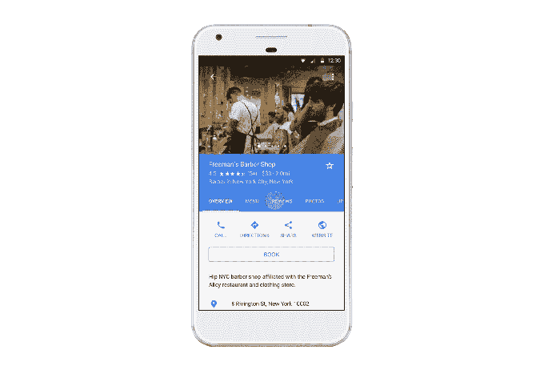

# 谷歌通过地图和搜索增加了沙龙和水疗预订 

> 原文：<https://web.archive.org/web/https://techcrunch.com/2017/07/13/google-adds-salon-and-spa-bookings-through-maps-and-search/>

# 谷歌通过地图和搜索增加了沙龙和水疗的预订

看看 StyleSeat 和其他沙龙预约应用程序，从今天开始，谷歌将允许人们预约美发和水疗。

谷歌博客上的一篇[帖子](https://web.archive.org/web/20221025222636/https://www.blog.google/products/maps/reserve-google-summer-bookin-happens-so-fast/)告诉我们:“这样，新的发型或棕榈树绿色的指甲只需轻点几下就可以了。”。

这是谷歌通过 [Reserve 的扩展，谷歌去年推出了一项功能，可以直接从搜索和地图内的企业列表中预订健康和健身课程。谷歌已经与几家沙龙和水疗中心合作，为我们提供同样的选择。](https://web.archive.org/web/20221025222636/https://www.google.com/maps/reserve/)

预订非常简单，你可以通过几种不同的方式来完成。你可以去地图，搜索沙龙，然后直接从那里预订。如果你去搜索也是一样的过程。另一个不太方便的方法是去谷歌的[网站](https://web.archive.org/web/20221025222636/https://www.google.com/maps/reserve/)预约，在那里输入沙龙或水疗中心。

这一增加对用户来说似乎非常方便，并让他们留在谷歌平台上，但也有助于搜索巨头收集大量关于我们去哪里和我们在做什么的数据。

