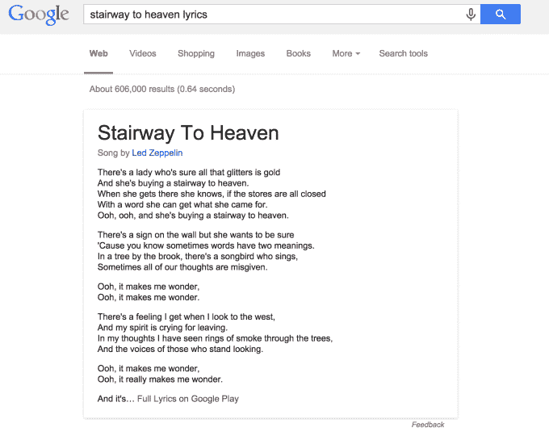
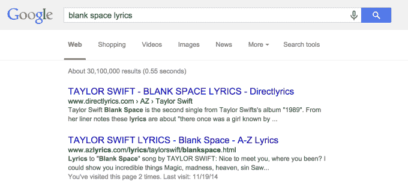

# 谷歌将歌词添加到搜索结果顶部，将搜索者引向 Google Play 

> 原文：<https://web.archive.org/web/https://techcrunch.com/2014/12/22/google-adds-song-lyrics-to-top-of-search-results-points-searchers-to-google-play/>

现在，当你在谷歌上搜索“歌曲名称”和“歌词”时，谷歌会在搜索结果页面的顶部显示歌词——这一举措可能会减少对歌词网站的访问次数，这些网站现在在谷歌搜索中排名很高，例如 azlyrics.com 或 songlyrics.com。此前，微软的 [Bing 在今年早些时候做了一项改变](https://web.archive.org/web/20221209154859/http://searchengineland.com/bing-starts-showing-full-song-lyrics-right-search-results-205050)，当时它增加了一项功能，也可以在搜索结果上方看到歌词，作为微软与谷歌“知识图”竞争的一部分。

有了 Knowledge Graph，谷歌[多年来一直在稳步增强其搜索结果页面](https://web.archive.org/web/20221209154859/https://beta.techcrunch.com/2012/05/16/google-just-got-a-whole-lot-smarter-launches-its-knowledge-graph/)，这些数据是从许多来源收集的，包括维基百科、世界中情局事实手册、Freebase、谷歌图书、在线活动列表、其他商业数据集和来自网络的结构化数据。

随着歌曲歌词结果添加到知识图谱，谷歌只是显示较长的歌词片段，并带有指向 Google Play 的链接，以获取“完整歌词”。或者换句话说，这是一个谷歌在指向第三方网站的搜索结果之上推广自己内容的案例。

这种变化最早是由搜索引擎优化圆桌博客发现的，它在[谷歌+](https://web.archive.org/web/20221209154859/https://plus.google.com/u/0/+GlennGabe/posts/WPDttoyi67s) 上注意到了这一点。我们已经要求谷歌确认新增内容的上线时间，但由于假期的关系，可能很难得到及时的回复。

不过，我们知道，谷歌几个月前正在测试这个歌词查找功能，但全面推广似乎就在几天前。(更新:据我们所知，它于上周针对美国英语用户推出。)

然而，在测试中，我们发现只有*一些*搜索得到歌词，而其他的——包括流行或经典歌曲的——没有。这可能意味着谷歌目前正在使用一个有限的歌词数据库。这也意味着谷歌不仅仅是从顶级歌词网站上抓取内容来展示歌词——如果是这样的话，也不会太短。

网络搜索者无需点击广告泛滥的歌词网站就能快速获得歌词的能力将对这个行业产生重大影响，这个行业今天严重依赖 SEO 技术，以便让他们的网站位于谷歌搜索结果的顶部并增加流量。

LyricFind 的首席执行官 Darryl Ballantyne 解释说，这种变化将产生足够大的影响，一些主要建立在 SEO 流量上的歌词网站将会消失。“然而，许多网站也围绕歌词建立社区，这是谷歌不会取代的，”他补充道。“像歌曲含义和都市歌词这样的网站不仅仅是 SEO 农场；我预计他们会继续发布令人印象深刻的流量数据。”

这不是谷歌第一次在歌词搜索方面展示实力。大约一年前，当它发现歌词和注释网站 [Rap Genius 使用各种链接方案和不正当交易来提高其可见性](https://web.archive.org/web/20221209154859/https://beta.techcrunch.com/2014/01/03/when-growth-hacking-goes-bad/)时，它惩罚了一个网站“增长黑客”在搜索结果页面上的排名。谷歌降低了这家初创公司的排名，它在[的“道歉”声明](https://web.archive.org/web/20221209154859/http://news.rapgenius.com/Rap-genius-founders-open-letter-to-google-about-rap-genius-seo-lyrics)中，利用这个机会抨击业内其他人在肮脏交易和链接计划方面做了很多同样的事情。

**更新**:谷歌发言人证实了歌词搜索功能的发布，他说(是的，说真的):

> 当你翻到一首歌，你会有一种感觉，你知道歌词有两种意思。有传言说，如果你去搜索这首曲子，也许谷歌会带你找到原因。哦，这让你怀疑…