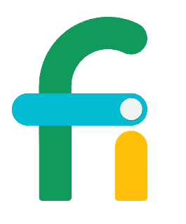

# 谷歌增加美国蜂窝网络以扩大 Project Fi 的覆盖范围

> 原文：<https://web.archive.org/web/https://techcrunch.com/2016/06/08/google-adds-u-s-cellulars-network-to-extend-project-fis-coverage/>

# 谷歌增加美国蜂窝网络以扩大 Fi 项目的覆盖范围

谷歌今天[宣布](https://web.archive.org/web/20230325114200/https://android.googleblog.com/2016/06/more-speed-and-coverage-with-us.html)已经将美国最大的地区运营商之一[美国移动](https://web.archive.org/web/20230325114200/http://www.uscellular.com/)加入其[项目 Fi](https://web.archive.org/web/20230325114200/https://fi.google.com/about/?u=0) [网络](https://web.archive.org/web/20230325114200/https://fi.google.com/about/network/)。美国蜂窝加入谷歌现有的网络合作伙伴 T-Mobile 和 Sprint。

Project Fi 与 Boost Mobile 或 MetroPCS 等移动虚拟网络运营商的不同之处在于，它不仅仅依赖于单一网络。相反，它可以在合作伙伴之间切换，以选择在任何给定时间可用的最佳网络。这样做的问题是，你需要使用谷歌自己的 Nexus 手机(6P、5X 或 Nexus 6)才能使用 Fi，因为其他手机无法执行无缝网络切换，而这是实现这一功能所必需的。

 “通过分析每个网络的速度，Project Fi 能够预测你所在位置的最快网络——下至城市街区——并自动为你连接，”谷歌解释道。“我们一直在考虑新的信号发射塔和新的可用无线电频率等因素如何影响现实世界的速度。”

U.S. Cellular 目前在 23 个州运营，并在城市和农村地区提供 4G LTE 覆盖。据[我可以告诉](https://web.archive.org/web/20230325114200/https://en.wikipedia.org/wiki/List_of_United_States_mobile_virtual_network_operators)的是，这也标志着美国蜂窝第一次向虚拟运营商播放主机网络。

谷歌表示，其用户能够将大约 95%的蜂窝时间花在 LTE 网络上，并拥有 99%的连接时间。对美国蜂窝网络的支持将在未来几周内展开。

Fi 的起价是每月 20 美元，用于无限制的国内电话和短信，每月每 GB 数据加收 10 美元。这项服务不需要任何年度合同。