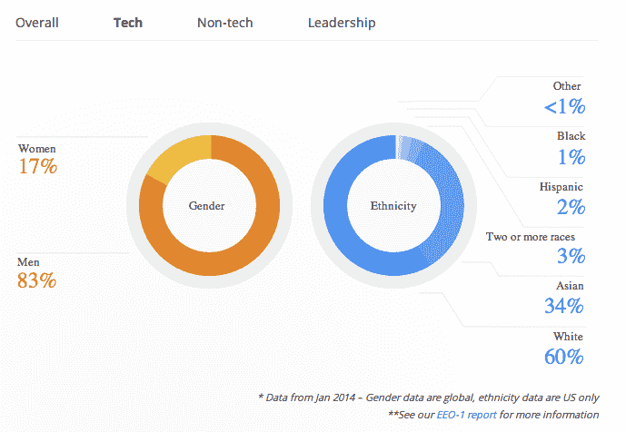

# 谷歌承认雇佣了太多白人

> 原文：<https://web.archive.org/web/https://techcrunch.com/2014/05/28/google-admits-it-hires-too-many-white-dudes/>

今天，硅谷最大的雇主之一谷歌终于[公开了工作场所的多样性](https://web.archive.org/web/20221207114740/http://googleblog.blogspot.com/2014/05/getting-to-work-on-diversity-at-google.html)以及它是如何雇佣女性和少数族裔的。

要点是，谷歌知道它有问题，很抱歉，但谷歌说这不完全是它的错…只是在技术领域没有足够的女性和少数族裔。

对于硅谷的一家大型科技公司来说，这并不奇怪，谷歌员工中男性和女性的比例是 7 比 3。但是如果把它分解成技术和非技术工作，男性的比例要高得多，为 83%。在种族方面也没好到哪里去，在科技领域亚裔人数最多，占 34%，在其他领域几乎不存在。

该公司让每个人都知道他们将在年度股东大会上这样做——在牧师杰西·杰克森和他的多元化联盟[彩虹推动](https://web.archive.org/web/20221207114740/http://www.rainbowpush.org/)在场的情况下，该公司欣然承认，“……当谈到多元化时，谷歌离我们想要的地方还很远。”

在硅谷，他们并不孤单，CNN 对 20 家顶级科技公司的调查显示了同样令人沮丧的数字。这些数字显然很难获得。出于显而易见的原因(*阅读，数字很糟糕)*大多数公司不想披露他们在硅谷这里的科技领域雇用的女性和少数族裔有多少。

谷歌表示，它这样做的目的是开启讨论，并开始解决问题:

> 完全清楚问题的程度是解决方案中非常重要的一部分。

杰克逊牧师还参加了本月早些时候举行的脸书股东大会，以推动那里的多元化。然后，他给其他科技巨头写信，包括易贝、苹果和 Twitter(这些公司都没有公布数字)，鼓励科技领域更加多元化。美国政府在这方面也帮不上忙。

关于女性、少数族裔和工作场所的历史数据太多了，但在科技领域却很少。虽然谷歌确实出来承认存在招聘问题，但它表示，原因是缺乏合格的候选人。来自[的博文](https://web.archive.org/web/20221207114740/http://googleblog.blogspot.com/2014/05/getting-to-work-on-diversity-at-google.html):

> 像谷歌这样的科技公司难以招募和留住女性和少数族裔有很多原因。例如，在美国，女性获得的计算机科学学位大约占总数的 18%。黑人和拉美裔分别占美国大学毕业生的不到 10%和不到 5%的计算机专业学位。

谷歌可能有一个点，在这里。根据全国妇女信息技术委员会(NCWIT)的数据，谷歌的统计数据仅低于 25%的计算机科学和工程学位女性的平均水平。

尽管如此，这是谷歌。他们没有资源招更好的吗？

尽管它已经是最大的少数群体之一，谷歌有一个计划来教育其他人关于亚洲文化，希望留住这个少数群体。然而，没有提到它计划如何教育、保留或招募其他少数民族。

不过，得给谷歌点甜头。不是每个科技公司都愿意如此赤裸裸地展示他们的数字。很成熟。它甚至可能鼓励其他科技公司，如亚马逊、微软等。敞开心扉，承认存在问题，并开始寻找解决问题的方法。