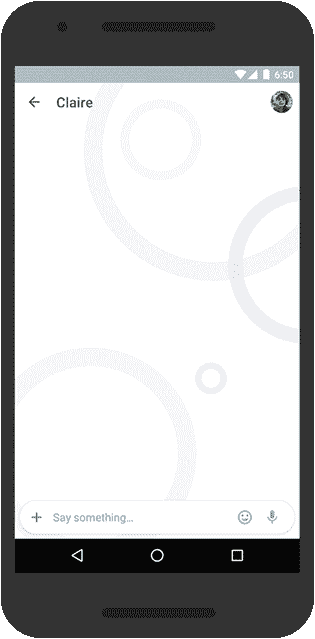

# 谷歌推出基于人工智能的聊天应用 Allo，使用其新的助手机器人、智能回复等

> 原文：<https://web.archive.org/web/https://techcrunch.com/2016/05/18/google-allo-chat-app/>

今天，在 I/O 大会上，谷歌揭开了其对通信领域的最新尝试:该公司[宣布了](https://web.archive.org/web/20230322184559/https://googleblog.blogspot.co.uk/2016/05/allo-duo-apps-messaging-video.html) Allo，这是一款智能消息应用程序，具有机器学习和谷歌新的谷歌助理服务(它的答案是亚马逊的 Alexa)，让用户不仅可以通过动画图形和放大/缩小文本相互聊天，还可以呼叫谷歌(以及后来的其他第三方应用程序)来共享媒体、计划活动、购买物品，甚至思考彼此应该说什么。谷歌表示，iOS 和 Android 应用程序今天发布，但只会在今年夏天上线。

如果你是一名谷歌新闻观察者，Allo 可能不会完全出乎意料:去年 12 月,《华尔街日报》[曾报道](https://web.archive.org/web/20230322184559/http://www.wsj.com/articles/google-plans-new-smarter-messaging-app-1450816899)该公司正在开发一款基于人工智能的消息应用程序:这似乎正是该产品。

对谷歌来说，这个应用出现在一个有趣的时刻。多年来，该公司在打造社交产品方面进行了多次尝试，但在脸书、Twitter 和 Snapchat 等其他产品起飞的时候，Google+、Wave 和 Buzz 等产品从未真正流行起来。

但另一方面，在从搜索到地图等信息服务方面，谷歌是王者；它的电子邮件服务非常受欢迎；它拥有一支强大的工程机器学习团队；谷歌的 Android 是世界上最受欢迎的智能手机平台。

因此，虽然现在已经有很多流行的消息应用，比如脸书的 WhatsApp 和 MessengerViber 线；微信和其他公司喜欢 Slack 专注于企业——毫不奇怪，谷歌会集中其优势，看看它是否能让自己的消息产品飞起来。

谷歌也希望 Allo 能够适应其自身服务使用方式的更广泛转变。“我们正在建设更具辅助性的搜索，”谷歌首席执行官桑德尔·皮帅今天在 I/O 主题演讲中提到，当时他推出了谷歌助手，以及当你通过 Google.com 寻找信息时它给你的许多帮助。他还指出，如今约有 50%的查询来自手机，因此受众已经存在。

虽然谷歌显然试图收购至少一家初创公司——200 Labs，现在称为 chat fuel——来帮助建立 Allo，但该应用是由谷歌自己的团队开发的，由谷歌通信团队的工程总监埃里克·凯(Erik Kay)领导，他也是今天 I/O 大会上的演示者。

同样值得注意的是:Hangouts 移动应用程序——也提供聊天选项——不会消失。谷歌表示，它将继续投资并与 Allo 一起更新这一功能。

## 功能

与其他通讯应用一样，Allo 用户将能够根据他们的电话号码找到聊天对象，那些使用谷歌账户提供 Gmail 等服务的用户也将能够从这些服务中呼叫他们的联系人。

为了与我们在信息服务中看到的用户隐私的更大趋势保持一致，并与谷歌自己在 Chrome 上的发展保持一致，谷歌将让用户选择在“匿名”模式下使用 Allo，在这种模式下，聊天是端到端加密的，并带有谨慎的通知——谷歌表示，它计划继续迭代和更新这些功能。

用户可以使用 Allo 彼此进行基本的对话，但当使用所有的铃铛和口哨时，该应用程序看起来真的会进入自己的领域。

除了表情符号和“耳语”/“大声”模式，你可以放大和缩小文本以强调你在说什么，还有许多基于人工智能的细节。

这将包括一个智能回复功能，类似于收件箱中的功能，它会建议对您的对话进行回复，这样您就不需要键入任何内容。与 Inbox 的智能回复一样，该应用程序将“学习”你如何回复事情，以向你提供更多相关的建议。

智能回复也可以处理 Google 相册中的照片，建议回复图片(只是有点令人毛骨悚然……)以便在你懒得回复一张美食图片时保持对话。

另一件有趣的事情是谷歌如何整合它自己的基于机器人的谷歌助手，这是它早些时候在 I/O 期间宣布的。

这样会有一些自然语言能力，让你可以直接和它聊天，或者问它问题，或者在策划什么事情的时候召唤进群聊，它都会给你回复。最初，助手将能够引用你已经在其他现有谷歌应用程序中看到的服务:例如，飞机时间、体育比分、电影院上映什么、地点位置和搜索查询。

随着时间的推移，谷歌可能会让开发者与助手机器人集成，以便它可以参考这些第三方服务的信息。时间会证明这个助手是否比我们看到的其他信息公司推出的其他机器人工作得更好。随着时间的推移，这将带来游戏和更多的功能。