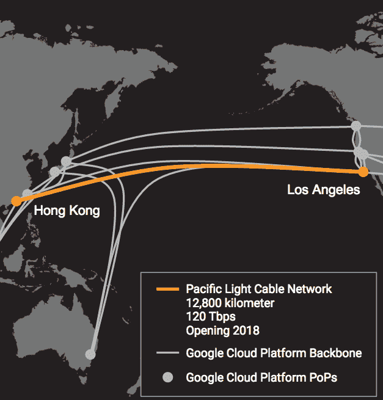

# 谷歌和脸书正在建造迄今最快的跨太平洋电缆 

> 原文：<https://web.archive.org/web/https://techcrunch.com/2016/10/12/google-and-facebook-are-building-the-fastest-trans-pacific-cable-yet/>

# 谷歌和脸书正在建造迄今最快的跨太平洋电缆

谷歌和脸书正在合作建设一条连接洛杉矶和香港的 120 兆比特每秒(Tbps)的海底电缆。这两家公司正在与太平洋光数据通信公司合作，太平洋光数据通信公司是[中国软实力技术](https://web.archive.org/web/20230212130537/http://www.cspthl.com/)的全资子公司，这对于海底电缆游戏来说相对较新。

一旦新的 12，800 公里电缆达到满负荷，它将是迄今为止容量最高的跨太平洋电缆。到目前为止，该记录由谷歌也持有股份的[快速电缆](https://web.archive.org/web/20230212130537/https://techcrunch.com/2016/09/06/google-asia-cable/)保持。

 去年年底[第一次宣布](https://web.archive.org/web/20230212130537/https://www.telegeography.com/products/commsupdate/articles/2015/11/20/cable-compendium-a-guide-to-the-weeks-submarine-and-terrestrial-developments/)的时候(在谷歌或脸书的名字被贴上这个项目之前)，估计建设新的太平洋光缆网络将花费大约 4 亿美元。该电缆有五对光纤。这些线对中的一个就能够提供 24 Tbps 的带宽。

谷歌告诉我，参与建设电缆的各方将拥有自己的电缆部分，该公司将拥有自己的光纤对，以保持自己的流量私有。

新电缆将成为谷歌入股的第六条海底电缆(其他分别是 [Unity](https://web.archive.org/web/20230212130537/https://en.wikipedia.org/wiki/Unity_(cable_system)) 、 [SJC](https://web.archive.org/web/20230212130537/http://www.submarinenetworks.com/systems/intra-asia/sjc/sjc-cable-system) 、 [FASTER](https://web.archive.org/web/20230212130537/http://www.submarinenetworks.com/systems/trans-pacific/faster/google-invests-in-new-trans-pacific-faster-cable) 、 [MONET](https://web.archive.org/web/20230212130537/https://en.wikipedia.org/wiki/Monet_(submarine_cable)) 和 [Tannat](https://web.archive.org/web/20230212130537/http://www.zdnet.com/article/google-backs-new-sao-paulo-rio-undersea-cable/) )。

虽然谷歌与脸书在这种项目上合作似乎不太寻常，但海底电缆经常以这种合作关系为特色。例如，脸书和微软最近合作建造了一条横跨大西洋的电缆，160 Tbps 的速度甚至比太平洋光缆还要快(但也只有一半长)。亚马逊也开始投资自己的海底电缆，但到目前为止，该公司还没有与其他行业巨头合作。

正如谷歌指出的，新电缆将为 APAC 地区的客户带来更低的延迟和更大的带宽。当然，脸书的顾客也可以这么说。