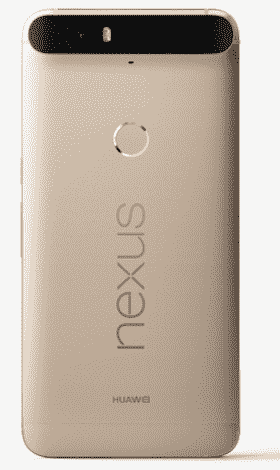

# 谷歌和华为为我们带来金色 Nexus 6P

> 原文：<https://web.archive.org/web/https://techcrunch.com/2016/01/05/google-and-huawei-bring-gold-colored-nexus-6p-to-us/>

# 谷歌和华为为我们带来金色的 Nexus 6P

你是否一直在等待购买你的 Nexus 6P ,但因为它在美国还没有金色版本而犹豫不决？你漫长而痛苦的等待现在结束了。正如谷歌和华为今天在 CES 上宣布的那样，6P 的哑光金色版本现在可以在谷歌商店买到，今天晚些时候应该也可以在百思买和 BestBuy.com 买到。

 其他颜色选项还包括‘铝’、‘石墨’、‘冰霜’不过，金色版本只有 32GB 和 64GB 两种型号。对于其他颜色，128GB 也是一个选项。

这差不多就是新闻了。

毫无疑问，Nexus 6P 是谷歌有史以来最好的 Nexus 手机(也可能是最好的安卓手机)。这也让华为在美国声名鹊起，在美国，它以前只为那些痴迷于智能手机新闻的人所知。

谷歌仍然很难保持 Nexus 6P 的库存。根据你想要的颜色和内存大小，在任何时候都有可能至少有几个会卖完。

