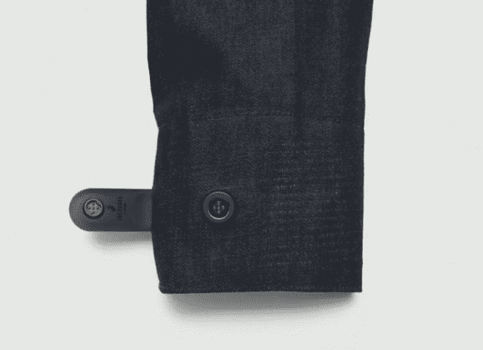
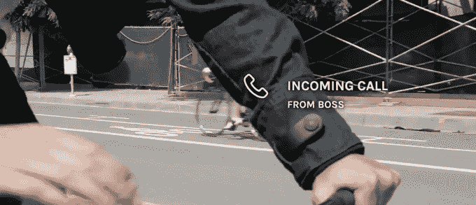
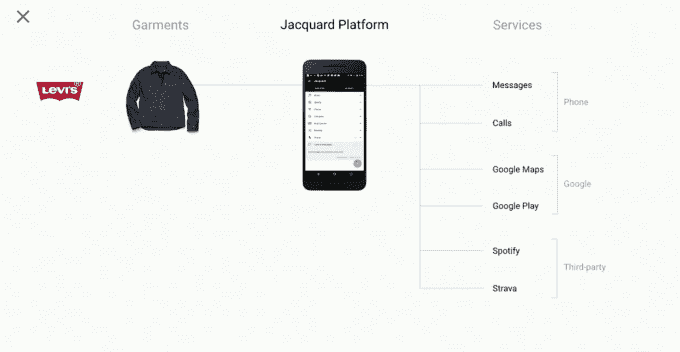
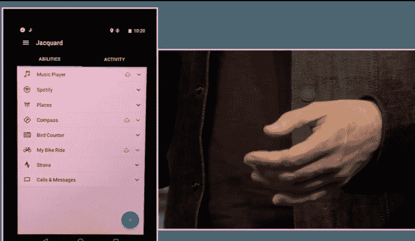

# 谷歌和李维斯合作开发了一款“互联”夹克，可以让你接听电话、使用地图等等

> 原文：<https://web.archive.org/web/https://techcrunch.com/2016/05/20/google-and-levis-team-up-on-a-connected-jacket-that-lets-you-answer-calls-use-maps-and-more/>

在今天的谷歌 I/O 大会上，谷歌高级技术和项目(ATAP)研究部门提供了去年公布的互动纺织品项目[、](https://web.archive.org/web/20221006171303/https://beta.techcrunch.com/2015/05/29/google-ataps-project-jacquard-wants-to-weave-sensors-into-your-clothes/)、[项目](https://web.archive.org/web/20221006171303/https://www.google.com/atap/project-jacquard/)的最新进展。ATAP 的 Ivan Poupyrev 宣布，该公司正在与标志性服装公司 Levi's 合作，推出一款针对城市骑自行车者的“互联”智能夹克，穿着者可以通过在夹克袖子上点击和滑动来控制音乐、接听电话、访问导航等。

谷歌与李维斯的合作于去年首次宣布，但两家公司尚未透露这家服装制造商将如何实施贾卡项目的技术。

如果你以前没有注意到，这个项目包括将多点触摸传感器编织到衣服中，以使你穿的东西成为新的…嗯…“可穿戴”计算设备。

该公司解释说，这种新的李维斯通勤夹克的想法是，制作一些既时尚又代表技术实际应用的东西。

如今，骑自行车的人在繁忙的街道上通勤时经常不得不摆弄手机，这很危险。

有了李维斯的通勤夹克，他们就可以触摸夹克的袖口，用手势控制各种功能，否则他们需要拿出手机来做。

这款夹克将成为李维斯通勤服装系列的一部分，主要面向骑自行车在城市中穿行的城市居民。

夹克的袖子上嵌入了一个提花标签，使这一功能成为可能，它可以通过 USB 拔出和充电。该标签与服装中的 LED、触觉、电池和编织传感器相连。这项技术的连接点巧妙地利用了夹克的纽扣孔，看起来不那么显眼。

此外，该平台包括一个移动应用程序，可以将你的智能衣服连接到云。在这里，消费者将控制与联网服装配合使用的应用程序。

此外，该公司强调，你可以像使用其他衣服一样使用李维斯夹克——把它卷起来，扔进洗衣机，等等。

“创建一个智能服装平台是一个独特的挑战——时尚和技术必须合二为一，但两者之间存在内在的紧张关系，”Poupyrev 说。“技术是脆弱的，而服装……不是。”

谷歌表示，除了控制通话、谷歌地图和谷歌播放音乐等原生手机功能外，这些夹克还将与第三方服务互操作。这意味着你将能够使用触摸来控制你的 Spotify 音乐，或者一个连接的健身应用程序，如 Strava。API 也将提供。

在活动的舞台演示中，两家公司展示了这种夹克的工作原理。

例如，手指在袖口上下移动可以控制音乐音量。另一个功能“指南针”是通过滑动来访问的。之后，一名语音助理通知佩戴者，李维斯的创新副总裁保罗·迪林杰，他们的下一次会议时间以及多长时间到达。

虽然演示进行得很顺利，但你可以看到传感器所在的袖口有点僵硬，有点凸出。不清楚这会有多舒服，或者有多吸引人。

谷歌表示，它计划在未来与其他服装制造商合作，扩大 Jacquard 的覆盖范围，包括运动服公司和设计商务装的公司。(虽然没有大声提到，但在合作伙伴讨论期间的演示中，Cinta 的徽标曾短暂出现在一张幻灯片上。)

也许最有趣的是，这款夹克并不是什么遥远的白日梦——谷歌表示，它将在今年秋天“推出”测试版，然后在 2017 年春天公开发售。

未提供定价信息。