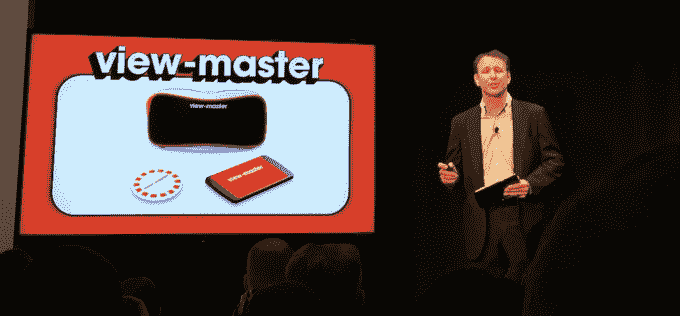

# 谷歌和美泰重振 View-Master

> 原文：<https://web.archive.org/web/https://techcrunch.com/2015/02/13/google-and-mattel-revive-the-85-year-old-view-master-with-cardboard-vr/>

Mattel 备受尊敬的 View-Master 是孩子们非常熟悉的立体照片浏览器，现在它正在使用谷歌 Cardboard 虚拟现实技术，为这些旧的 3D 图像带来生命。

昔日的观景台是一个美丽的东西。通过放入电影、遥远的目的地或你自己生活中的微型卷轴，用户可以看到他们想要的任何东西。该公司表示，多年来，它已售出超过 15 亿盘 View-Master，总计超过 1 亿盘 View-Master。

今天在纽约世界玩具展上发布的新版本，谷歌和美泰公司在 View-Master 上安装了一个智能手机插槽。用户可以将一部 Android 手机放入塑料盖中，当与 View-Master 配套应用程序配对时，可以从大量查看选项中进行选择。

这使得 Mattel 能够将一个古老的玩具带入数字未来，提供更好的质量体验，并有机会通过智能手机将卷轴作为应用内购买进行销售。美泰还表示，它将通过实体卷轴销售独家体验，用美泰的道格·瓦德利(Doug Wadleigh)的话说，孩子们喜欢拥有“可以放在房间里的收藏品”另外，可能有很多怀旧的收藏家想要实物。

至于这实际上给纸板平台增加了什么，Wadleigh 说，“我们的物理产品实际上是为家庭设计的。这是儿童友好的。”

Wadleigh 还将这描述为 Mattel 虚拟现实工作的“刚刚开始”，尽管他不愿透露这是否意味着扩展与谷歌的合作关系。

“我们专注于此时此地，”他说。“这是一个非常好的合作伙伴关系，因为他们的能力和我们的能力以及我们希望利用这项技术实现的目标完全一致。”

[gallery ids="1119124，1119123，1119122，1119121，1119116，1119118，1119119，1119120，1119115，1119114"]

新的纸板驱动的 View-Master 将在秋季开始销售(Wadleigh 说他们的目标是 10 月)，据《今日美国》报道，它的价格为 29.99 美元，额外的“体验卷轴”每包三个售价为 14.99 美元。

【YouTube https://www.youtube.com/watch?v=JlhFBU2I7vU&w=640&h=360]

*补充报道由[安东尼哈](https://web.archive.org/web/20230326174319/https://techcrunch.com/author/anthony-ha/)*