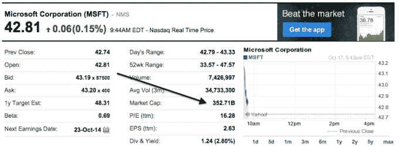
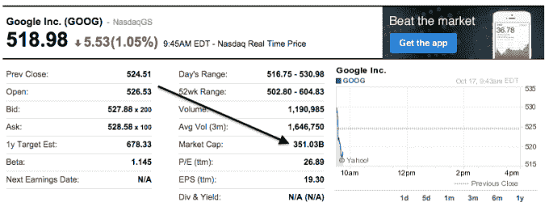

# 谷歌和微软争夺市值霸权 

> 原文：<https://web.archive.org/web/https://techcrunch.com/2014/10/17/google-and-microsoft-battle-for-market-cap-supremacy/>

# 谷歌和微软争夺市值霸主地位

***更新:**微软成功了，在撰写本文时(伦敦时间下午 2:45，纽约时间上午 9:45)，微软的市值超过了谷歌。我们将在一天结束时回来登记:*

* *

—

谷歌和微软目前正为成为世界上第二大有价值的科技公司而缠斗。继谷歌不太令人敬畏的收益报告之后，加上微软盘前的上涨，这两个科技巨头在市值霸权方面不分上下。

苹果和埃克森美孚仍将比这两大科技巨头更有价值。这四家公司的总市值超过 1.5 万亿美元。

昨天，谷歌的收益报告使其股票在盘后交易中下跌超过 5%。谷歌在早盘交易中下跌，但开盘小幅上涨。微软开盘略高于 1%。

依靠[雅虎财经](https://web.archive.org/web/20230130021203/http://finance.yahoo.com/)和[美国消费者新闻与商业频道数据](https://web.archive.org/web/20230130021203/http://www.cnbc.com/)，谷歌昨天收盘价值 3547.7 亿美元。微软，3521.7 亿美元。今天，谷歌的开盘价为 3570.5 亿美元，微软为 3561.3 亿美元，两者之间保持着微小的差距。换句话说，谷歌在开市前的快速反弹使其免于在开盘当天不如总部位于雷蒙德的竞争对手有价值。

这种潜在的转变象征意义大于实质意义，但考虑到两家公司共享的巨大竞争领域，仍然值得注意。和其他平台公司一样，谷歌和微软在许多领域竞争，从游戏到音乐到云计算到硬件到操作系统到开发者生态系统，一直到搜索。

因此，也许看到一家公司在价值上超过另一家公司会引起一端的惊愕，另一端的沾沾自喜。

但是，不要着急，因为微软还没有公布自己的收益。如果该公司今天设法超过谷歌，如果其季度业绩达不到预期，它可能会轻易放弃任何优势。什么可能会出错？疲弱的表面收入会带来伤害，超出预期的手机损失也会带来伤害。Office 365 增长减速可能会吓坏投资者。消费者对个人电脑的需求不足可能会损害 Windows 的收入。如果 Azure 慢下来，街道可能会寻找一个出口。

但那都是以后的事了。现在，在经历了一场自己创造的风暴之后，微软至少有一天会走向光明。

*1。开玩笑的。雷德蒙可能在下雨。*