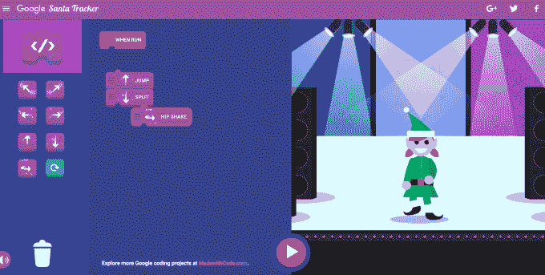
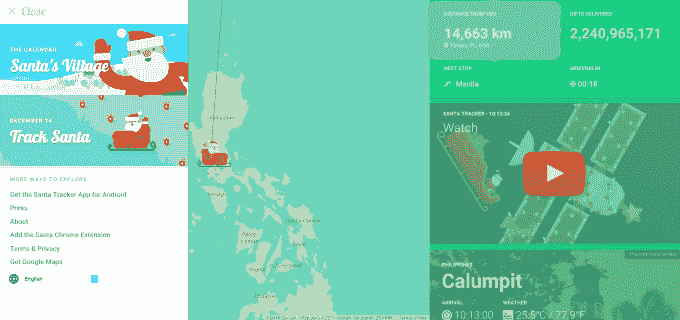
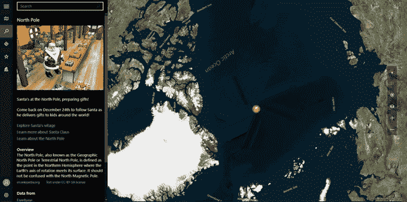
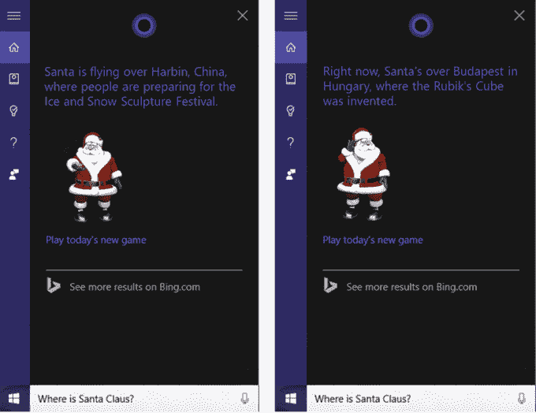
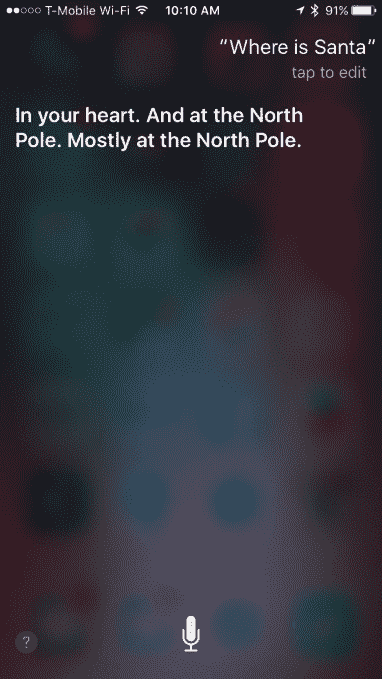

# 谷歌和微软推出他们的圣诞老人追踪器 

> 原文：<https://web.archive.org/web/https://techcrunch.com/2015/12/24/google-and-microsoft-launch-their-santa-trackers/>

还记得孩子们凝视星空，试图发现圣诞老人雪橇上的灯光(或者鲁道夫闪亮的鼻子)吗？那些日子已经过去很久了。圣诞老人追踪又一次获得了年度数字升级。今天，[微软](https://web.archive.org/web/20230203145218/https://news.microsoft.com/features/hes-back-norad-tracks-santa-returns-for-60th-anniversary-with-online-coloring-book-exclusive-to-microsoft-edge-new-places-to-explore-on-bing-and-more/)和北美防空司令部[与谷歌一起开始追踪圣诞老人](https://web.archive.org/web/20230203145218/http://www.noradsanta.org/?utm_source=MS%20News%20Center&utm_medium=Internal%20Evangelism&utm_content=News%20Center&utm_campaign=NORAD%20article)，在自己的[刚刚推出的](https://web.archive.org/web/20230203145218/https://googleblog.blogspot.com/2015/12/tis-season-for-santa-tracker.html) [圣诞老人追踪网站](https://web.archive.org/web/20230203145218/https://google.com/santatracker)上。谷歌今年的网站提供了一个定制的地图界面，显示圣诞老人现在在哪里，离你有多远，到目前为止已经送了多少礼物，等等。它甚至提供了一个名为“Code Boogie”的圣诞主题游戏，教孩子们编程的基础知识，以及其他一些活动。

在游戏中，孩子们可以通过将“向左指”或“向右指”等基本舞蹈动作拖放到屏幕上来制作精灵舞蹈。该游戏提供了两种游戏模式——一种是孩子们配合老师的动作，另一种是孩子们可以通过使用跳跃、劈叉、摇臀等元素来设计自己的舞蹈，以“编程”他们的精灵舞蹈。

通过[圣诞老人追踪网站](https://web.archive.org/web/20230203145218/https://santatracker.google.com/#village)也可以获得像“[礼物掉落](https://web.archive.org/web/20230203145218/https://santatracker.google.com/?hl=en#presentdrop)这样的在线游戏一个[教育区](https://web.archive.org/web/20230203145218/https://santatracker.google.com/?hl=en#traditions)了解世界各地的圣诞节传统；一个工具，让你翻译，然后听其他语言的节日词汇和短语，如“圣诞老人”，“节日的问候”，甚至“嗬嗬嗬”；[谷歌地图界面](https://web.archive.org/web/20230203145218/https://www.google.com/maps/place/Santa/@31.222222,121.475,7z/data=!3m1!4b1!4m2!3m1!1s0x0000000000001224:0x0000000000001225)被定制成包括一个圣诞老人图标；再加上[一整村的其他活动](https://web.archive.org/web/20230203145218/https://santatracker.google.com/#village)探索。

像往常一样，谷歌的网站非常吸引人，当孩子们盯着电脑屏幕时，你甚至可以偷偷把最后一分钟的礼物包装好。或者，如果你喜欢，谷歌的圣诞老人追踪器也可以作为安卓设备的移动应用程序和 Chrome 的扩展使用。

与此同时，微软今年也对圣诞老人追踪进行了升级，这要归功于与包括 Bing、Windows Maps、Microsoft Edge 和 Cortana 在内的各种微软工具的集成。

微软[第三年再次与北美防空司令部(NORAD)合作，提供在线版的](https://web.archive.org/web/20230203145218/https://news.microsoft.com/features/hes-back-norad-tracks-santa-returns-for-60th-anniversary-with-online-coloring-book-exclusive-to-microsoft-edge-new-places-to-explore-on-bing-and-more/) [NORAD 追踪圣诞老人网站](https://web.archive.org/web/20230203145218/http://www.noradsanta.org/)。

这一次，该网站包括 Windows 10 设备和微软 Edge 网络浏览器的节日主题涂色书，圣诞老人访问的城市的新图像转盘，Windows 地图集成，游戏，节日音乐，电影，教育内容和其他活动，包括一个名为“善意行动”的活动，本着节日的精神，将网站访问者与有需要的人和军人家庭联系起来。

此外，面向 iOS、Android 和 Windows 10 的北美防空司令部追踪圣诞老人应用程序今天开始提供实时圣诞老人追踪。

然而，微软体验的更好部分是 Cortana 集成。使用 Cortana for Windows 10、iOS 或 Android，可以问“圣诞老人在哪里？”微软的虚拟助手将通过显示圣诞老人的图像和他现在所在位置的细节来回答。Cortana 还从今天开始自动更新圣诞老人的位置。

让 Cortana 参与到追踪圣诞老人的行动中来实际上是非常聪明的——并且凸显了苹果 Siri 错过的机会。当我们问同一个问题——“圣诞老人在哪里？”——今早对我们 iPhone 上的苹果按键助手，助手只回复了，*“在你心里。在北极。大部分在北极。”*

我想是准确的。但肯定没那么有趣。