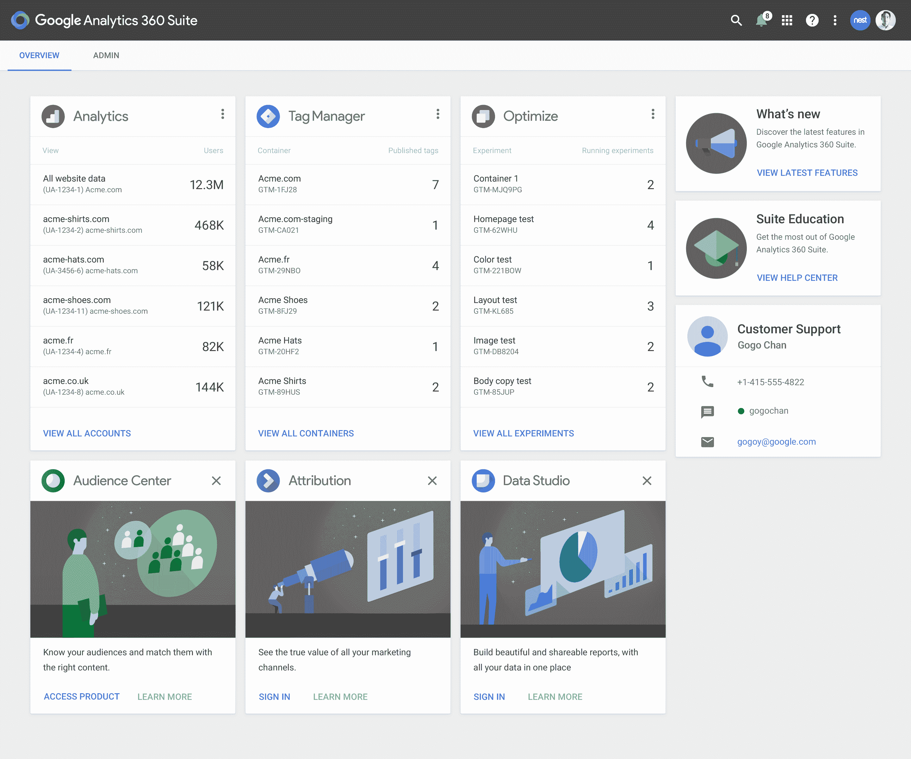

# 谷歌发布面向企业营销人员的 Analytics 360 套件 

> 原文：<https://web.archive.org/web/https://techcrunch.com/2016/03/15/google-announces-analytics-360-suite-for-enterprise-marketers/>

谷歌今天为企业营销人员推出新产品，将直接挑战 Adobe 的 T2 营销云和类似服务。

Google Analytics 360 套件将结合 Google Analytics Premium(现名为 Google Analytics 360)和[Adometry](https://web.archive.org/web/20230207091855/https://www.google.com/analytics/adometry/)(it[于 2014 年收购](https://web.archive.org/web/20230207091855/https://techcrunch.com/2014/05/06/google-acquires-adometry/)，现名为 Attribution 360)，以及企业级版本的 Google Tag Manger 和三款新产品(Audience Center 360、Data Studio 360 和 Optimize 360)为营销人员提供单一解决方案。

谷歌产品管理高级总监 Babak Pahlavan 告诉我，这里的想法是为营销人员提供一种新的解决方案，帮助他们在多屏世界中更有效地工作。今天的营销人员——尤其是大型组织中的营销人员——通常仍然将他们在桌面时代学到的东西作为营销工作的基础。“但这是关于理解客户的旅程，一直到转化，”Pahlavan 解释说。

这项服务由这六个彼此紧密集成的不同应用程序组成，旨在帮助营销人员在正确的时间与正确的用户接触，并帮助广告商更好地了解他们客户的旅程。

所有新工具背后的指导思想是确保它们易于使用，即使它们需要大量数据，并为营销人员提供可操作的信息，而不仅仅是大量数据。

“如果你有非常复杂的工具，它们不会被使用，”Pahlavan 指出。“我们注重简单。我们如何才能制造出极其易用的工具，并让协作变得容易？”

这套房里有什么？该产品的基石之一显然是谷歌分析 360——谷歌分析高级版的更名版本。毕竟，这是谷歌收集所有测量数据的地方。

除此之外，谷歌还推出了 Audience Center 360，这是一个数据管理平台，将与谷歌自己的工具(包括 DoubleClick)集成，但也可以从第三方提供商那里获取数据。

通过另一款全新产品 Optimize 360，谷歌现在可以让营销人员更容易在他们的网站上进行 A/B 测试，例如，找到文本片段或图像的最佳版本。

然而，全新产品中最有趣的可能是谷歌数据工作室 360。这是所有数据可视化和分析发生的地方。Pahlavan 告诉我，Data Studio 建立在 Google Doc 的协作和共享技术之上，但它也由 Google 的数据分析平台 [BigQuery](https://web.archive.org/web/20230207091855/https://cloud.google.com/bigquery/) 提供支持。

标签管理器、分析和属性都是现有工具的更名版本，现在将获得更多功能(在 Adometry 的情况下，谷歌表示属性已经“从头开始重建”)。这些变化中的大部分都计划在接下来的几个月内推出。

套件中的四个新产品(观众中心、数据工作室、优化和标签管理器)现在处于有限的测试阶段。目前的 Google Analytics Premium 和 Adometry 用户将在未来几个月内收到加入新测试版的邀请。