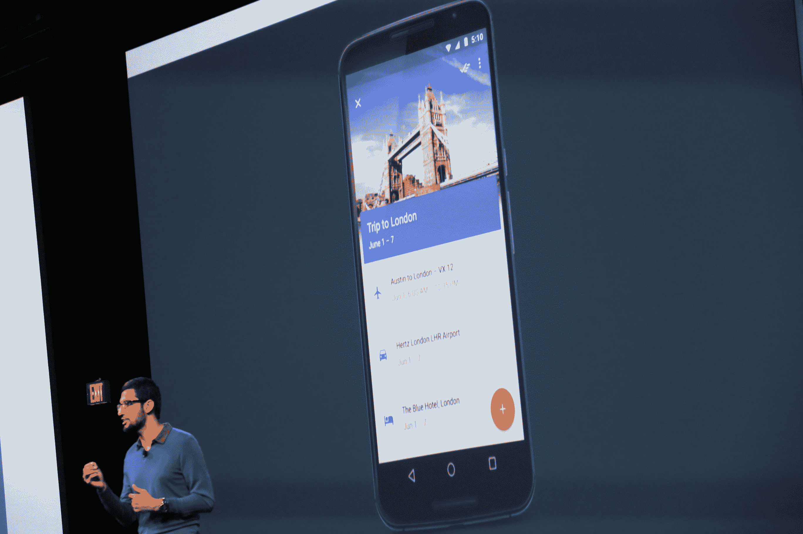
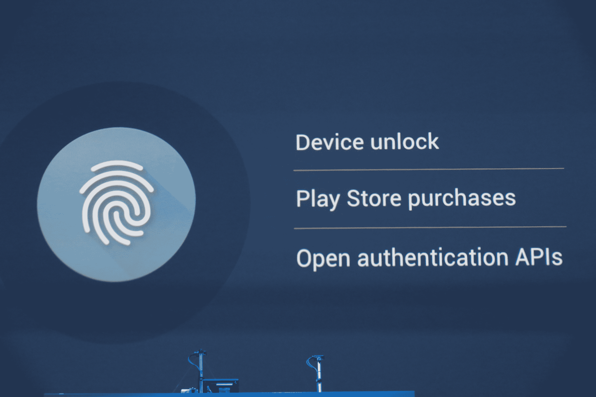
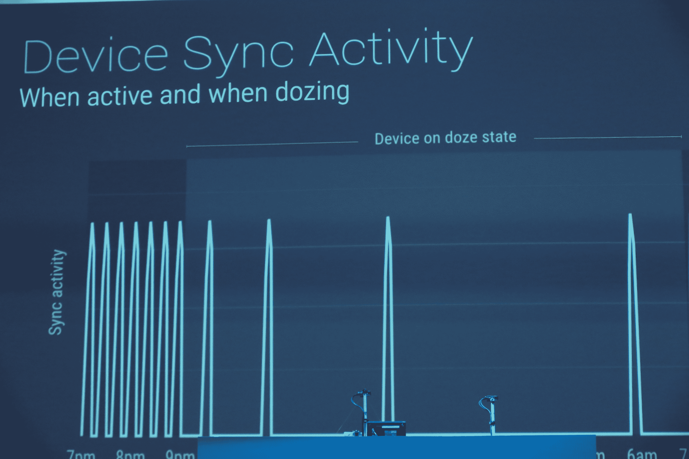
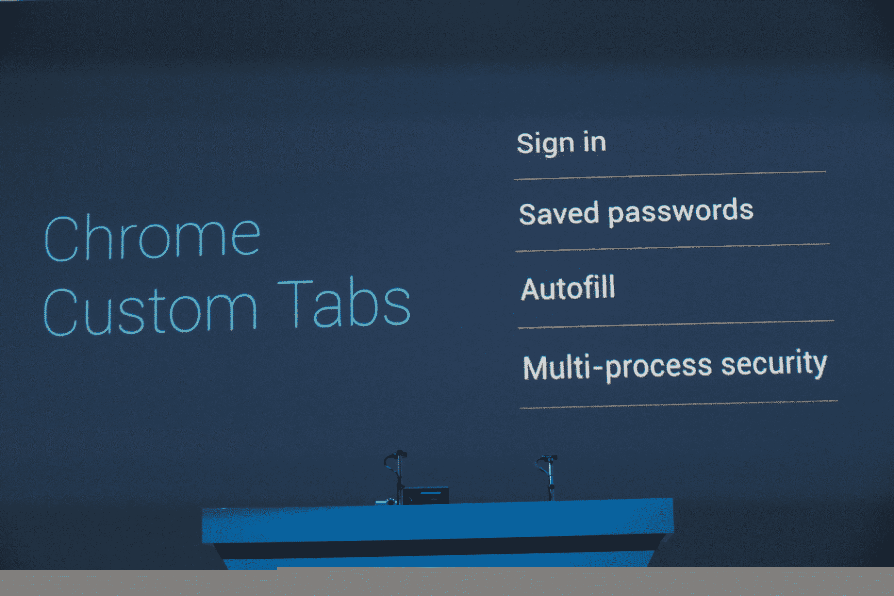

# 谷歌推出 Android M 预览版，支持指纹扫描仪、Android Pay、改进的权限和电池寿命 

> 原文：<https://web.archive.org/web/https://techcrunch.com/2015/05/28/google-announces-android-m-with-fingerprint-scanner-support-android-pay-improved-permissions-battery-and-performance-tweaks/>

正如预期的那样，谷歌今天在旧金山的 I/O 开发者大会上宣布了下一版本 Android 的开发者预览版。对于 Android M(一旦向用户发布，它将获得其全名)，谷歌主要关注 fit 和 finish，但该公司也为其移动操作系统添加了许多新功能。

Android M 不会采用任何主要的新设计元素也就不足为奇了。最后一个版本， [Android Lollipop](https://web.archive.org/web/20230131040433/https://techcrunch.com/2014/11/12/android-5-0-lollipop-review-2/) ，引入了谷歌的材料设计语言，毕竟，仍然有很多开发者甚至没有迁移他们的应用程序。

正如谷歌产品管理总监 Brian Rakowski 本周早些时候告诉我的那样，自从团队在去年的 I/O 上推出 Lollipop 以来，公司已经学到了很多东西，其中相当一部分已经融入到 Android M 中。

预览版包括更新的 SDK、用于在 Android 模拟器以及 Nexus 5、Nexus 6、Nexus 9 和 Nexus player 上测试的系统映像。谷歌表示，它已经修复了这个版本中的“数千个错误”，并将在预览计划期间定期提供更新的预览系统图像。消费者发布会定于秋季。

除了用于手机的 Android M，谷歌今天还宣布了 Android Wear 的更新，以及用于物联网的 Android。

以下是新版本的一些亮点:

## Google Now 随时可用

此次发布的亮点包括一个新的更具背景的 [Google Now](https://web.archive.org/web/20230131040433/https://www.google.com/landing/now/) 版本，名为 Google Now On Tap，可以为你提供更多关于你目前正在手机或平板电脑上任何给定应用程序中查看的内容的信息。据谷歌称，这项新服务为你提供了一个上下文助手，可以帮助你更快地完成工作。

这是如何工作的:假设你正在与一位朋友在 Hangouts 进行关于疯狂的麦克斯的文本聊天，当你通过点击并按住手机上的 home 键(因此是“On Tap”)调出 Now On Tap 时，谷歌将知道你在应用程序中谈论了什么，并给你更多有关它的信息(在这种情况下，可能是电影时间、电影演员列表、相关应用程序等)。).

虽然开发人员不必做任何事情来为他们的应用程序启用这一功能(它内置于操作系统级别)，但他们可以通过向应用程序添加一些元数据来帮助谷歌更好地理解应用程序中的上下文。

我们有一个关于这个新特性的完整帖子[在这里](https://web.archive.org/web/20230131040433/http://wp.me/p1FaB8-4Sjh)。

## Android Pay

随着苹果支付(Apple Pay)的出现，谷歌钱包作为移动支付系统的失败在过去几个月里变得非常明显。现在，通过 Android Pay，谷歌正在这个市场进行新的尝试，这一次，它与许多供应商合作，包括 AT & T、威瑞森(即将成为 TechCrunch 的母公司)和 T-Mobile，他们将在手机上预装 Android Pay。谷歌表示，Pay 应该适用于所有带有 NFC 芯片、运行 Android KitKat forward 的手机。

谷歌表示，付费的重点是简单、安全和选择。该公司还强调这是一个开放的平台。银行合作伙伴包括美国运通、Discover、Visa 和万事达卡。谷歌已经与许多应用程序开发商合作，将支付整合到他们的应用程序中。

[gallery ids="1164013，1164006"]

与 Apple Pay 一样，Android Pay 既适用于应用内购买，也适用于实体店购买。想要支持它的开发者可以简单地调用 Pay API。谷歌表示，它希望给开发者尽可能多的选择，直到他们想使用谁作为他们的支付提供商。

用户将能够使用 Android 常用的解锁机制来访问 Pay，以及 Android M 中新的指纹扫描仪支持。在应用程序中，开发者也将能够支持指纹扫描仪来快速验证用户的支付身份。

谷歌钱包将暂时继续与支付并行存在，但现在它的重点将是点对点支付。

## 指纹扫描仪的操作系统级支持

据传闻，Android M 还将支持指纹扫描仪。虽然一些原始设备制造商已经在他们的设备中内置了这一功能，但在 Android 中从来没有对这一功能的系统级支持。在观察了原始设备制造商在这一领域的做法——当然还有苹果在触控 ID 的努力——之后，谷歌决定是时候为这一功能创建一个全系统的标准了。正如你所料，用户将能够用他们的指纹解锁手机并授权支付。

## 许可

到目前为止，用户在安装应用程序时，必须向应用程序授予访问他们的联系人、文件、相机、照片或其他任何应用程序所需的权限。然而，通常情况下，用户甚至可能不完全理解为什么一个应用程序想要访问他们的联系人，例如，简单地选择中止安装过程。毕竟，太多的应用程序在权限方面往往会越权。

Android M 有一个完全改进的许可过程。谷歌现在不会在用户安装应用程序时在一个对话框中询问他们的所有权限，而是在用户第一次运行应用程序时进行。开发人员可以选择只在应用程序需要的时候询问权限，而不是一次询问所有权限。因此，当你第一次启动相机应用程序时，它可能会要求访问相机、麦克风和相机胶卷，但只有当你想分享照片或视频时，它才会要求访问你的联系人。这样，开发人员可以在正确的上下文中请求权限，用户也会理解为什么应用程序请求访问这些信息。

不更新应用程序的开发人员将看到他们的应用程序仍将使用旧的权限模型，但他们将不得不修改他们的应用程序以启用这些更细粒度的权限。无论开发者是否更新他们的应用程序，用户都将能够在 Android 设置菜单中更改他们权限的每个方面。

[gallery ids="1163987，1163988"]

## 瞌睡模式

谷歌告诉我，Android 团队也在努力全面提高性能和内存使用率。不过，该团队最引以为豪的一个功能是新的“瞌睡”模式，这将有助于提高设备在静止一段时间后的电池寿命。

这种新模式不同于 Android 当前的“电池节电”模式，后者是指当你实际使用设备时的模式。Rakowski 告诉我，新模式意味着当你把平板电脑或手机放一会儿的时候。谷歌已经关闭了设备的大部分硬件，但因为许多应用程序喜欢每隔几分钟就载入新数据，所以手机或平板电脑往往会定期醒来下载你的电子邮件。现在，Android 将管理这一点，并自动降低同步速度。毕竟，当你不使用这款设备时，你并不在乎下载电子邮件需要多长时间，当你拿起它时，你所有的信息仍然会保持同步

例如，Rakowski 告诉我，这可以将 Nexus 9 平板电脑的电池寿命提高 50%。谷歌还强调，实时警报仍然会像预期的那样工作，高优先级的消息仍然会像以前一样到达。

## 意图

Android M 也让开发者更容易在 Android 应用之间进行链接。当然，Android 一直允许应用程序注册来处理特定的 URL。Android 平台总是支持意图，但如果你有许多应用程序使用相同的 URL 方案，Android 将不得不弹出一个消歧提示(根据我的经验，它经常忘记你的选择)。现在，开发者可以在他们的应用清单中设置谷歌所说的“自动验证”属性，这将确保用户可以通过该提示直接链接到他们的原生应用。

在网络方面，谷歌也推出了 Chrome 定制标签。这意味着，当你在本地应用程序中点击一个网页链接时，该网页链接将在一个自定义标签中打开，该标签对该应用程序来说是本地的，即使该应用程序中有自定义按钮。内容是预先获取的，因此 web 内容会以极快的速度启动。

谷歌告诉我，该团队还致力于为 Android 带来 USB-C 支持。谷歌表示，它正在与设备制造商合作，很快将带 USB-C 的设备带给用户。

Rakowski 说**“在这个版本中，我们专注于产品的卓越性，并打磨锉掉多年来困扰我们的粗糙边缘，以及我们去年没有及时完成的事情。**

Android M 的其他更新包括更容易的单词选择，新的共享功能，突出显示您最常分享的人和应用程序，简化的音量控制，允许您更容易地控制音乐，统一的设置菜单，闹钟和其他音量设置。

想要利用这一新版本中的功能的开发者可能会希望从金丝雀发布频道安装最新更新的 [Android Studio](https://web.archive.org/web/20230131040433/https://developer.android.com/sdk/index.html) (1.3)。这个新版本支持 Android M，但它也引入了像 C 和 C++代码的代码编辑和调试这样的功能(这是倾向于在应用程序中使用这些语言的游戏开发人员长期以来一直要求的)。

