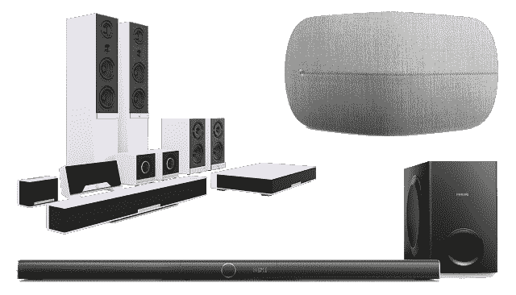

# 谷歌宣布新的 Chromecast 音频和 Android 电视硬件合作伙伴

> 原文：<https://web.archive.org/web/https://techcrunch.com/2016/01/06/google-announces-new-chromecast-audio-and-android-tv-hardware-partners/>

# 谷歌宣布新的 Chromecast 音频和 Android 电视硬件合作伙伴

如果你已经忘记了安卓电视，那也是情有可原的，但是谷歌一年前基于安卓系统的、命运多舛的谷歌电视项目的继任者仍然存在。今天，谷歌[宣布了](https://web.archive.org/web/20230308072023/https://www.android.com/tv/)一些新的 Android 电视硬件合作伙伴，以及一些计划将 Chromecast 音频直接内置到扬声器中的新合作伙伴——最近[推出了](https://web.archive.org/web/20230308072023/https://www.google.com/chromecast/speakers/)chrome cast 音频版本。

很快，你就会在 Arcelik、Vestel、RCA、海信、TCL 和 Bang & Olufsen 等品牌的屏幕上看到安卓电视。谷歌还与印度尼西亚有线电视和宽带提供商 Linknet 合作，提供基于安卓电视的机顶盒。此前，仅有的安卓电视机来自索尼、夏普和飞利浦。

至于 Chromecast 音频，索尼和 LG 是第一个采用这项技术的公司。现在，B&O Play、哈曼卡顿、安桥、飞利浦、先锋和劳菲尔德也加入了这个行列。此外， [Frontier Silicon](https://web.archive.org/web/20230308072023/http://www.frontier-silicon.com/) 和 [StreamUnlimited](https://web.archive.org/web/20230308072023/http://www.streamunlimited.com/) 将提供支持 Chromecast 的软件和硬件，允许其他人快速将该技术构建到他们的产品中。

这些新的扬声器也将很快支持 Chromecast Audio 的多房间同步。如果你有多个扬声器连接到 Chromecast Audio(或内置)，你可以通过此功能将它们分组，然后通过单击将同一首歌曲传输给所有人。

