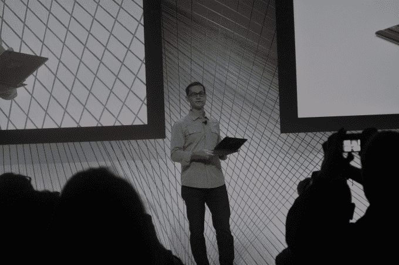
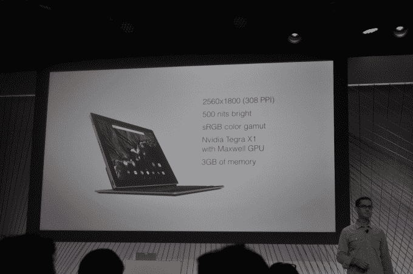

# 谷歌发布 Pixel C Android 平板电脑，配备磁性键盘插件 

> 原文：<https://web.archive.org/web/https://techcrunch.com/2015/09/29/google-announces-pixel-c-android-tablet-with-magnetic-keyboard-add-on/>

谷歌今天在旧金山的 Nexus 活动上宣布，它正在开发一款名为 Pixel C 的 10.2 英寸平板电脑。产品管理高管安德鲁·鲍尔斯(Andrew Bowers)透露了这一计划，他谈到了谷歌即将推出的 Pixel 产品线的“游戏”和“生产力”两个方面。

与之前的 Pixels 不同，这款平板电脑运行的是 Android 6.0(棉花糖)，而不是谷歌的 Chrome OS。它也是一台平板电脑，而不是笔记本电脑(像早期的 Pixels)——尽管它的旗舰功能是一个可拆卸的键盘附件，通过磁铁连接，也可以获得完整的 Qwerty 打字体验。

鲍尔斯说，平板电脑“当你想写一份文件或回复一封长邮件时，往往会迫使你回到笔记本电脑，”他解释了谷歌对 Pixel C 卡扣式键盘设计的想法。“虽然有很多键盘配件，但它们通常只是配件。它们的键盘很窄，需要你在桌子上使用，或者在你不想打字的时候碍事。

“就平板电脑而言，我们问自己，理想的触控加打字体验是什么样的？屏幕和键盘相辅相成的东西，”他补充说，并指出名字中的“C”代表“可兑换”

“我们认为 Pixel C 的平板电脑和键盘体验真正开启了在一台设备上娱乐和工作的新方式。”

合上时，键盘和平板电脑通过“自动对齐磁铁”固定在一起当你想将它转换为捆绑模式时，屏幕会升起并附着在键盘背面的挡板上。这是可调的，因此屏幕角度可以在 100 到 135 度之间倾斜。

“没有支架或卡扣机制可以阻挡你，”鲍尔斯补充道——对微软最初的 Surface slate(有支架)进行了一点点侧击。“放在腿上使用非常方便。你可以在床上使用它，也可以在沙发上使用它，无论你想在哪里使用它。”

物理键盘布局略有调整以节省空间，删除了五个较少使用的符号键，因此它们仅在触摸屏键盘上可用。

物理键盘通过蓝牙连接到 Pixel，所以它确实包含电池，但鲍尔斯声称用户将“永远不必充电”——因为平板电脑在关闭时会感应充电 Pixel C 的键盘。根据谷歌的说法，如果你忘记关闭键盘，在需要充电之前，键盘仍然可以持续两个多月的日常活跃使用。

鲍尔斯表示，Pixel C 将“赶在假期前”发布，并通过谷歌商店销售，平板电脑的标价为 499 美元，键盘为 149 美元。所以如果你全押，就是 648 美元。

最初的 Chromebook Pixel 发布于 2013 年 2 月——谷歌将其自有品牌的高端笔记本电脑硬件与 Chrome OS 配对，以激发人们对其基于云的操作系统的兴趣。还有一个相当高端的价格标签，尽管在两年了，这款笔记本电脑依然光鲜亮丽，但价格略低。

Pixel C 在外观方面也毫不逊色，它采用全金属外壳，鲍尔斯称之为“握在手中坚固结实”的确，它与微软的 Surface 平板电脑有着相似的外观，后者也配有键盘盖配件(尽管 Surface 键盘在外观方面有点不那么高端/更丰富多彩)。

在规格方面，Pixel C 的高分辨率显示屏为 308ppi，因此谷歌的目标是苹果在其 Retina 显示屏上宣传的无像素观看，并在亮度方面提供 500 尼特。在引擎盖下有一个 NVIDIA X1 四核处理器和一个“桌面级”Maxwell GPU，以及 3GB 的 RAM。“移动设备的图形处理能力非常强大。你会发现游戏真的很棒，”鲍尔斯补充道。

还包括:屏幕两侧的立体声扬声器，着眼于电影观看体验。和四个麦克风来支持“来自房间另一端”的 Android 语音交互它还包括用于充电的 USB Type-C。电池寿命没有具体量化——除了鲍尔斯说它对平板电脑来说“很棒”。他补充说，谷歌将在未来几个月发布之前披露更多关于平板电脑的细节。

